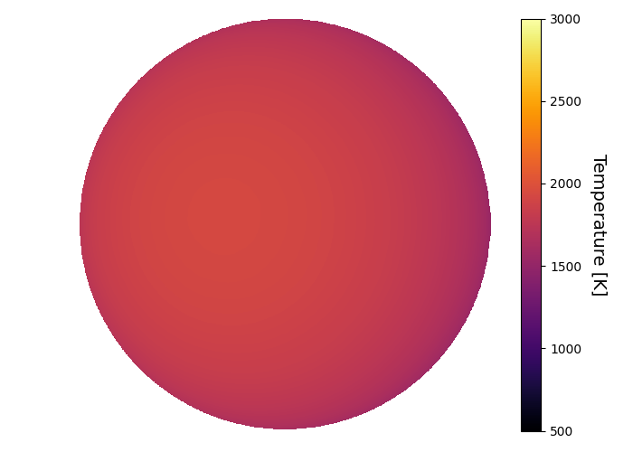
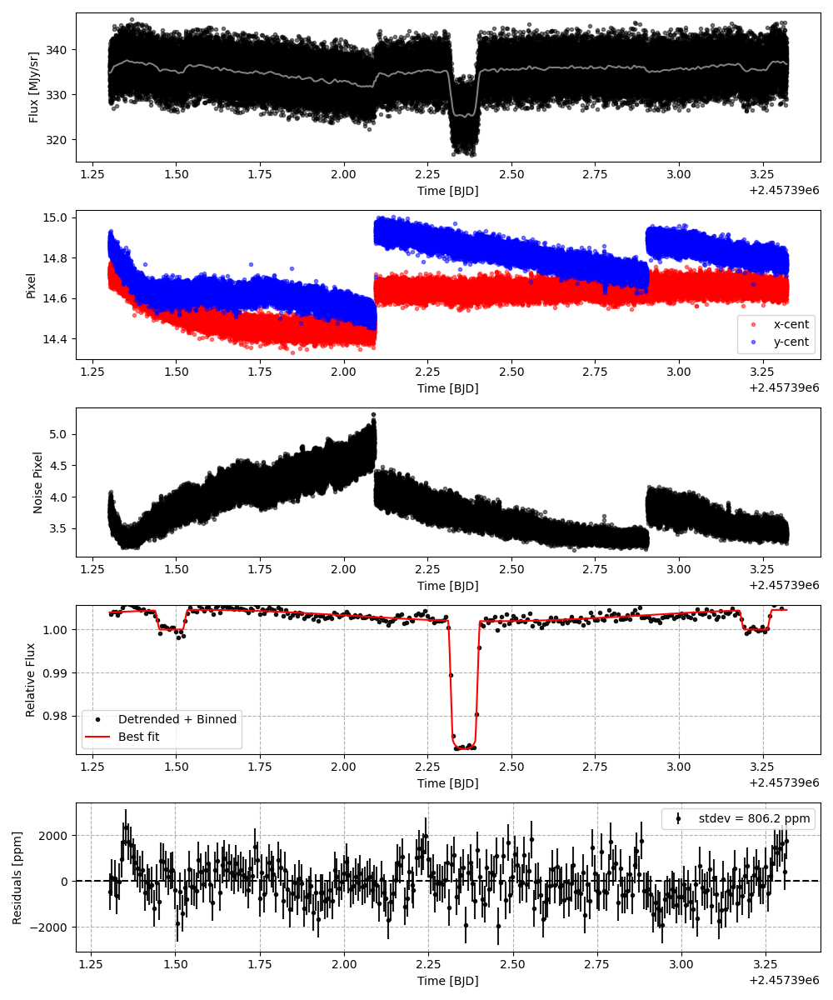
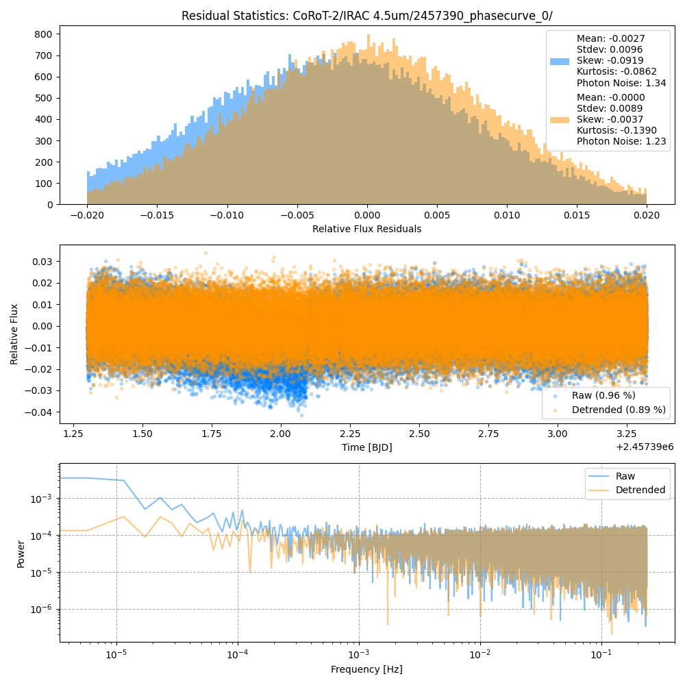
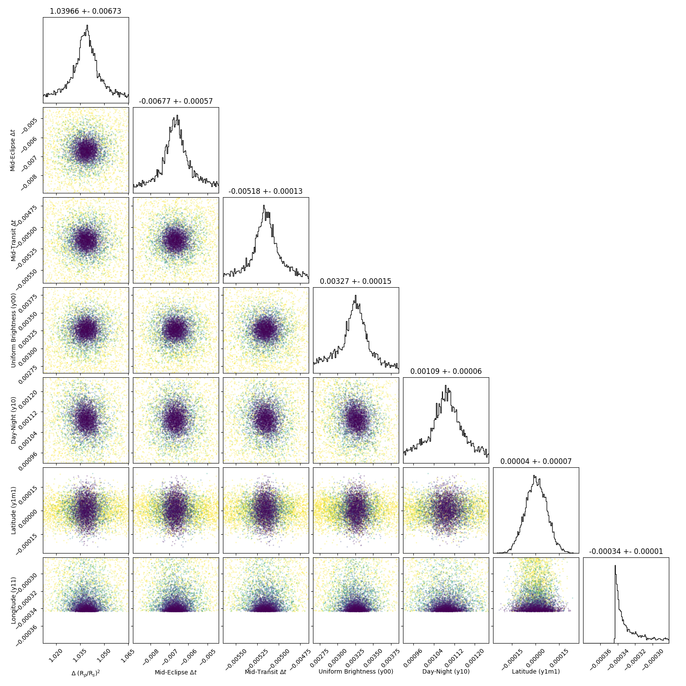
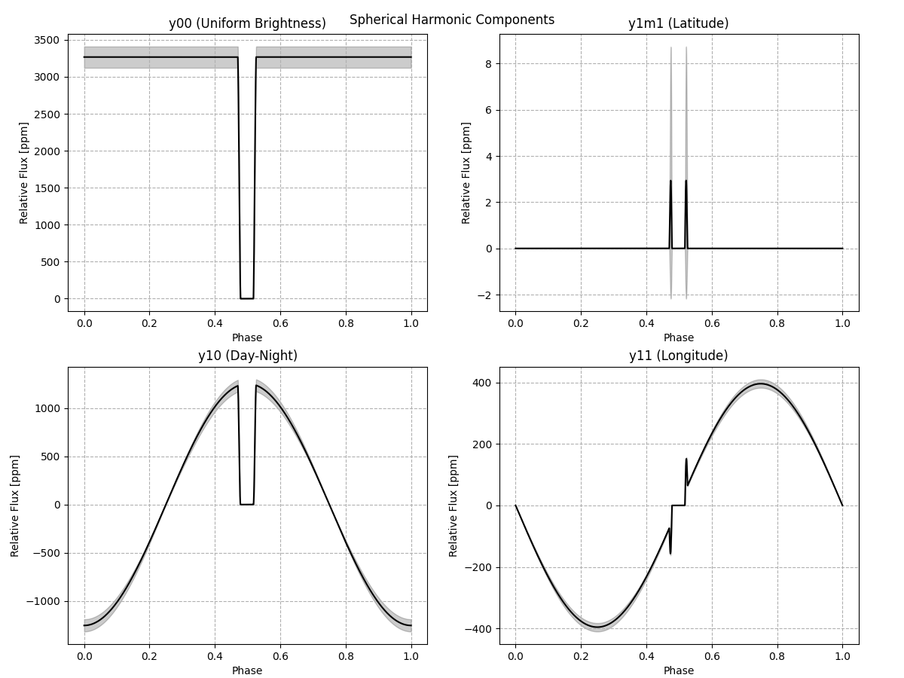
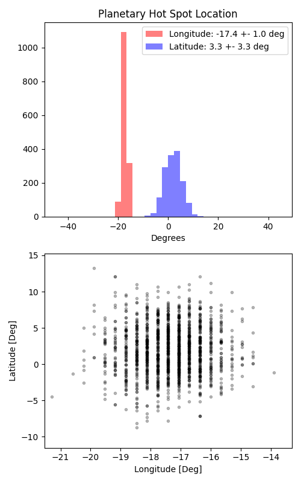

```
# target: corot-2
# filter: IRAC 4.5um
# tmid: 2457392.359770 +- 0.000126
# emid: 2457391.485764 +- 0.000568
# transit_depth: 0.030025+-0.000055
# eclipse_depth: 0.004584 +- 0.000160
# nightside_amp: 0.002229 +- 0.000263
# hotspot_amp: 0.004584 +- 0.000160
# hotspot_lon[deg]: -17.419355 +- 1.030337
# hotspot_lat[deg]: 1.847507 +- 3.346057
time,flux,err,xcent,ycent,npp,phase,raw_flux,phasecurve
2457391.301582,1.007573,0.007680,14.750781,14.833491,3.814541,0.392433,335.953754,1.004000
2457391.301605,0.991200,0.007746,14.720768,14.838592,3.751807,0.392447,330.320508,1.004000
2457391.301628,1.012703,0.007666,14.742313,14.813176,3.814688,0.392460,337.187342,1.004000
2457391.301674,1.010398,0.007677,14.714817,14.850082,3.754926,0.392486,336.233968,1.004000
2457391.301696,1.002008,0.007694,14.742641,14.883507,3.863395,0.392499,334.732324,1.004000

...
```

[timeseries.csv](timeseries.csv)

```python
import pandas as pd

df = pd.read_csv('timeseries.csv', comment='#')

# extract comments from the file
with open('timeseries.csv', 'r') as f:
    comments = [line for line in f if line.startswith('#')]

# clean and convert to a dictionary
comments_dict = dict()
for comment in comments:
    key, value = comment[1:].strip().split(': ')
    comments_dict[key] = value

# print the comments
print(comments_dict)
```















