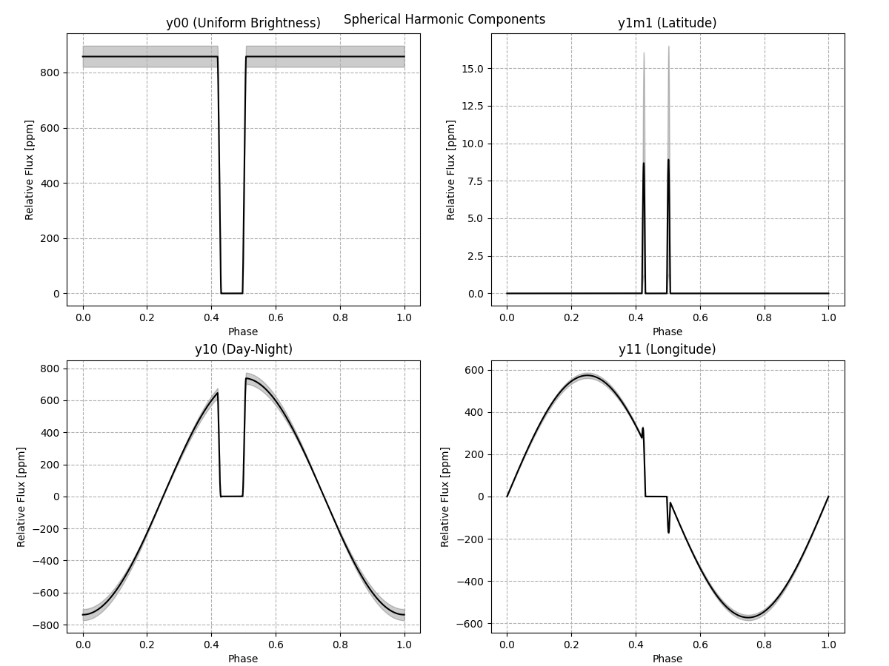
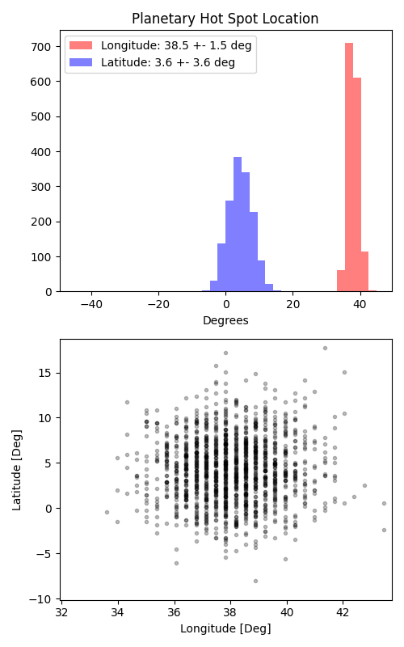

```
# target: hat-p-23
# filter: IRAC 3.6um
# tmid: 2457763.187066 +- 0.000274
# emid: 2457762.576917 +- 0.000248
# transit_depth: 0.012697+-0.000019
# eclipse_depth: 0.001792 +- 0.000049
# nightside_amp: 0.000320 +- 0.000086
# hotspot_amp: 0.001792 +- 0.000049
# hotspot_lon[deg]: 37.829912 +- 1.477937
# hotspot_lat[deg]: 4.310850 +- 3.606885
time,flux,err,xcent,ycent,npp,phase,raw_flux,phasecurve
2457762.426016,1.013442,0.006958,15.222821,14.942450,3.762856,0.339268,356.551116,1.001736
2457762.426039,0.983794,0.007030,15.258948,14.974871,3.651792,0.339286,349.273264,1.001736
2457762.426062,1.001154,0.006988,15.243767,14.985557,3.754257,0.339305,353.450247,1.001736
2457762.426085,0.998205,0.007021,15.233848,14.936457,3.806247,0.339324,350.178678,1.001736
2457762.426107,1.013523,0.006969,15.229631,14.913295,3.778985,0.339343,355.423690,1.001736

...
```

[timeseries.csv](timeseries.csv)

```python
import pandas as pd

df = pd.read_csv('timeseries.csv', comment='#')

# extract comments from the file
with open('timeseries.csv', 'r') as f:
    comments = [line for line in f if line.startswith('#')]

# clean and convert to a dictionary
comments_dict = dict()
for comment in comments:
    key, value = comment[1:].strip().split(': ')
    comments_dict[key] = value

# print the comments
print(comments_dict)
```







