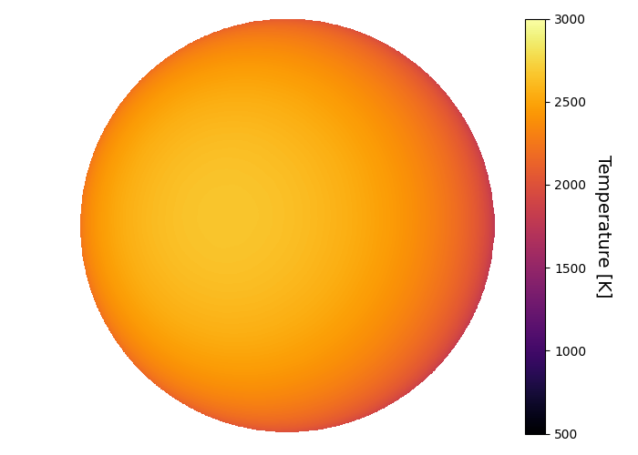
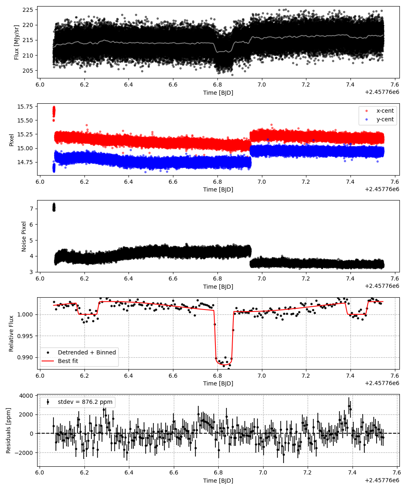
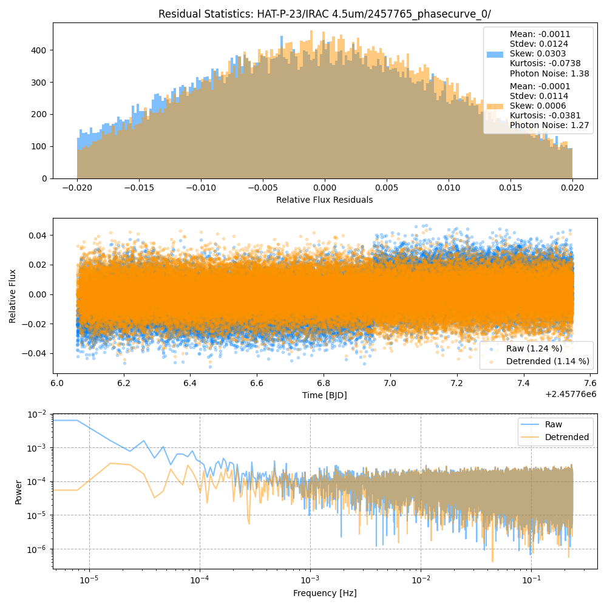
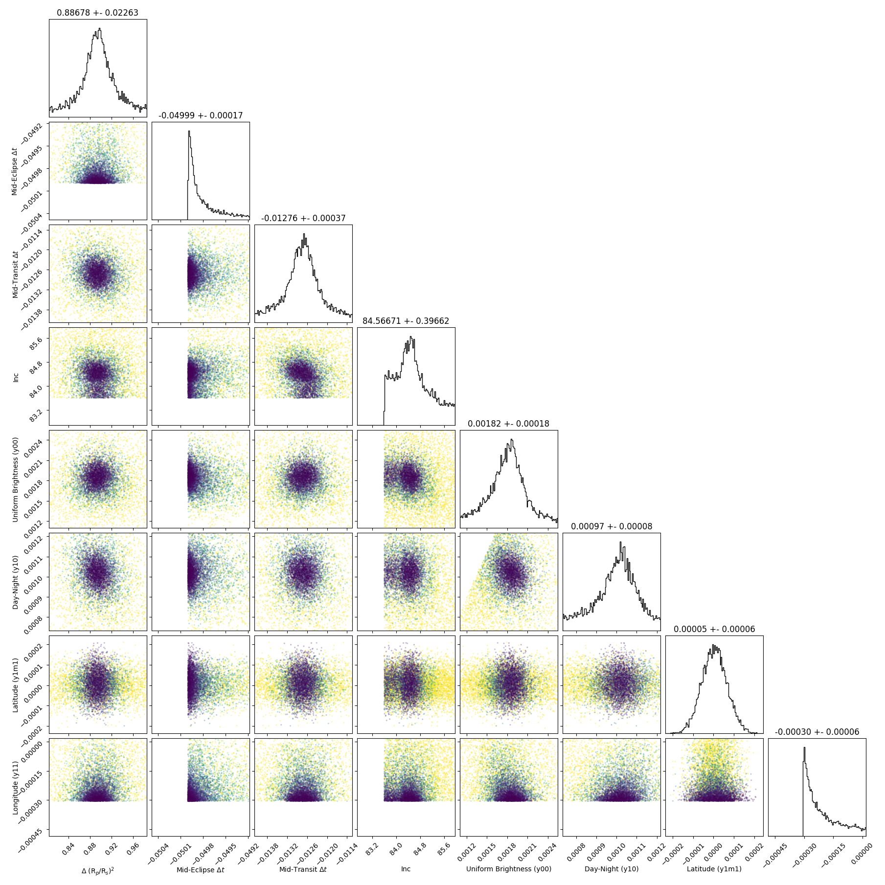
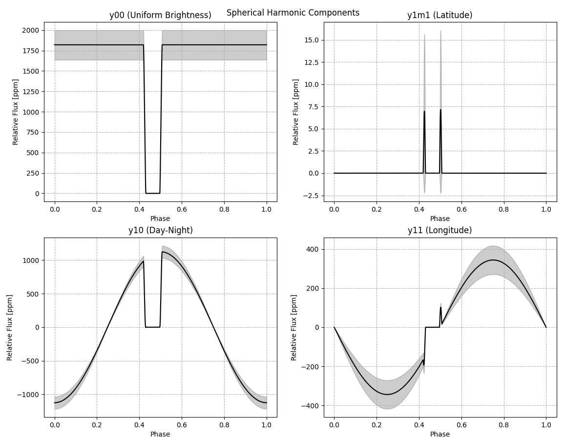
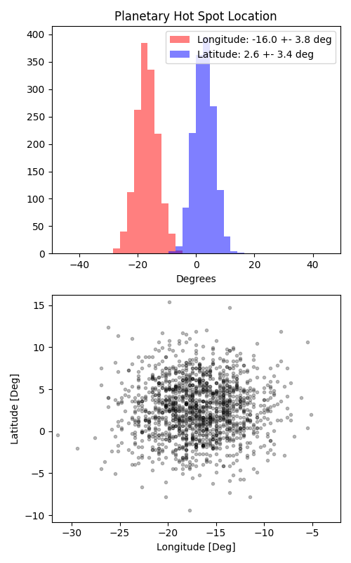

```
# target: hat-p-23
# filter: IRAC 4.5um
# tmid: 2457766.832445 +- 0.000368
# emid: 2457766.215625 +- 0.000171
# transit_depth: 0.012956+-0.000072
# eclipse_depth: 0.002996 +- 0.000203
# nightside_amp: 0.001164 +- 0.000278
# hotspot_amp: 0.002997 +- 0.000203
# hotspot_lon[deg]: -17.067449 +- 3.753566
# hotspot_lat[deg]: 2.727273 +- 3.381498
time,flux,err,xcent,ycent,npp,phase,raw_flux,phasecurve
2457766.061085,0.990435,0.009750,15.634628,14.658132,7.114440,0.336266,208.458887,1.002106
2457766.061108,1.004628,0.009683,15.573781,14.647319,6.948247,0.336285,211.354887,1.002106
2457766.061131,1.015214,0.009633,15.701337,14.628357,6.942206,0.336304,213.541781,1.002106
2457766.061154,1.001339,0.009699,15.494435,14.642227,7.048730,0.336323,210.658838,1.002106
2457766.061176,1.002383,0.009694,15.497168,14.645255,6.897237,0.336342,210.869849,1.002106

...
```

[timeseries.csv](timeseries.csv)

```python
import pandas as pd

df = pd.read_csv('timeseries.csv', comment='#')

# extract comments from the file
with open('timeseries.csv', 'r') as f:
    comments = [line for line in f if line.startswith('#')]

# clean and convert to a dictionary
comments_dict = dict()
for comment in comments:
    key, value = comment[1:].strip().split(': ')
    comments_dict[key] = value

# print the comments
print(comments_dict)
```















