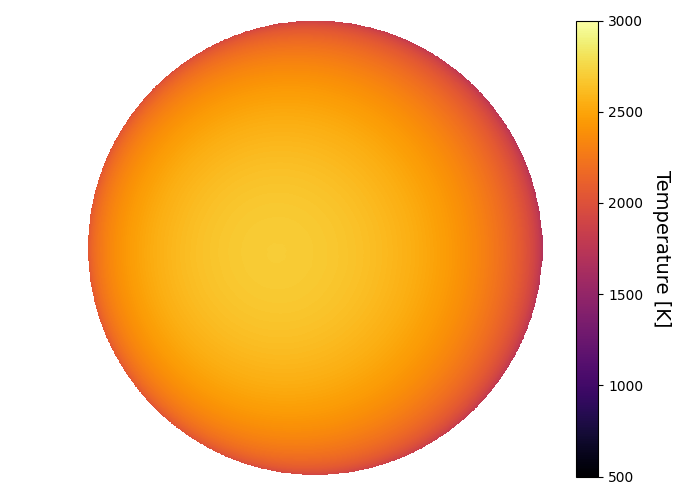
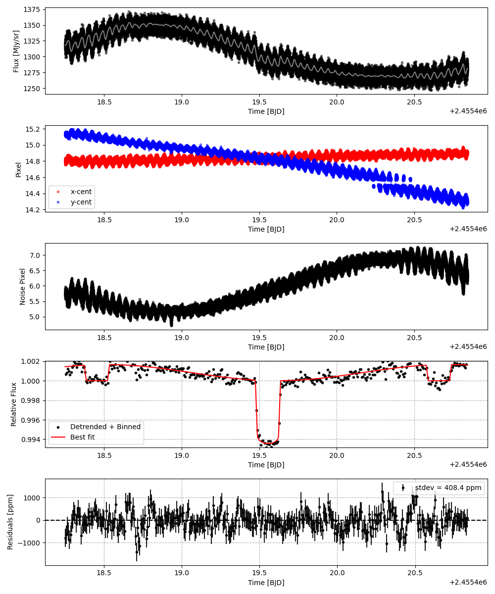
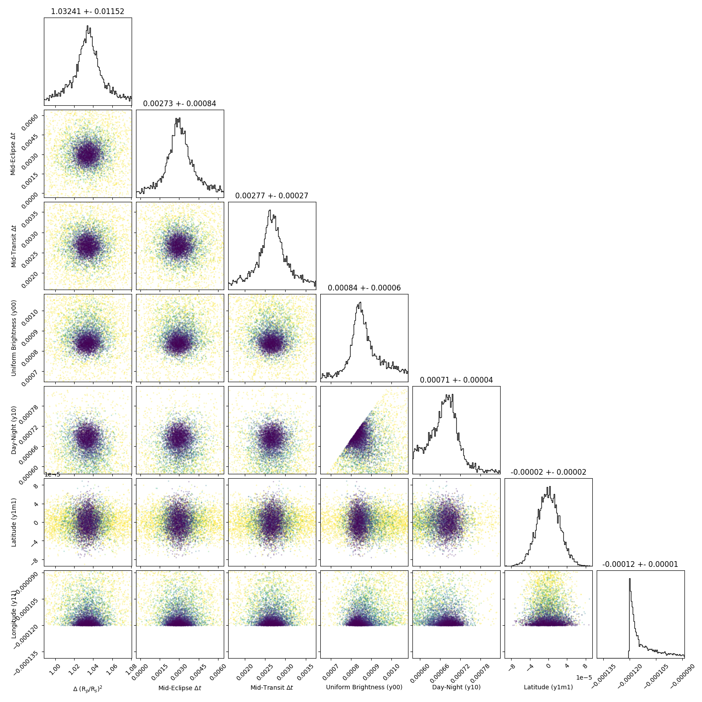
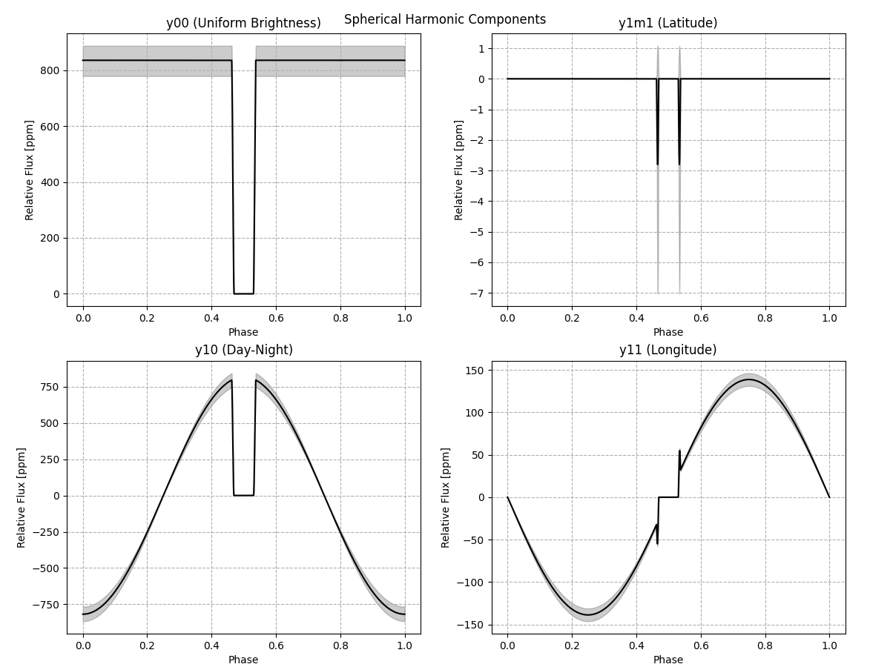
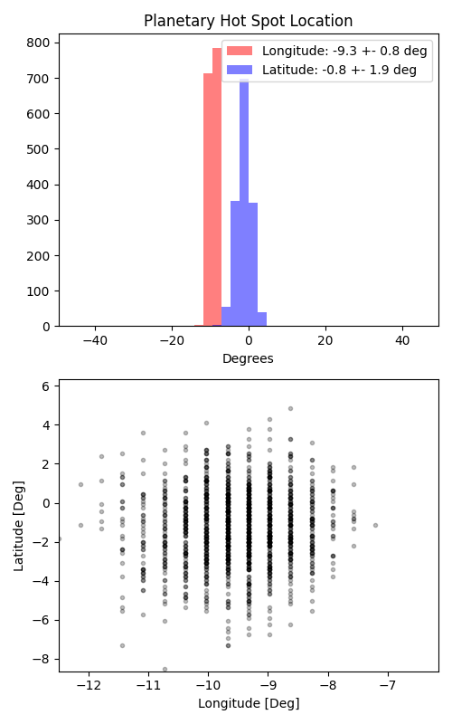

```
# target: hat-p-7
# filter: IRAC 3.6um
# tmid: 2455419.558615 +- 0.000271
# emid: 2455418.453640 +- 0.000843
# transit_depth: 0.006518+-0.000030
# eclipse_depth: 0.001662 +- 0.000076
# nightside_amp: 0.000085 +- 0.000148
# hotspot_amp: 0.001661 +- 0.000076
# hotspot_lon[deg]: -9.325513 +- 0.794040
# hotspot_lat[deg]: -1.143695 +- 1.875145
time,flux,err,xcent,ycent,npp,phase,raw_flux,phasecurve
2455418.248790,1.001846,0.003615,14.802181,15.132358,5.667902,0.407088,1320.769049,1.001441
2455418.248813,1.008845,0.003599,14.797593,15.115612,5.701351,0.407099,1332.421404,1.001441
2455418.248835,0.999005,0.003621,14.805733,15.130991,5.686277,0.407109,1316.770078,1.001441
2455418.248858,1.000148,0.003618,14.825585,15.132542,5.619196,0.407119,1318.550260,1.001441
2455418.248881,1.000768,0.003618,14.784320,15.132171,5.787979,0.407130,1318.845836,1.001441

...
```

[timeseries.csv](timeseries.csv)

```python
import pandas as pd

df = pd.read_csv('timeseries.csv', comment='#')

# extract comments from the file
with open('timeseries.csv', 'r') as f:
    comments = [line for line in f if line.startswith('#')]

# clean and convert to a dictionary
comments_dict = dict()
for comment in comments:
    key, value = comment[1:].strip().split(': ')
    comments_dict[key] = value

# print the comments
print(comments_dict)
```














