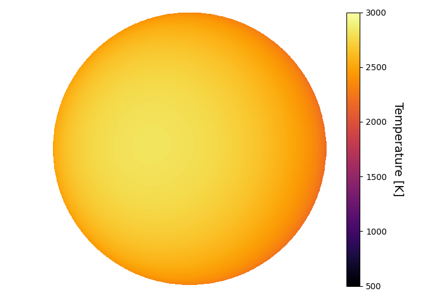
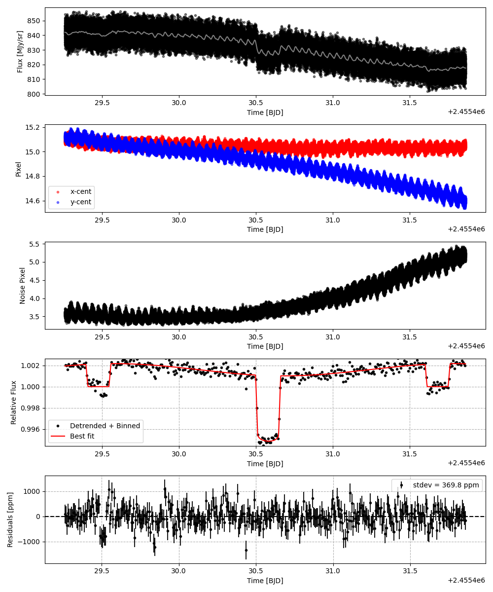
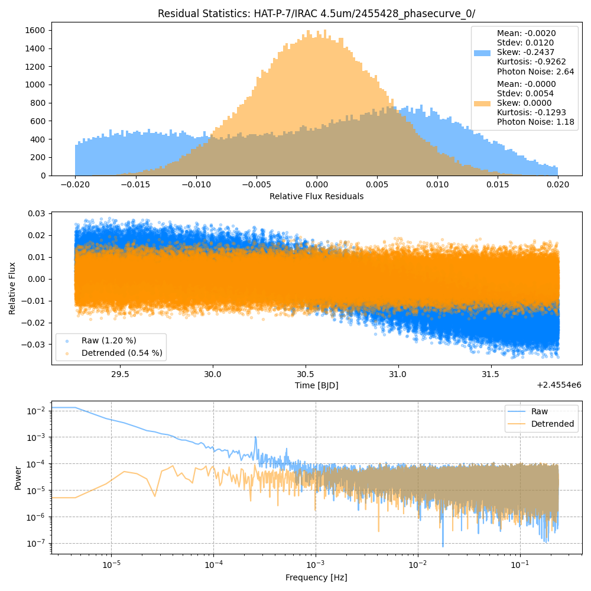
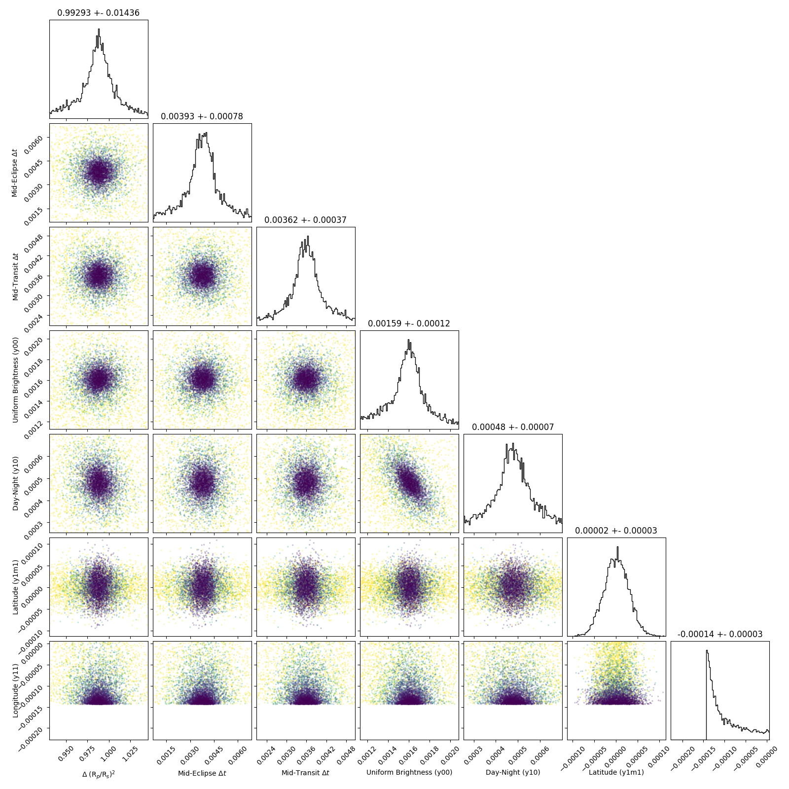
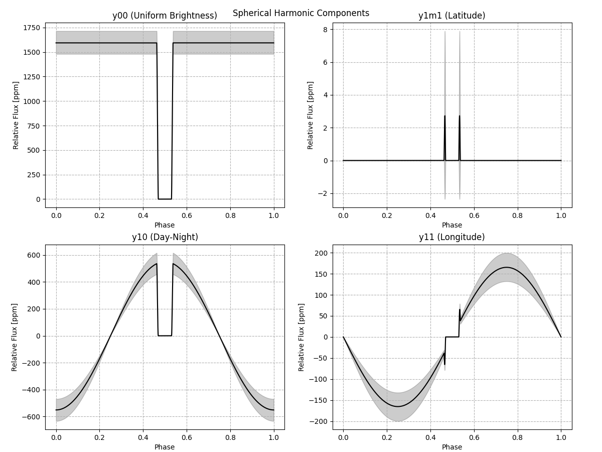
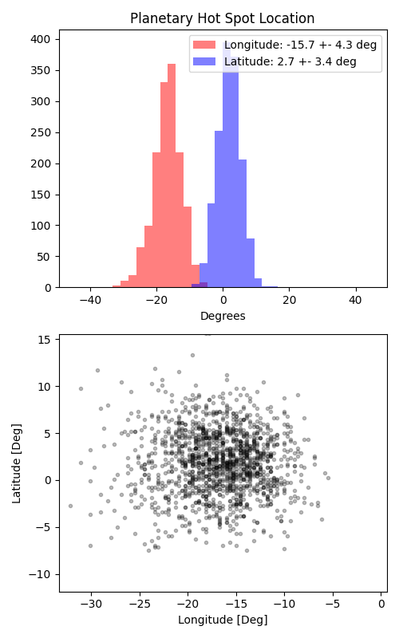

```
# target: hat-p-7
# filter: IRAC 4.5um
# tmid: 2455430.582911 +- 0.000373
# emid: 2455429.476141 +- 0.000776
# transit_depth: 0.006233+-0.000052
# eclipse_depth: 0.002169 +- 0.000138
# nightside_amp: 0.001106 +- 0.000199
# hotspot_amp: 0.002169 +- 0.000138
# hotspot_lon[deg]: -16.363636 +- 4.255765
# hotspot_lat[deg]: 1.847507 +- 3.423891
time,flux,err,xcent,ycent,npp,phase,raw_flux,phasecurve
2455429.258057,0.995271,0.004867,15.077637,15.129821,3.591403,0.401086,836.692874,1.001945
2455429.258080,0.999549,0.004855,15.093776,15.139643,3.568202,0.401096,840.851251,1.001945
2455429.258102,1.004069,0.004844,15.101299,15.134183,3.610291,0.401107,844.448845,1.001945
2455429.258125,1.001040,0.004853,15.087159,15.124172,3.604404,0.401117,841.464667,1.001945
2455429.258148,1.001310,0.004851,15.083993,15.132261,3.562391,0.401127,842.113511,1.001945

...
```

[timeseries.csv](timeseries.csv)

```python
import pandas as pd

df = pd.read_csv('timeseries.csv', comment='#')

# extract comments from the file
with open('timeseries.csv', 'r') as f:
    comments = [line for line in f if line.startswith('#')]

# clean and convert to a dictionary
comments_dict = dict()
for comment in comments:
    key, value = comment[1:].strip().split(': ')
    comments_dict[key] = value

# print the comments
print(comments_dict)
```















