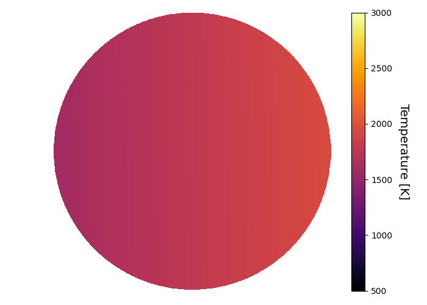
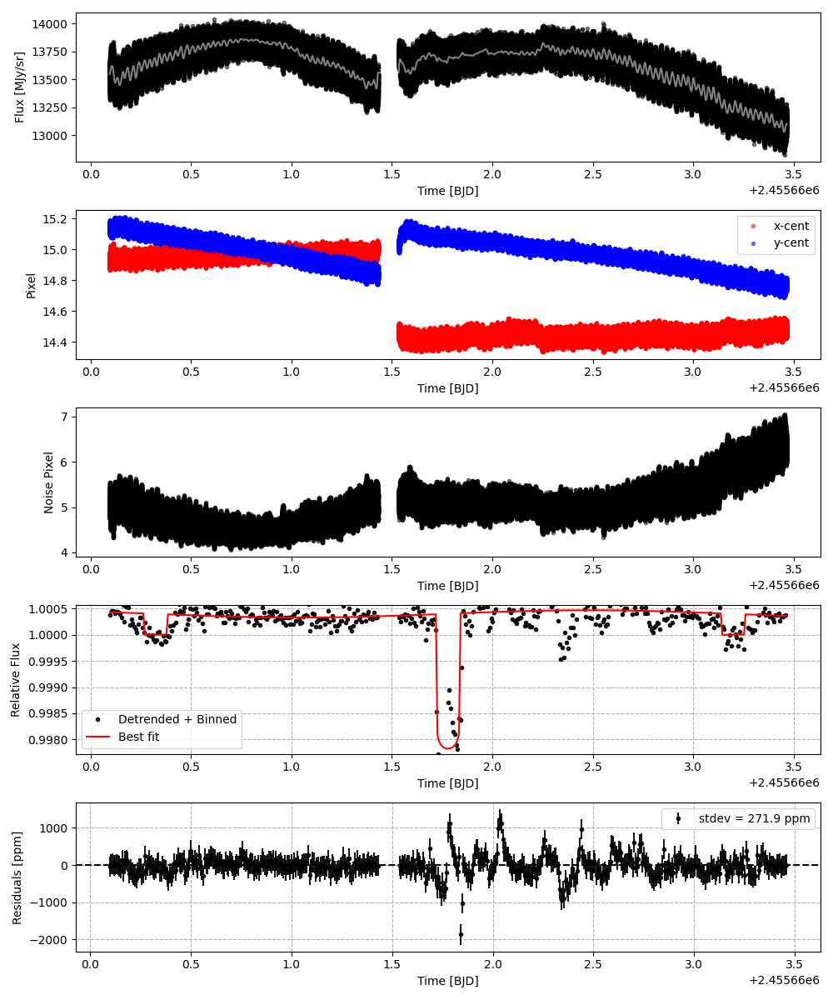
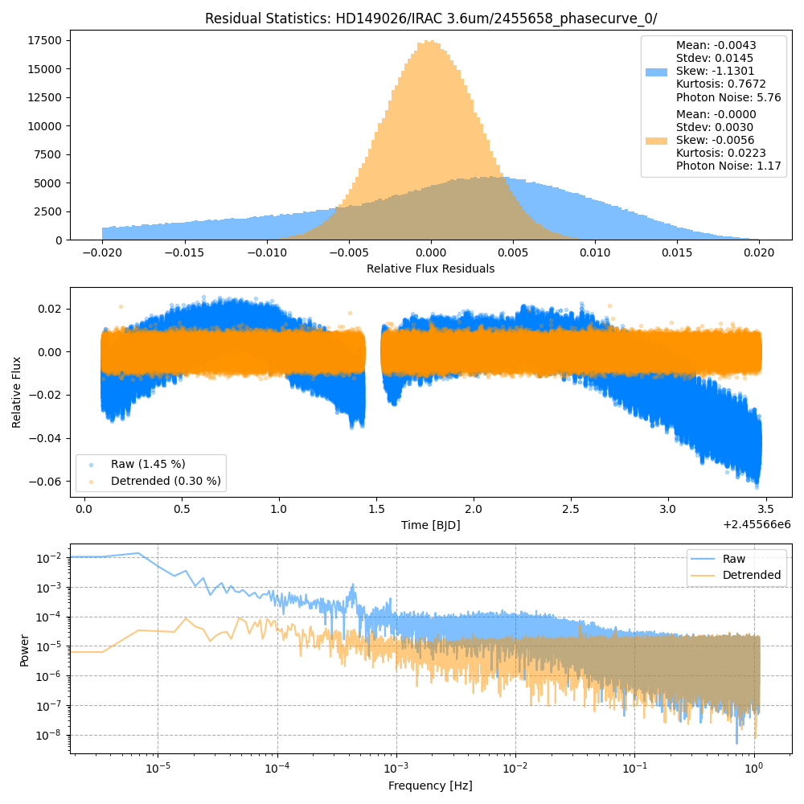
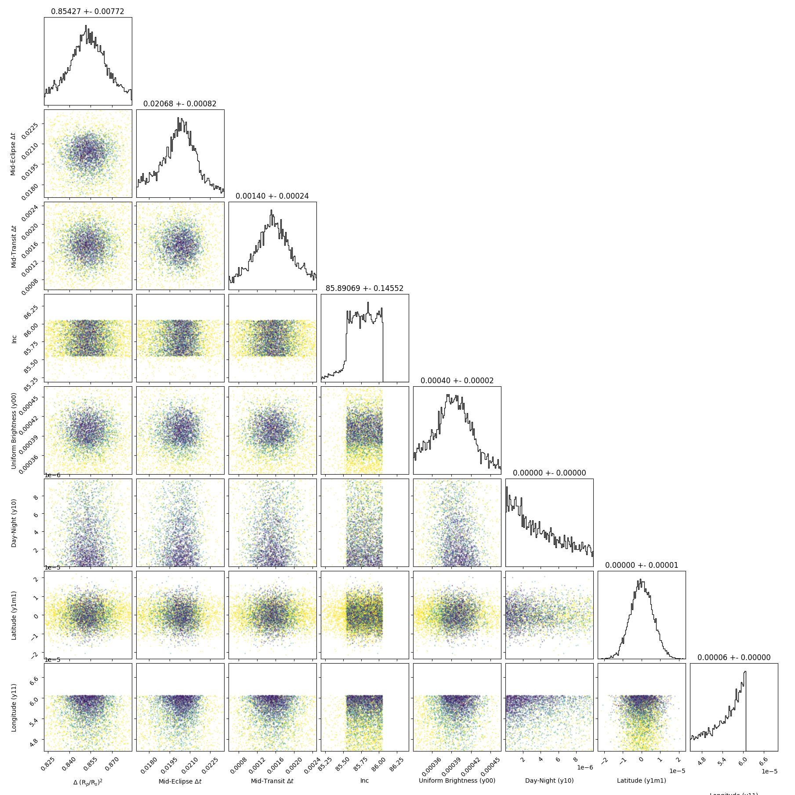
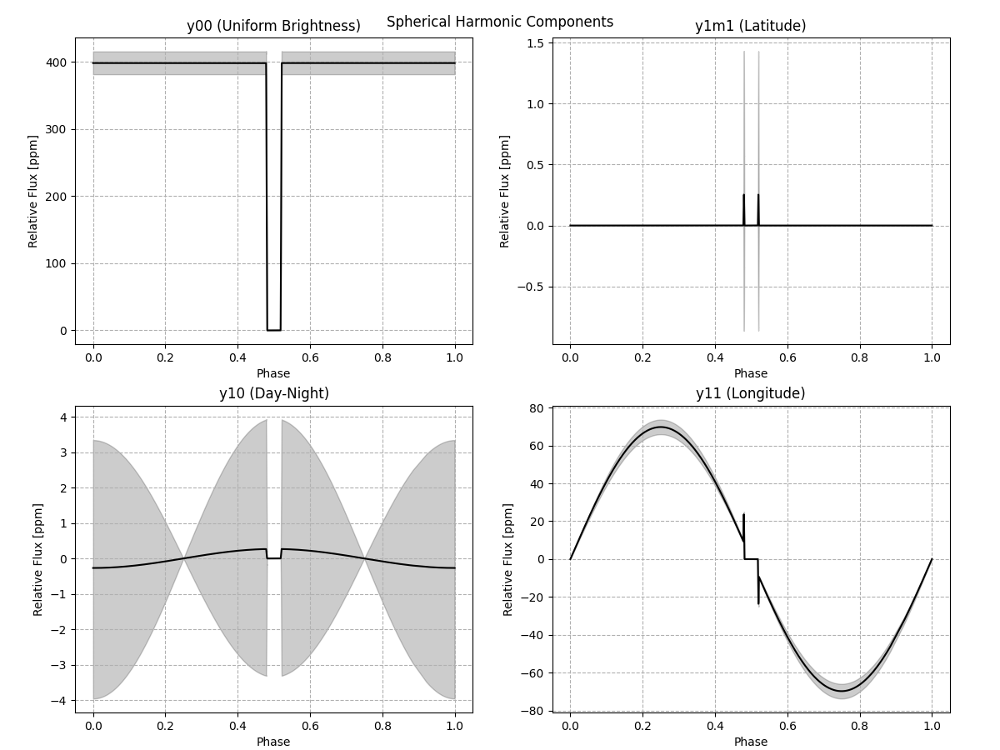
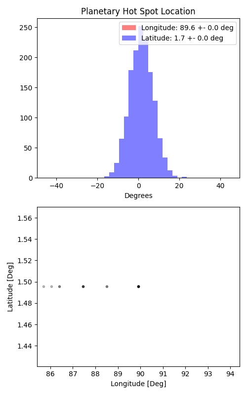

```
# target: hd149026
# filter: IRAC 3.6um
# tmid: 2455661.778823 +- 0.000238
# emid: 2455660.323188 +- 0.000821
# transit_depth: 0.002591+-0.000000
# eclipse_depth: 0.000413 +- 0.000017
# nightside_amp: 0.000416 +- 0.000022
# hotspot_amp: 0.000468 +- 0.000017
# hotspot_lon[deg]: 89.912023 +- 0.000000
# hotspot_lat[deg]: 1.495601 +- 0.000000
time,flux,err,xcent,ycent,npp,phase,raw_flux,phasecurve
2455660.094680,0.999543,0.002536,14.922404,15.159622,5.264881,0.420538,13424.632439,1.000432
2455660.094684,1.004323,0.002530,14.918288,15.156262,5.274547,0.420540,13487.918986,1.000432
2455660.094689,1.006774,0.002528,14.922294,15.161846,5.287915,0.420542,13510.900035,1.000432
2455660.094693,1.000025,0.002536,14.930321,15.160575,5.270854,0.420543,13424.867487,1.000432
2455660.094698,0.993936,0.002543,14.929685,15.161486,5.259545,0.420545,13349.308801,1.000432

...
```

[timeseries.csv](timeseries.csv)

```python
import pandas as pd

df = pd.read_csv('timeseries.csv', comment='#')

# extract comments from the file
with open('timeseries.csv', 'r') as f:
    comments = [line for line in f if line.startswith('#')]

# clean and convert to a dictionary
comments_dict = dict()
for comment in comments:
    key, value = comment[1:].strip().split(': ')
    comments_dict[key] = value

# print the comments
print(comments_dict)
```















