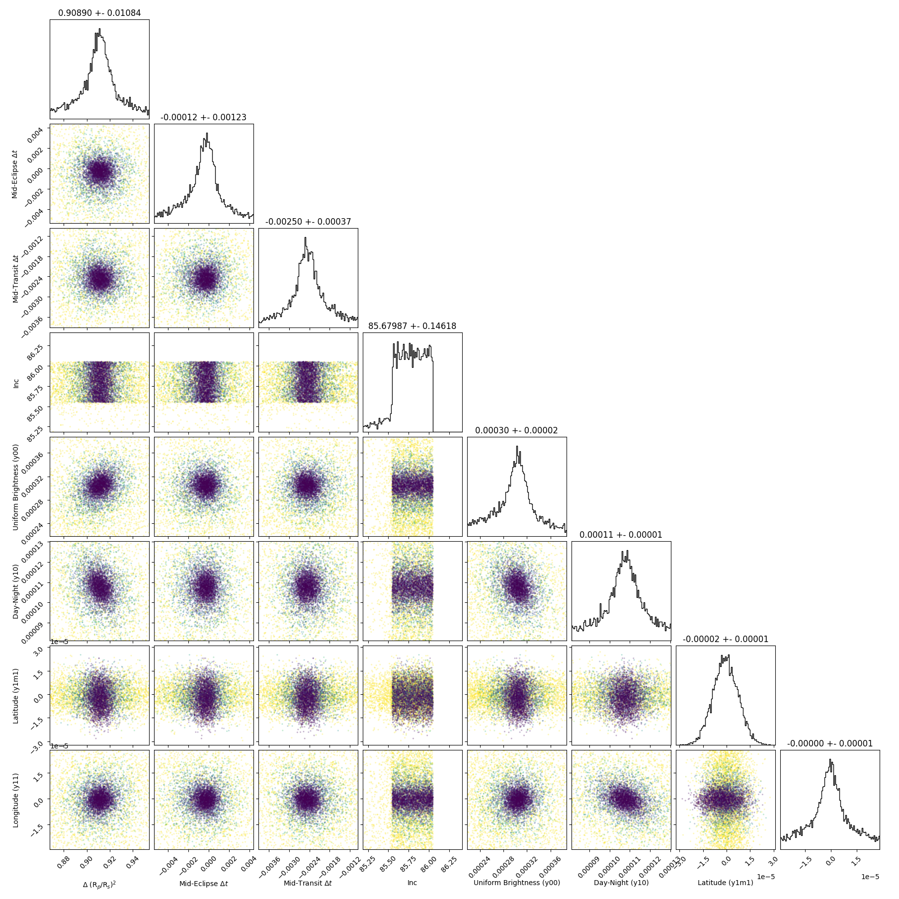

```
# target: hd149026
# filter: IRAC 4.5um
# tmid: 2455673.287905 +- 0.000371
# emid: 2455671.847563 +- 0.001227
# transit_depth: 0.002729+-0.000008
# eclipse_depth: 0.000422 +- 0.000023
# nightside_amp: 0.000182 +- 0.000030
# hotspot_amp: 0.000421 +- 0.000023
# hotspot_lon[deg]: -0.527859 +- 3.972293
# hotspot_lat[deg]: -8.533724 +- 4.181953
time,flux,err,xcent,ycent,npp,phase,raw_flux,phasecurve
2455671.568191,1.004089,0.003427,14.775627,15.284584,6.671506,0.402859,8436.791530,1.000400
2455671.568196,0.999250,0.003436,14.769465,15.289314,6.588964,0.402861,8392.365754,1.000400
2455671.568200,1.000077,0.003435,14.777968,15.288057,6.563763,0.402862,8398.286889,1.000400
2455671.568231,1.006178,0.003424,14.790662,15.297887,6.594510,0.402873,8453.260376,1.000400
2455671.568236,0.999238,0.003436,14.789180,15.293742,6.551351,0.402875,8395.310753,1.000400

...
```

[timeseries.csv](timeseries.csv)

```python
import pandas as pd

df = pd.read_csv('timeseries.csv', comment='#')

# extract comments from the file
with open('timeseries.csv', 'r') as f:
    comments = [line for line in f if line.startswith('#')]

# clean and convert to a dictionary
comments_dict = dict()
for comment in comments:
    key, value = comment[1:].strip().split(': ')
    comments_dict[key] = value

# print the comments
print(comments_dict)
```





