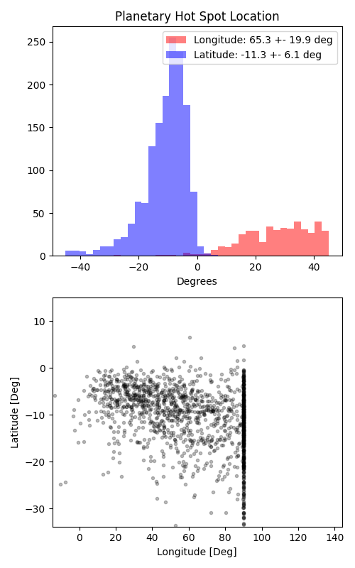

```
# target: k2-141
# filter: <_io.TextIOWrapper name='DATA/K2-141/IRAC 4.5um/2458401_phasecurve_0/timeseries.csv' mode='w' encoding='UTF-8'>
# tmid: 2458401.166175 +- 0.010028
# emid: 2458400.882392 +- 0.007373
# transit_depth: 0.000402+-0.000021
# eclipse_depth: 0.000300 +- 0.000061
# nightside_amp: 0.000300 +- 0.000113
# hotspot_amp: 0.000300 +- 0.000061
# hotspot_lon[deg]: 64.574780 +- 19.852878
# hotspot_lat[deg]: -9.413490 +- 6.119131
time,flux,err,xcent,ycent,npp,phase,raw_flux,phasecurve
2458400.605355,0.996225,0.003117,15.046225,15.128586,3.881809,-0.988251,2039.454509,0.999898
2458400.605378,1.001631,0.003109,15.065918,15.131441,3.917309,-0.988170,2050.343699,0.999898
2458400.605400,0.999144,0.003113,15.050289,15.132482,3.911549,-0.988088,2045.561316,0.999898
2458400.605423,1.001241,0.003110,15.058039,15.117105,3.863457,-0.988007,2048.853089,0.999898
2458400.605446,0.997684,0.003115,15.060529,15.117575,3.902441,-0.987926,2042.185375,0.999898

...
```

[timeseries.csv](timeseries.csv)

```python
import pandas as pd

df = pd.read_csv('timeseries.csv', comment='#')

# extract comments from the file
with open('timeseries.csv', 'r') as f:
    comments = [line for line in f if line.startswith('#')]

# clean and convert to a dictionary
comments_dict = dict()
for comment in comments:
    key, value = comment[1:].strip().split(': ')
    comments_dict[key] = value

# print the comments
print(comments_dict)
```




