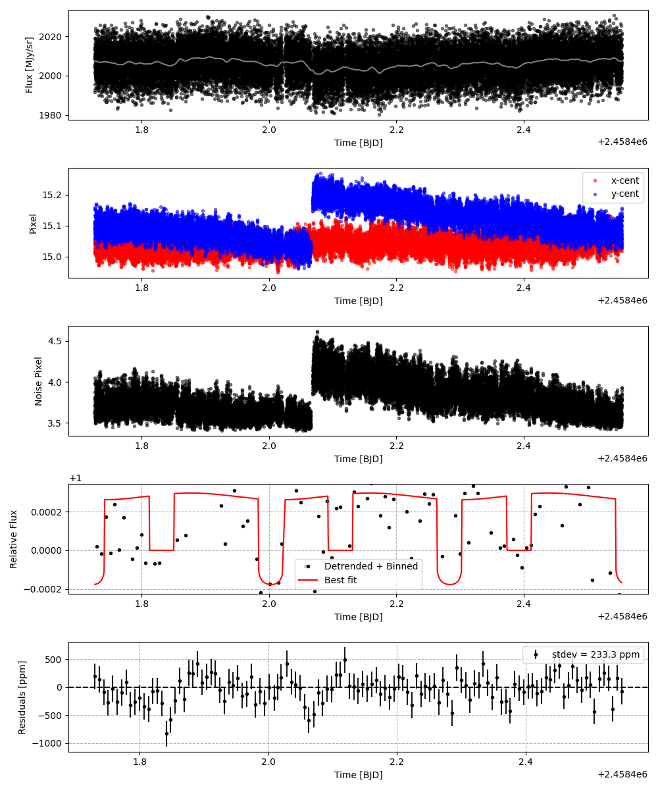
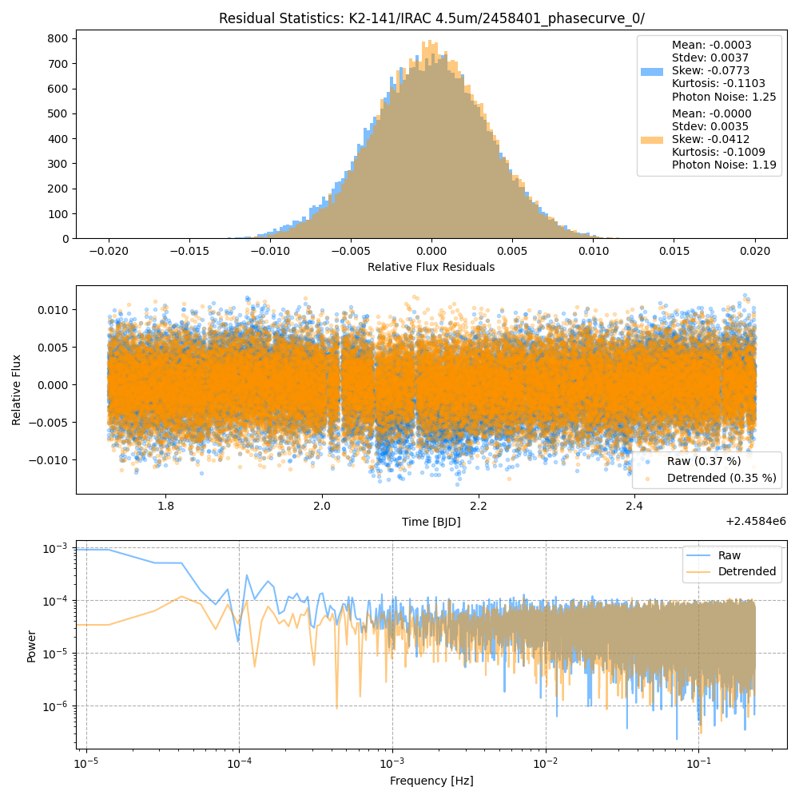
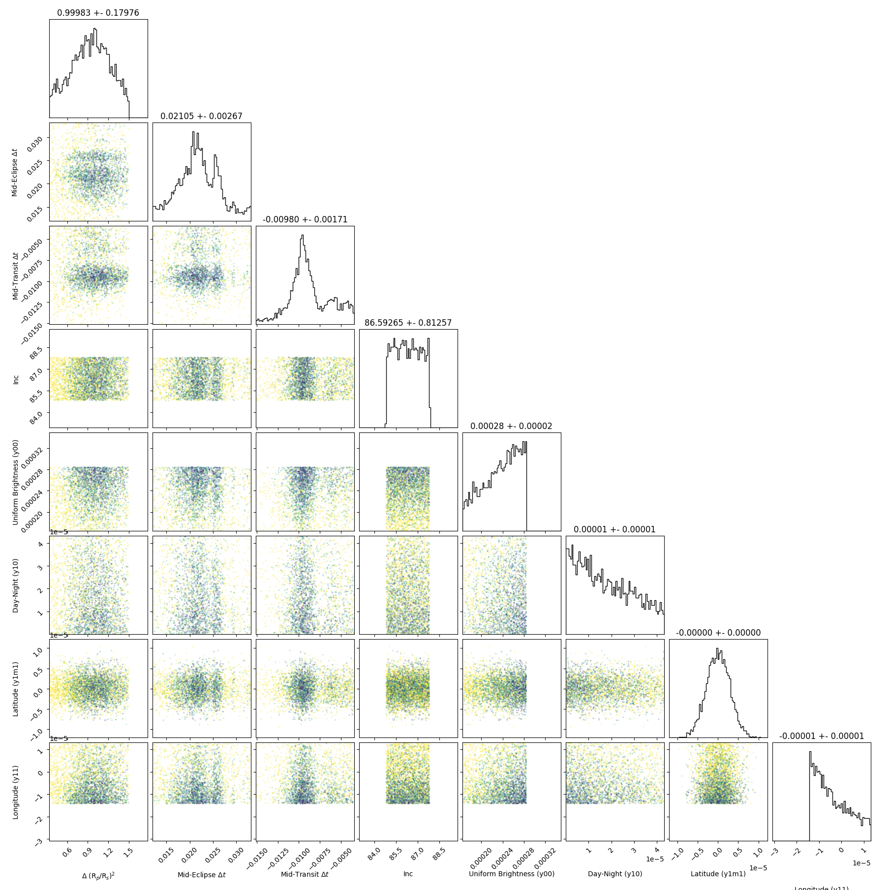
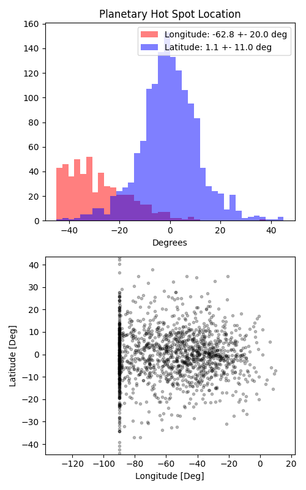

```
# target: k2-141
# filter: <_io.TextIOWrapper name='DATA/K2-141/IRAC 4.5um/2458402_phasecurve_0/timeseries.csv' mode='w' encoding='UTF-8'>
# tmid: 2458402.003660 +- 0.001708
# emid: 2458401.971917 +- 0.002673
# transit_depth: 0.000471+-0.000009
# eclipse_depth: 0.000297 +- 0.000025
# nightside_amp: 0.000293 +- 0.000049
# hotspot_amp: 0.000297 +- 0.000025
# hotspot_lon[deg]: -57.536657 +- 19.967980
# hotspot_lat[deg]: -0.439883 +- 11.032092
time,flux,err,xcent,ycent,npp,phase,raw_flux,phasecurve
2458401.726772,0.994787,0.003151,15.016687,15.093807,3.800127,-0.874503,1995.644851,0.999824
2458401.726795,1.002849,0.003139,15.009621,15.106262,3.818824,-0.874421,2011.278803,0.999824
2458401.726817,0.999280,0.003144,15.015217,15.096295,3.761627,-0.874340,2005.163008,0.999824
2458401.726840,1.002979,0.003136,15.016653,15.094013,3.712140,-0.874259,2014.526401,0.999824
2458401.726863,0.999721,0.003140,15.047959,15.114144,3.643879,-0.874178,2009.315896,0.999824

...
```

[timeseries.csv](timeseries.csv)

```python
import pandas as pd

df = pd.read_csv('timeseries.csv', comment='#')

# extract comments from the file
with open('timeseries.csv', 'r') as f:
    comments = [line for line in f if line.startswith('#')]

# clean and convert to a dictionary
comments_dict = dict()
for comment in comments:
    key, value = comment[1:].strip().split(': ')
    comments_dict[key] = value

# print the comments
print(comments_dict)
```











