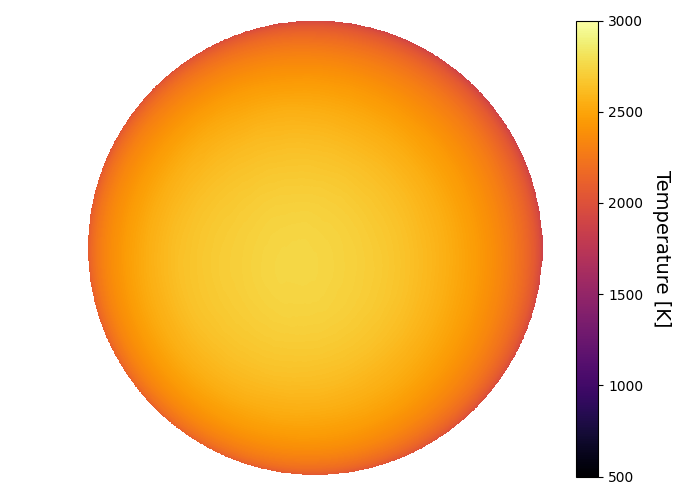
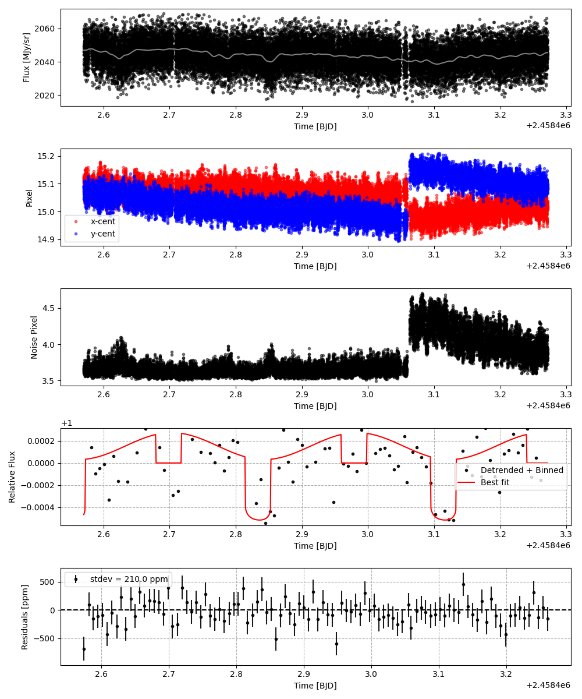
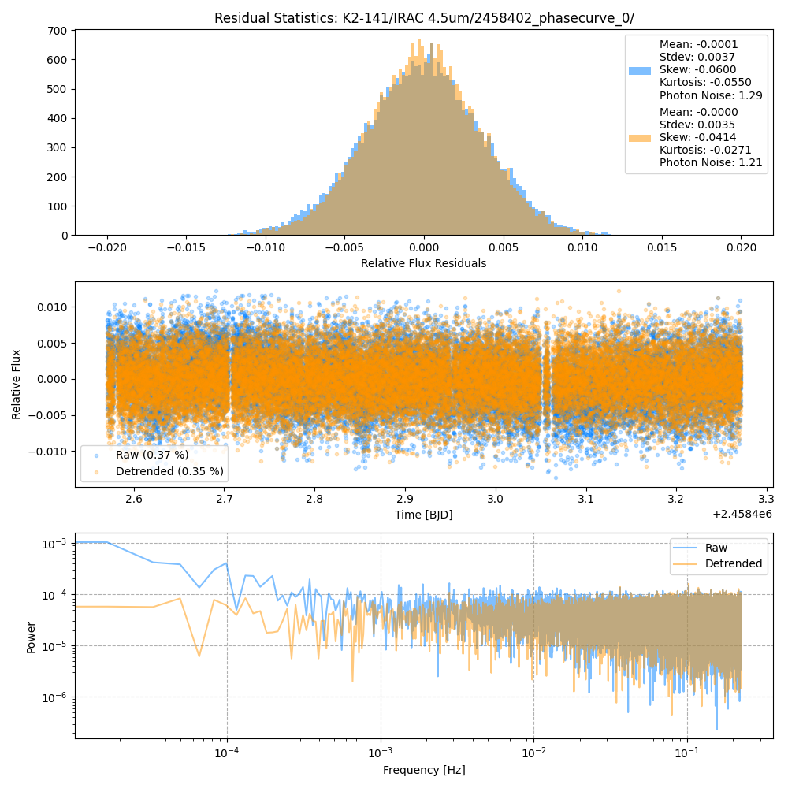
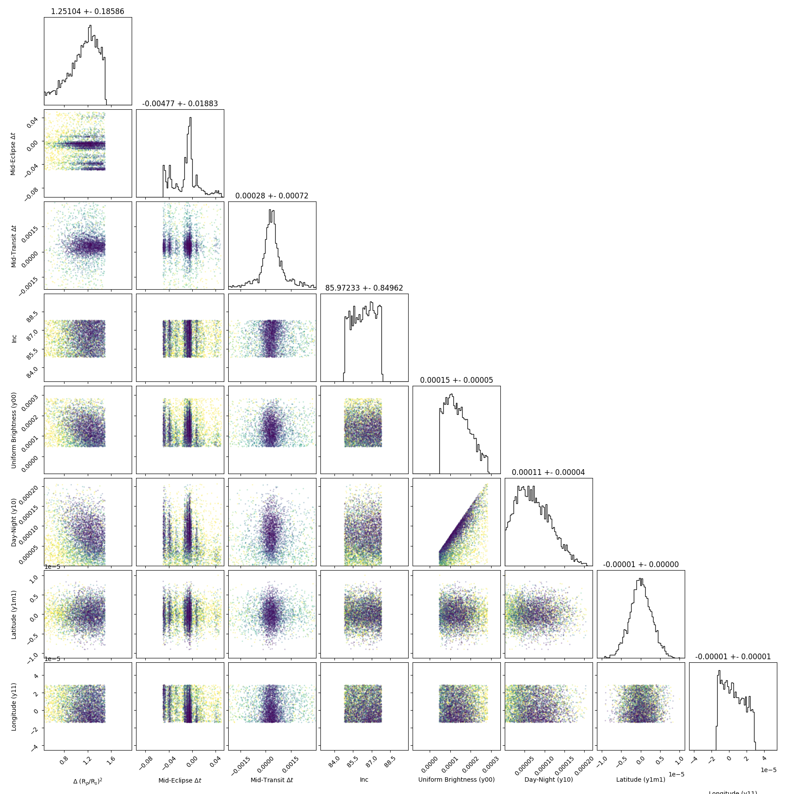
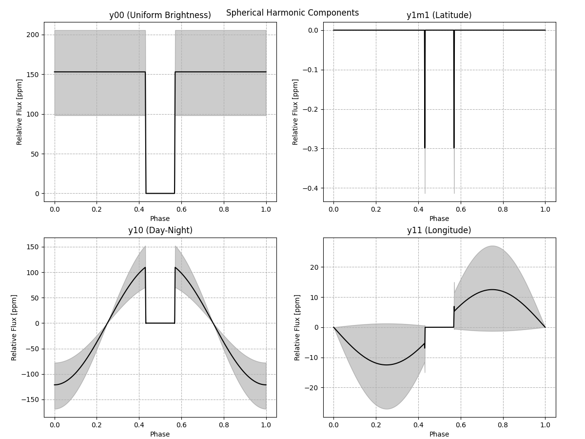
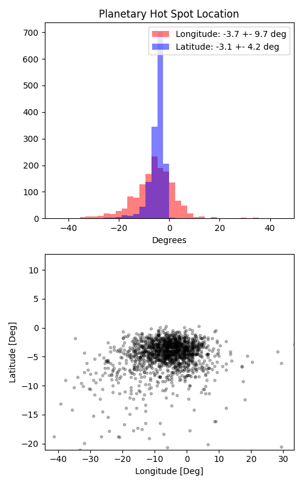

```
# target: k2-141
# filter: IRAC 4.5um
# tmid: 2458402.836177 +- 0.000718
# emid: 2458402.838723 +- 0.018830
# transit_depth: 0.000756+-0.000028
# eclipse_depth: 0.000226 +- 0.000069
# nightside_amp: 0.000239 +- 0.000107
# hotspot_amp: 0.000265 +- 0.000069
# hotspot_lon[deg]: -5.454545 +- 9.696830
# hotspot_lat[deg]: -4.134897 +- 4.226901
time,flux,err,xcent,ycent,npp,phase,raw_flux,phasecurve
2458402.570318,0.996058,0.003116,15.108098,15.074423,3.655625,-0.957445,2040.420196,0.999533
2458402.570341,1.004056,0.003103,15.120425,15.074388,3.608982,-0.957363,2057.905330,0.999533
2458402.570364,1.000275,0.003110,15.122332,15.080032,3.629457,-0.957282,2049.459116,0.999533
2458402.570386,0.998093,0.003112,15.132091,15.071070,3.625760,-0.957201,2046.045069,0.999534
2458402.570409,0.994667,0.003118,15.121943,15.085138,3.632247,-0.957119,2038.197080,0.999534

...
```

[timeseries.csv](timeseries.csv)

```python
import pandas as pd

df = pd.read_csv('timeseries.csv', comment='#')

# extract comments from the file
with open('timeseries.csv', 'r') as f:
    comments = [line for line in f if line.startswith('#')]

# clean and convert to a dictionary
comments_dict = dict()
for comment in comments:
    key, value = comment[1:].strip().split(': ')
    comments_dict[key] = value

# print the comments
print(comments_dict)
```















