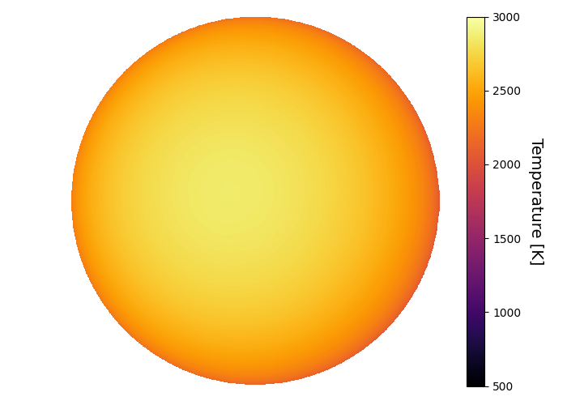

```
# target: kelt-1
# filter: IRAC 3.6um
# tmid: 2457306.976448 +- 0.000203
# emid: 2457306.366550 +- 0.000899
# transit_depth: 0.006733+-0.000028
# eclipse_depth: 0.001623 +- 0.000077
# nightside_amp: 0.000531 +- 0.000156
# hotspot_amp: 0.001621 +- 0.000077
# hotspot_lon[deg]: -7.565982 +- 3.810971
# hotspot_lat[deg]: 3.079179 +- 2.868233
time,flux,err,xcent,ycent,npp,phase,raw_flux,phasecurve
2457306.271526,1.004708,0.003796,15.182596,15.153079,4.066796,0.422957,1197.910725,1.001522
2457306.271549,1.009244,0.003788,15.188825,15.144774,4.072043,0.422976,1203.027834,1.001522
2457306.271571,1.004793,0.003796,15.178079,15.153405,3.993953,0.422995,1197.863216,1.001522
2457306.271594,0.999587,0.003805,15.181149,15.158746,4.068938,0.423013,1191.957489,1.001522
2457306.271617,0.996509,0.003810,15.166841,15.149956,4.076096,0.423032,1188.994966,1.001522

...
```

[timeseries.csv](timeseries.csv)

```python
import pandas as pd

df = pd.read_csv('timeseries.csv', comment='#')

# extract comments from the file
with open('timeseries.csv', 'r') as f:
    comments = [line for line in f if line.startswith('#')]

# clean and convert to a dictionary
comments_dict = dict()
for comment in comments:
    key, value = comment[1:].strip().split(': ')
    comments_dict[key] = value

# print the comments
print(comments_dict)
```





