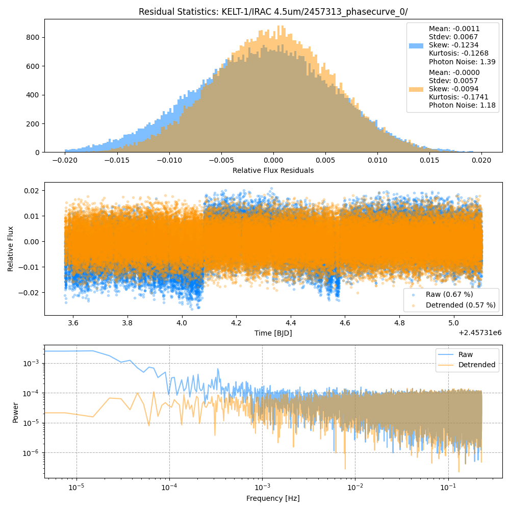

```
# target: kelt-1
# filter: IRAC 4.5um
# tmid: 2457314.279015 +- 0.000477
# emid: 2457313.671146 +- 0.000810
# transit_depth: 0.006109+-0.000061
# eclipse_depth: 0.002227 +- 0.000158
# nightside_amp: 0.000956 +- 0.000225
# hotspot_amp: 0.002225 +- 0.000158
# hotspot_lon[deg]: -1.231672 +- 6.557832
# hotspot_lat[deg]: 1.495601 +- 3.171513
time,flux,err,xcent,ycent,npp,phase,raw_flux,phasecurve
2457313.570049,0.988461,0.005190,15.089146,15.327084,4.719678,0.417952,735.820023,1.002160
2457313.570072,1.000115,0.005162,15.078532,15.347514,4.727495,0.417970,743.612134,1.002160
2457313.570095,0.994862,0.005175,15.071198,15.343505,4.715889,0.417989,739.894481,1.002160
2457313.570158,0.994445,0.005172,15.074304,15.318992,4.555084,0.418041,740.866020,1.002160
2457313.570180,1.001057,0.005156,15.084991,15.329631,4.602168,0.418059,745.305982,1.002160

...
```

[timeseries.csv](timeseries.csv)

```python
import pandas as pd

df = pd.read_csv('timeseries.csv', comment='#')

# extract comments from the file
with open('timeseries.csv', 'r') as f:
    comments = [line for line in f if line.startswith('#')]

# clean and convert to a dictionary
comments_dict = dict()
for comment in comments:
    key, value = comment[1:].strip().split(': ')
    comments_dict[key] = value

# print the comments
print(comments_dict)
```





