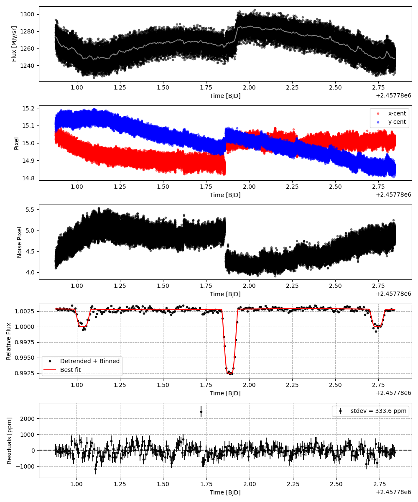

```
# target: kelt-14
# filter: IRAC 3.6um
# tmid: 2457781.887355 +- 0.000881
# emid: 2457781.033981 +- 0.000750
# transit_depth: 0.010452+-0.000039
# eclipse_depth: 0.002862 +- 0.000135
# nightside_amp: 0.002860 +- 0.000270
# hotspot_amp: 0.002918 +- 0.000135
# hotspot_lon[deg]: 87.800587 +- 63.369933
# hotspot_lat[deg]: 12.228739 +- 47.789616
time,flux,err,xcent,ycent,npp,phase,raw_flux,phasecurve
2457780.876578,0.996831,0.003682,15.045561,15.100228,4.168146,0.407951,1273.113046,1.002879
2457780.876601,1.000467,0.003679,15.061686,15.107300,4.197203,0.407964,1275.305294,1.002879
2457780.876624,0.994279,0.003692,15.045019,15.097121,4.245652,0.407977,1266.405857,1.002879
2457780.876647,0.998547,0.003689,15.024919,15.119120,4.364476,0.407991,1267.982587,1.002879
2457780.876709,0.992753,0.003703,15.042981,15.129546,4.408788,0.408027,1259.059560,1.002879

...
```

[timeseries.csv](timeseries.csv)

```python
import pandas as pd

df = pd.read_csv('timeseries.csv', comment='#')

# extract comments from the file
with open('timeseries.csv', 'r') as f:
    comments = [line for line in f if line.startswith('#')]

# clean and convert to a dictionary
comments_dict = dict()
for comment in comments:
    key, value = comment[1:].strip().split(': ')
    comments_dict[key] = value

# print the comments
print(comments_dict)
```





