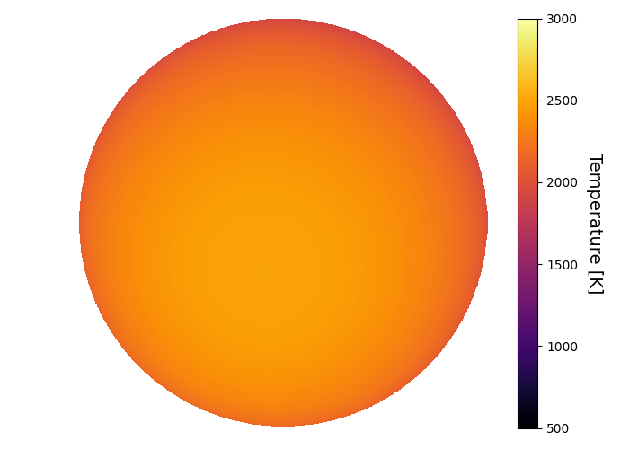
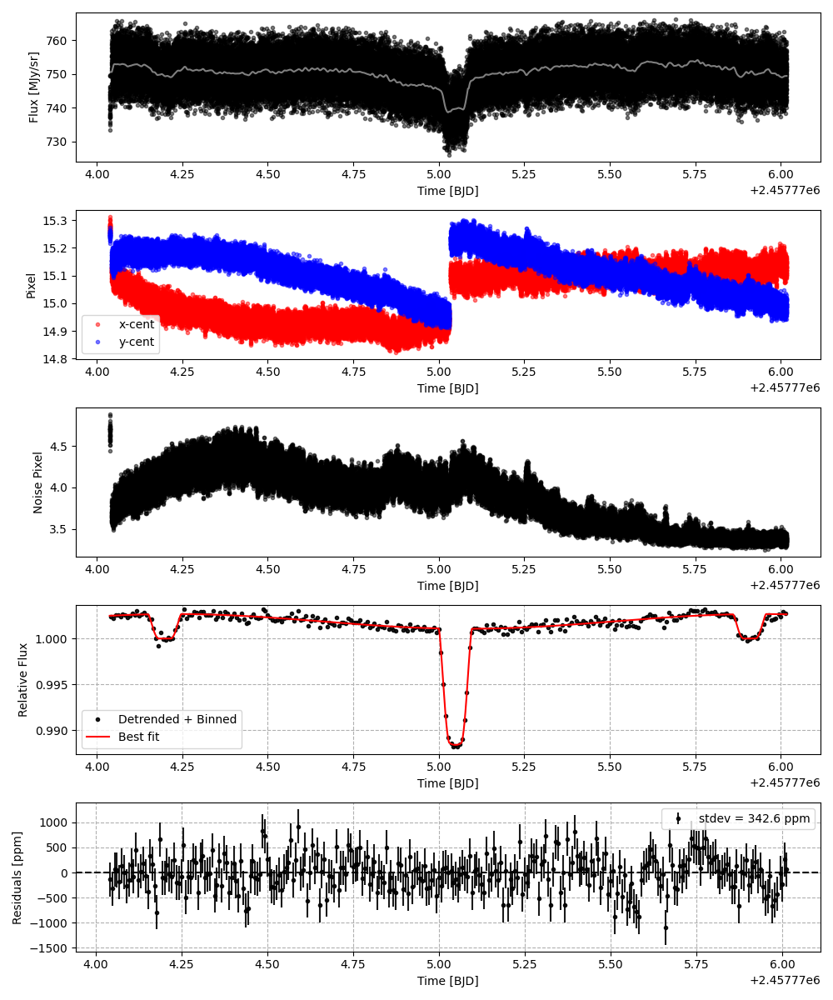
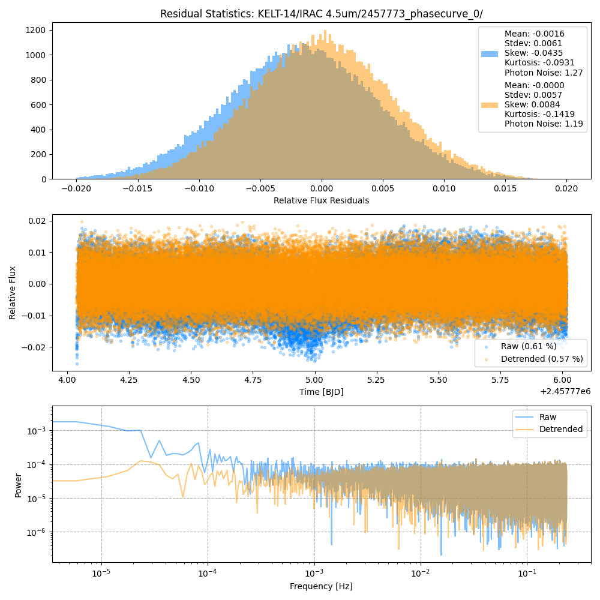
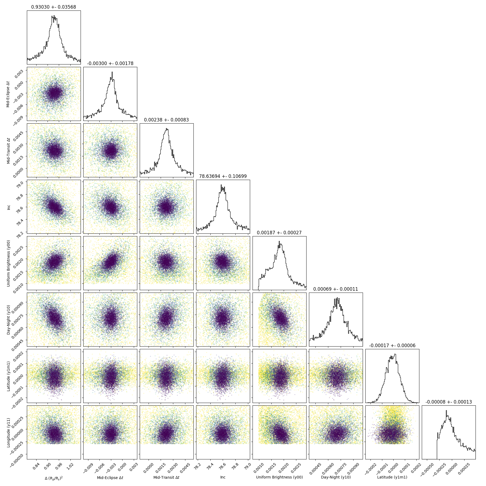
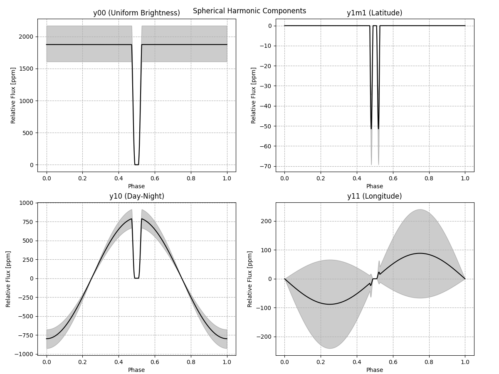
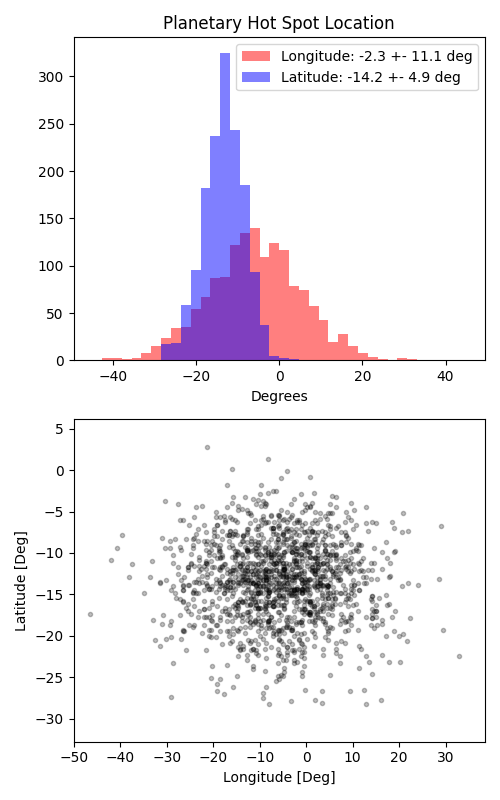

```
# target: kelt-14
# filter: IRAC 4.5um
# tmid: 2457775.048679 +- 0.000830
# emid: 2457774.198715 +- 0.001775
# transit_depth: 0.012762+-0.000102
# eclipse_depth: 0.002676 +- 0.000295
# nightside_amp: 0.001164 +- 0.000582
# hotspot_amp: 0.002675 +- 0.000295
# hotspot_lon[deg]: -5.806452 +- 11.073982
# hotspot_lat[deg]: -13.284457 +- 4.871341
time,flux,err,xcent,ycent,npp,phase,raw_flux,phasecurve
2457774.037622,0.997850,0.005182,15.301769,15.239202,4.868327,0.405795,738.096837,1.002489
2457774.037645,0.996313,0.005185,15.312426,15.243388,4.884387,0.405808,737.064864,1.002489
2457774.037668,0.998774,0.005179,15.271867,15.257799,4.733707,0.405822,738.884759,1.002489
2457774.037691,1.008439,0.005155,15.276457,15.264921,4.744533,0.405835,745.856857,1.002489
2457774.037714,1.004407,0.005165,15.278520,15.250648,4.708439,0.405848,742.805543,1.002489

...
```

[timeseries.csv](timeseries.csv)

```python
import pandas as pd

df = pd.read_csv('timeseries.csv', comment='#')

# extract comments from the file
with open('timeseries.csv', 'r') as f:
    comments = [line for line in f if line.startswith('#')]

# clean and convert to a dictionary
comments_dict = dict()
for comment in comments:
    key, value = comment[1:].strip().split(': ')
    comments_dict[key] = value

# print the comments
print(comments_dict)
```















