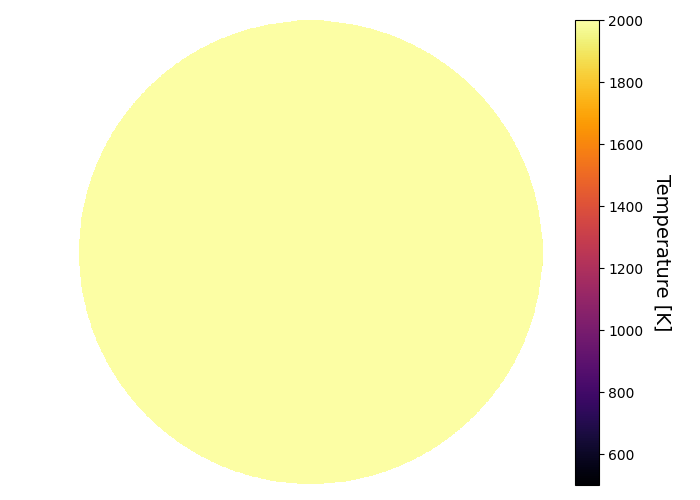
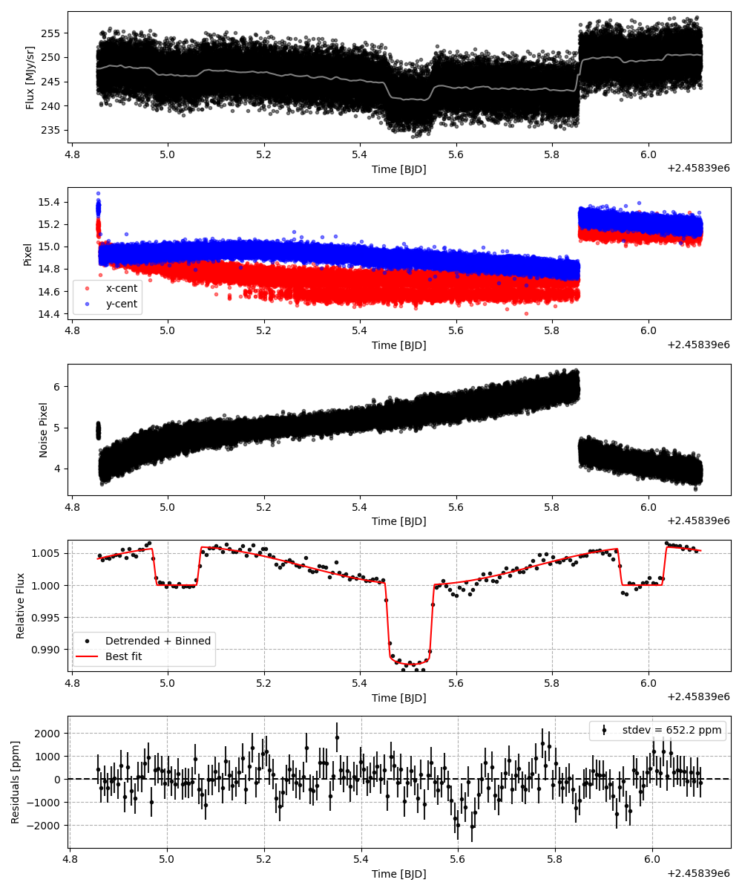
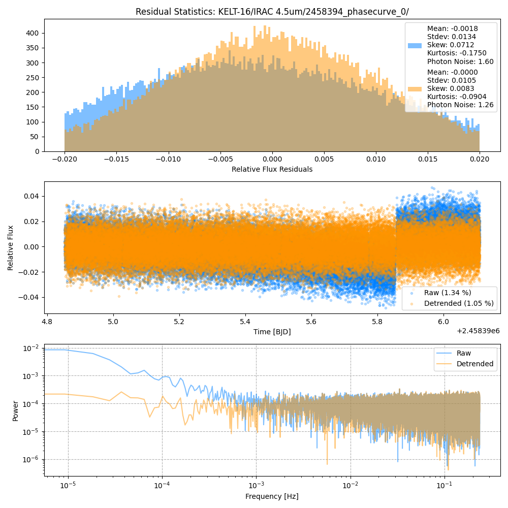
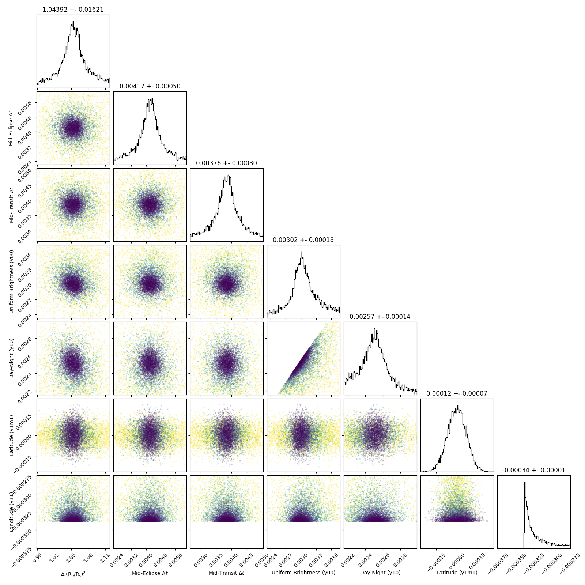
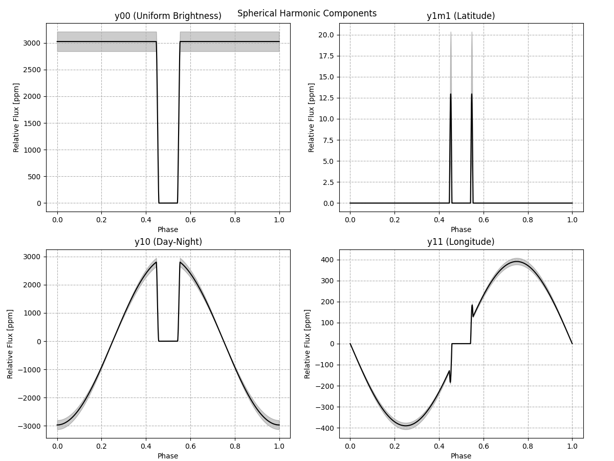
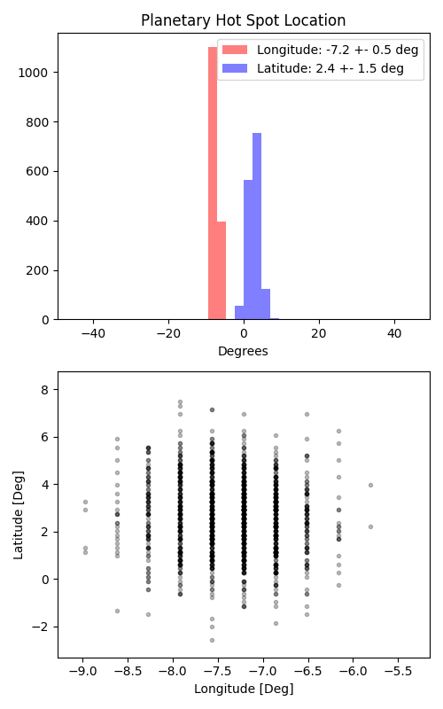

```
# target: kelt-16
# filter: IRAC 4.5um
# tmid: 2458395.507822 +- 0.000297
# emid: 2458395.018432 +- 0.000498
# transit_depth: 0.013168+-0.000097
# eclipse_depth: 0.005931 +- 0.000242
# nightside_amp: 0.000801 +- 0.000418
# hotspot_amp: 0.005929 +- 0.000242
# hotspot_lon[deg]: -7.214076 +- 0.516268
# hotspot_lat[deg]: 2.727273 +- 1.508189
time,flux,err,xcent,ycent,npp,phase,raw_flux,phasecurve
2458394.853564,1.015016,0.008898,15.203322,15.292352,4.835874,0.329853,250.314566,1.004109
2458394.853587,1.007309,0.008936,15.142869,15.336027,4.816268,0.329876,248.156755,1.004110
2458394.853609,1.001971,0.008957,15.194803,15.325065,4.893984,0.329900,247.002447,1.004110
2458394.853632,1.007218,0.008937,15.223122,15.314928,5.047184,0.329923,248.131432,1.004111
2458394.853678,0.998970,0.008970,15.220792,15.355269,4.827002,0.329970,246.295254,1.004111

...
```

[timeseries.csv](timeseries.csv)

```python
import pandas as pd

df = pd.read_csv('timeseries.csv', comment='#')

# extract comments from the file
with open('timeseries.csv', 'r') as f:
    comments = [line for line in f if line.startswith('#')]

# clean and convert to a dictionary
comments_dict = dict()
for comment in comments:
    key, value = comment[1:].strip().split(': ')
    comments_dict[key] = value

# print the comments
print(comments_dict)
```















