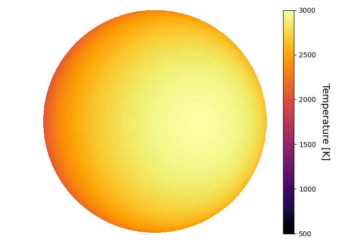
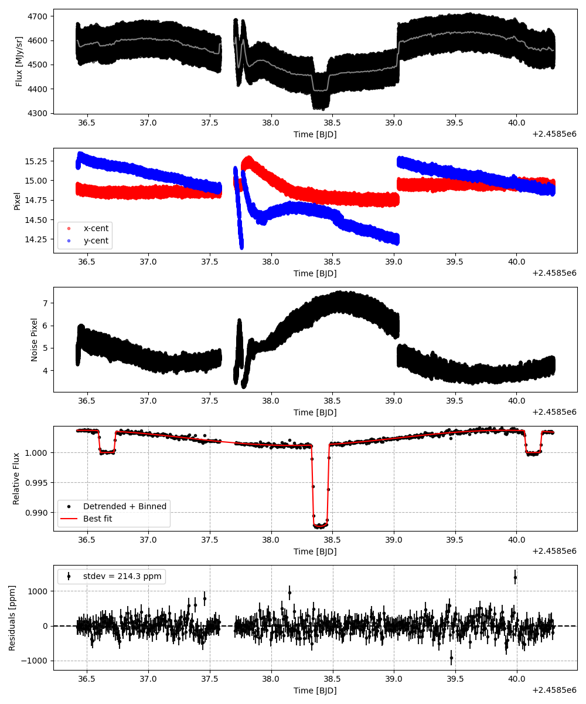
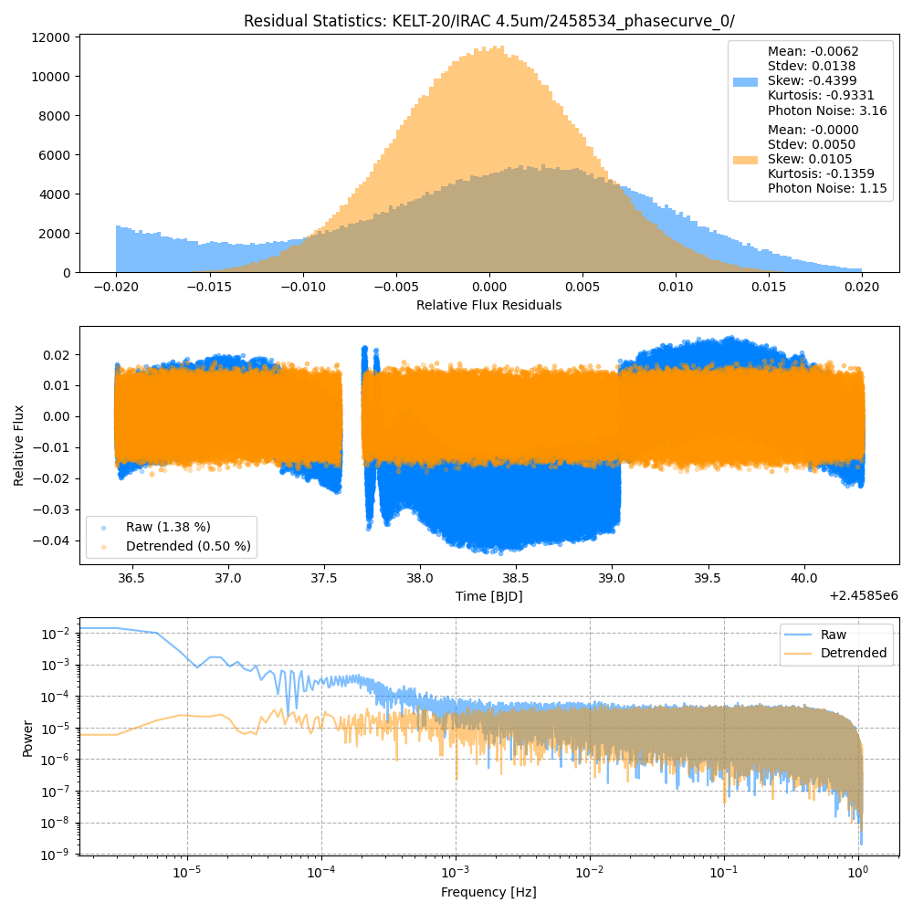
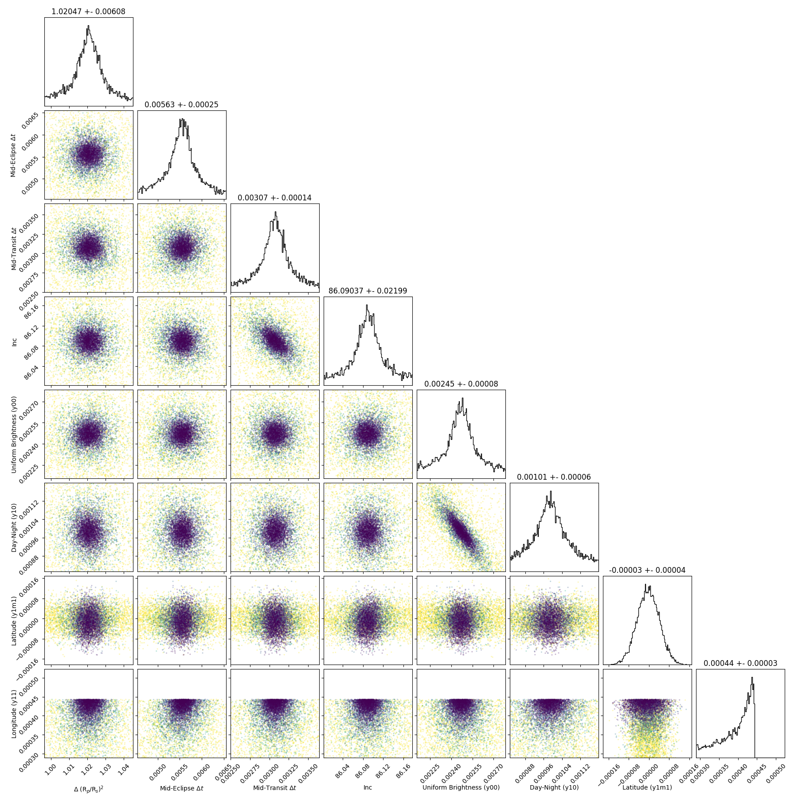
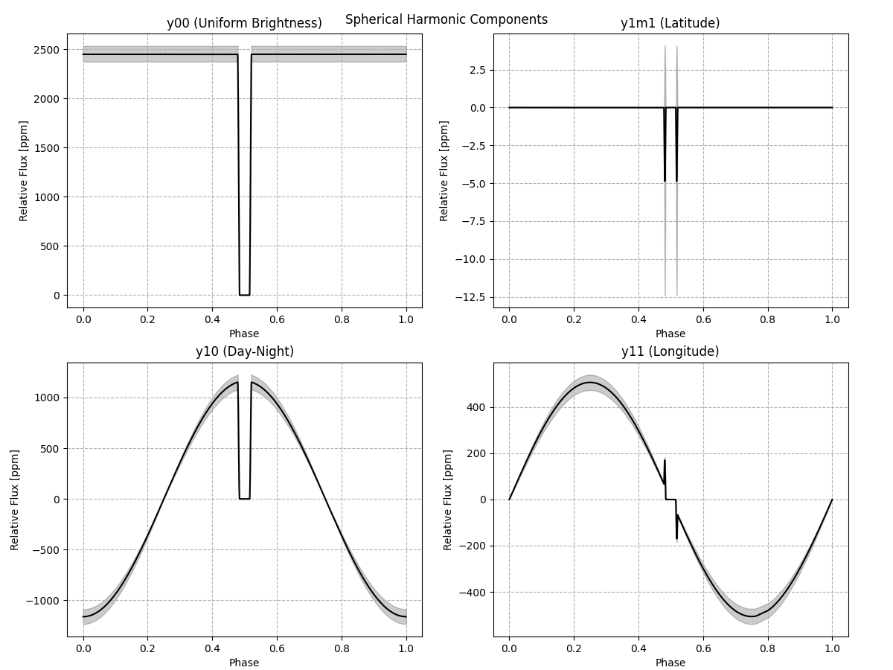
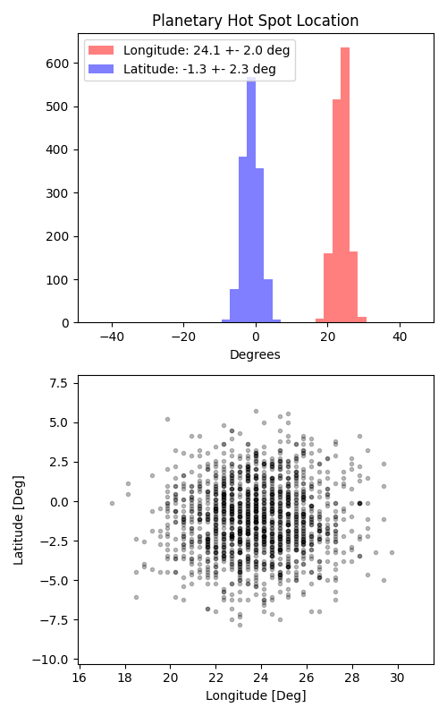

```
# target: kelt-20
# filter: IRAC 4.5um
# tmid: 2458538.396538 +- 0.000143
# emid: 2458536.661714 +- 0.000252
# transit_depth: 0.013764+-0.000041
# eclipse_depth: 0.003681 +- 0.000105
# nightside_amp: 0.001393 +- 0.000149
# hotspot_amp: 0.003718 +- 0.000105
# hotspot_lon[deg]: 23.753666 +- 1.959275
# hotspot_lat[deg]: -1.143695 +- 2.288699
time,flux,err,xcent,ycent,npp,phase,raw_flux,phasecurve
2458536.418340,0.999332,0.004663,14.866848,15.226771,5.076759,0.429950,4558.316962,1.003717
2458536.418340,0.999298,0.004663,14.866848,15.226771,5.076759,0.429950,4558.316962,1.003717
2458536.418344,1.008863,0.004640,14.871367,15.204067,5.067831,0.429951,4602.348661,1.003717
2458536.418344,1.008864,0.004640,14.871367,15.204067,5.067831,0.429951,4602.348661,1.003717
2458536.418349,1.006246,0.004636,14.860861,15.198589,5.007018,0.429952,4609.672960,1.003717

...
```

[timeseries.csv](timeseries.csv)

```python
import pandas as pd

df = pd.read_csv('timeseries.csv', comment='#')

# extract comments from the file
with open('timeseries.csv', 'r') as f:
    comments = [line for line in f if line.startswith('#')]

# clean and convert to a dictionary
comments_dict = dict()
for comment in comments:
    key, value = comment[1:].strip().split(': ')
    comments_dict[key] = value

# print the comments
print(comments_dict)
```















