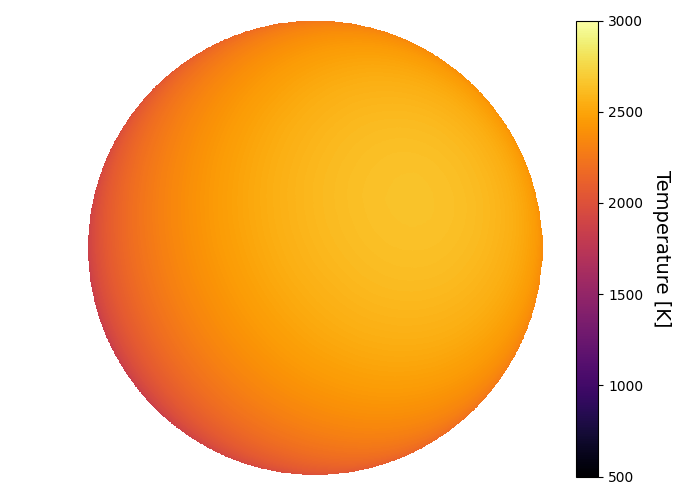
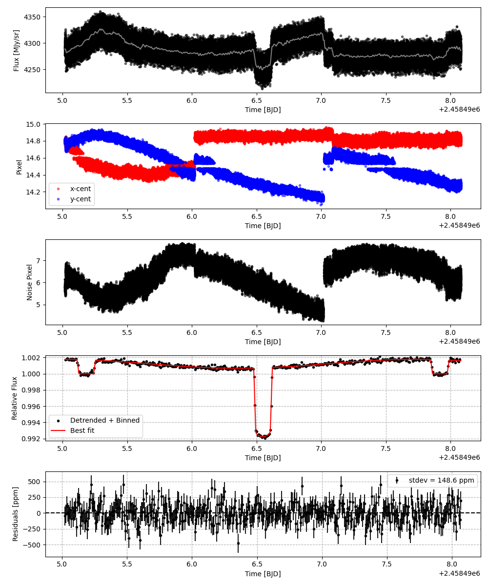
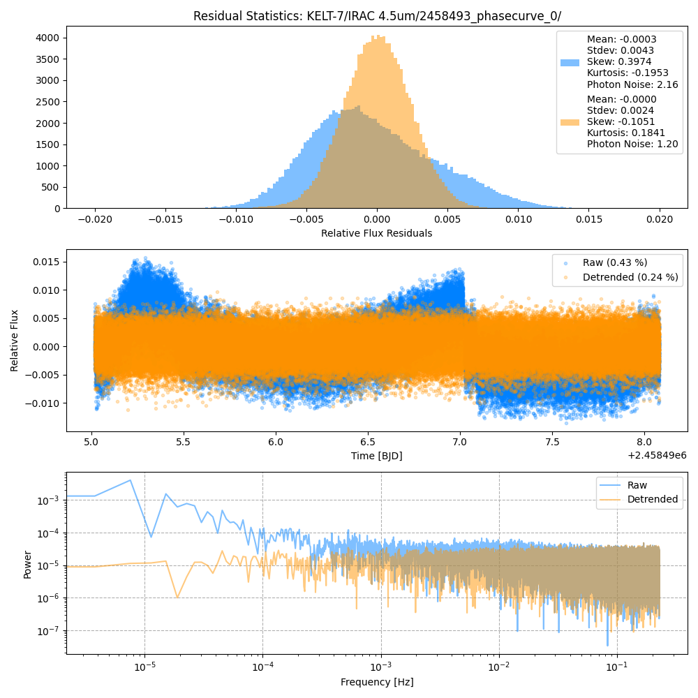
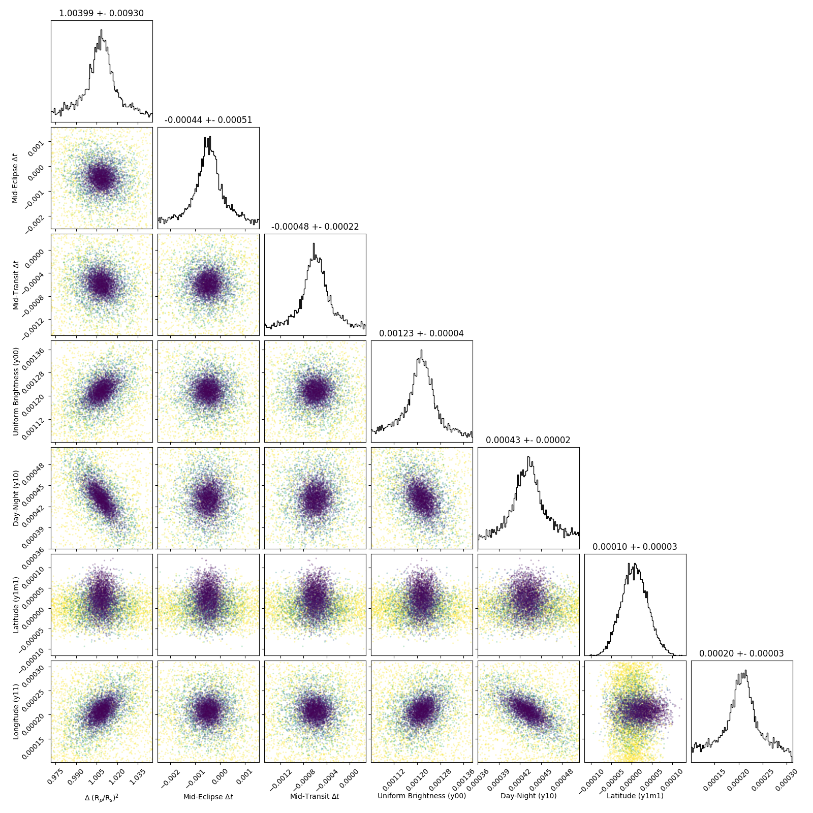
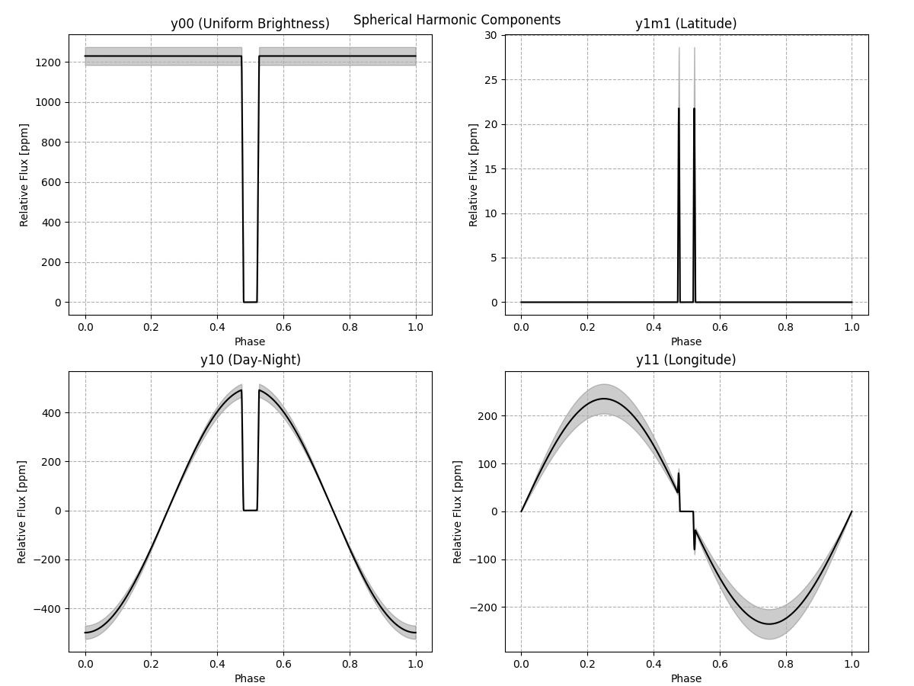
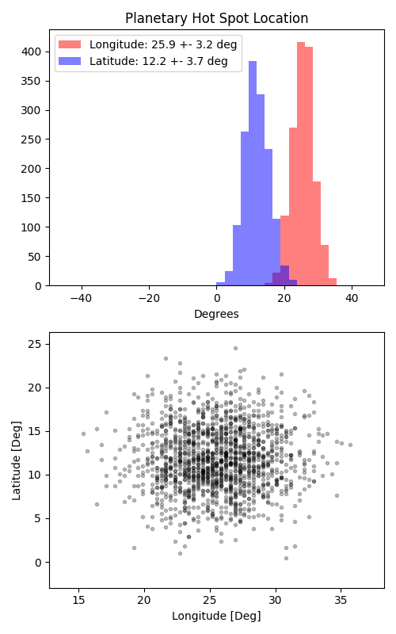

```
# target: kelt-7
# filter: IRAC 4.5um
# tmid: 2458496.547013 +- 0.000222
# emid: 2458495.182355 +- 0.000512
# transit_depth: 0.008530+-0.000019
# eclipse_depth: 0.001767 +- 0.000052
# nightside_amp: 0.000794 +- 0.000070
# hotspot_amp: 0.001781 +- 0.000052
# hotspot_lon[deg]: 25.513196 +- 3.194880
# hotspot_lat[deg]: 11.700880 +- 3.666649
time,flux,err,xcent,ycent,npp,phase,raw_flux,phasecurve
2458495.018440,1.003913,0.002146,14.807066,14.779802,5.920195,0.440061,4303.044113,1.001780
2458495.018463,1.000061,0.002150,14.799914,14.783634,5.854841,0.440069,4288.061949,1.001780
2458495.018486,1.001798,0.002149,14.788364,14.776530,5.998543,0.440078,4292.127418,1.001780
2458495.018508,0.998770,0.002153,14.778058,14.768502,6.148328,0.440086,4276.831138,1.001780
2458495.018531,1.002096,0.002149,14.773272,14.776912,6.134258,0.440094,4290.583988,1.001780

...
```

[timeseries.csv](timeseries.csv)

```python
import pandas as pd

df = pd.read_csv('timeseries.csv', comment='#')

# extract comments from the file
with open('timeseries.csv', 'r') as f:
    comments = [line for line in f if line.startswith('#')]

# clean and convert to a dictionary
comments_dict = dict()
for comment in comments:
    key, value = comment[1:].strip().split(': ')
    comments_dict[key] = value

# print the comments
print(comments_dict)
```















