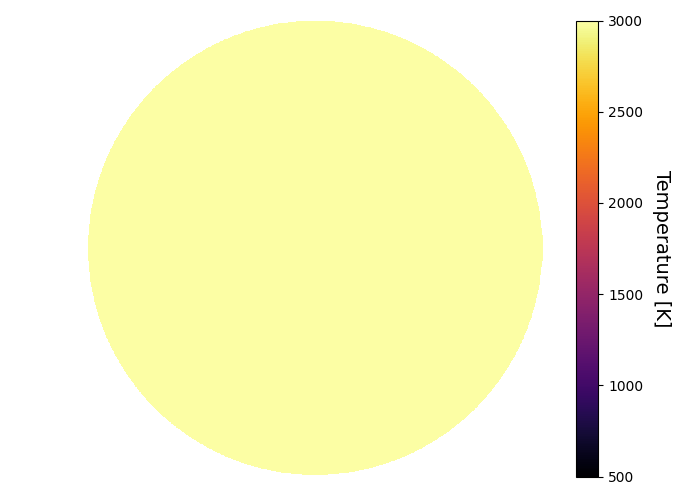
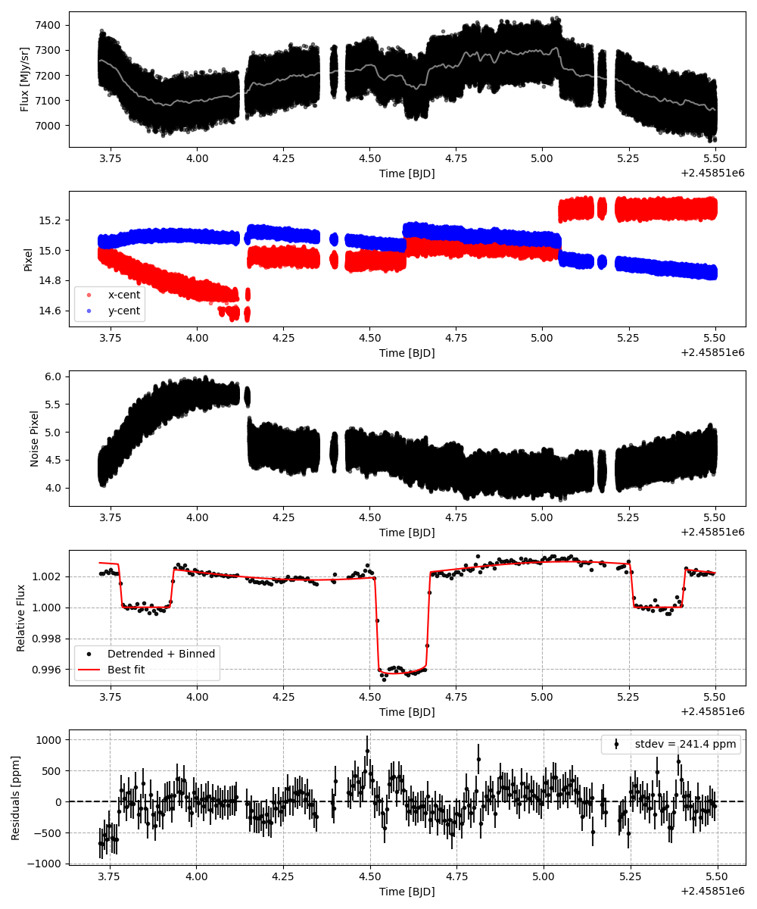
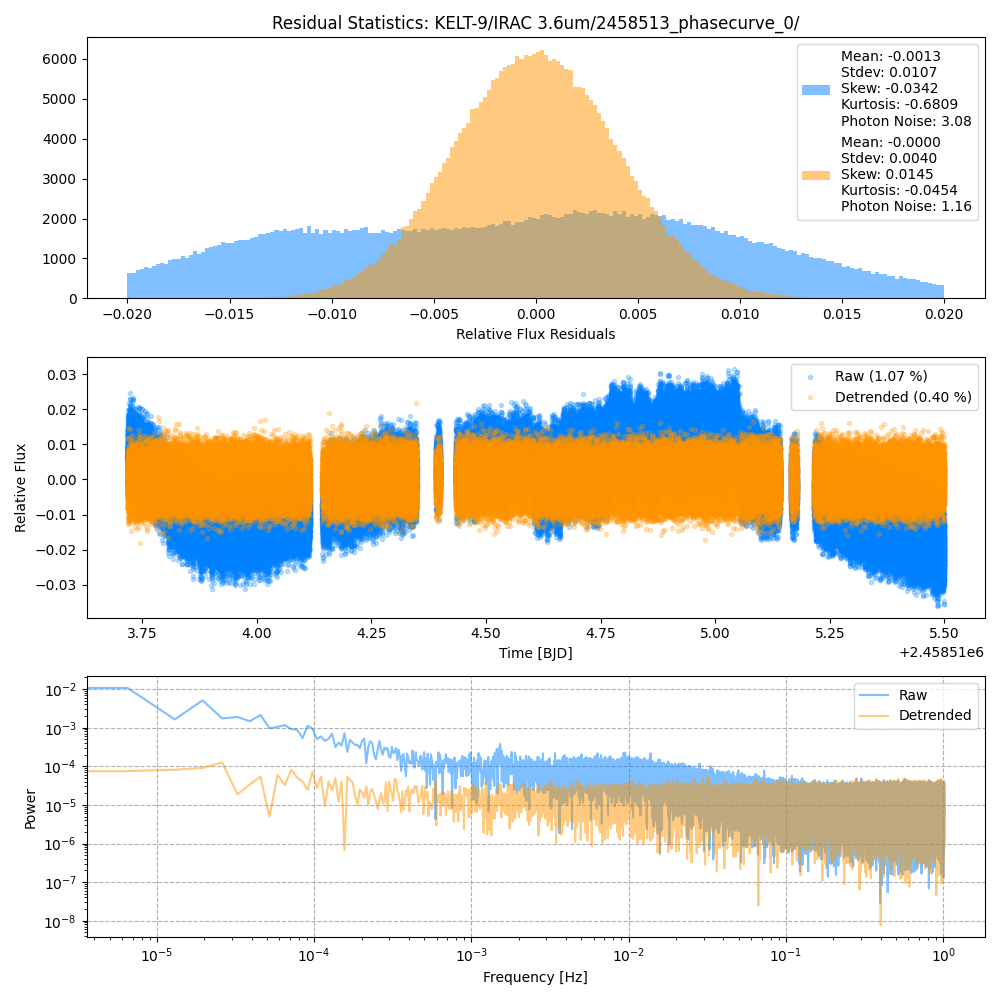
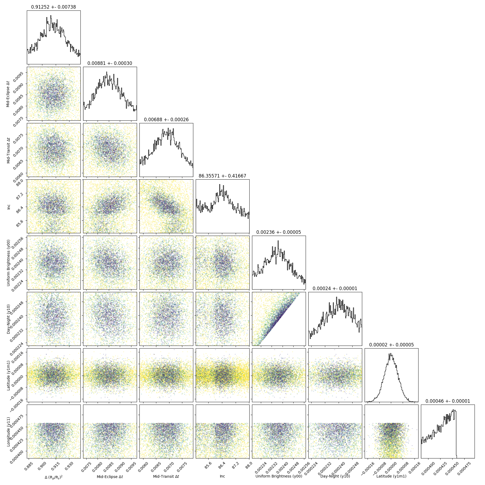
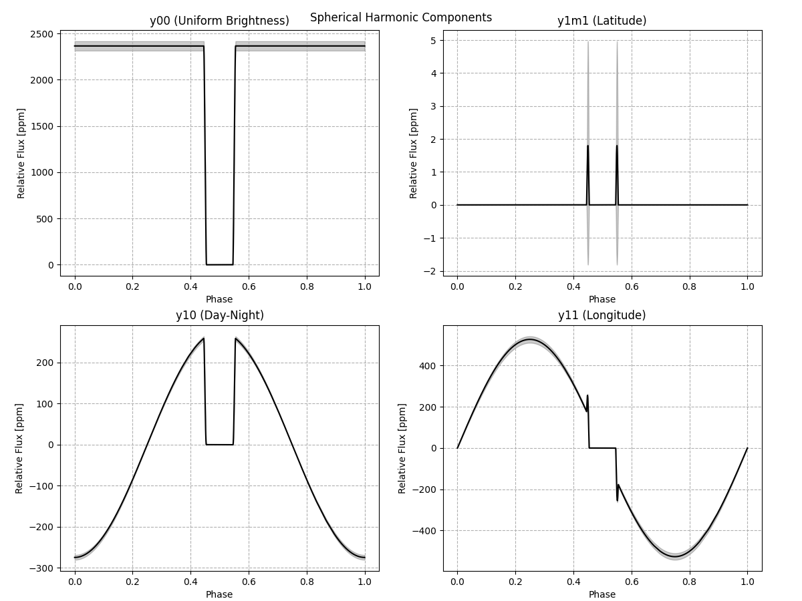
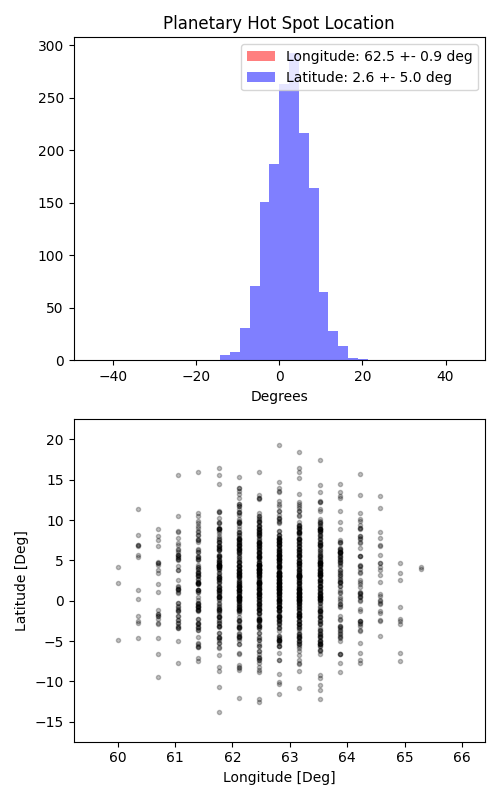

```
# target: kelt-9
# filter: IRAC 3.6um
# tmid: 2458514.569173 +- 0.000256
# emid: 2458513.852661 +- 0.000302
# transit_depth: 0.006223+-0.000017
# eclipse_depth: 0.002823 +- 0.000052
# nightside_amp: 0.001928 +- 0.000067
# hotspot_amp: 0.002959 +- 0.000052
# hotspot_lon[deg]: 62.815249 +- 0.896350
# hotspot_lat[deg]: 2.551320 +- 5.004376
time,flux,err,xcent,ycent,npp,phase,raw_flux,phasecurve
2458513.718455,0.998847,0.003451,14.984958,15.055829,4.273439,0.409386,7247.083870,1.002880
2458513.718460,1.002837,0.003446,14.979407,15.061485,4.319950,0.409389,7266.902784,1.002880
2458513.718464,0.994664,0.003462,14.977336,15.046886,4.371350,0.409392,7200.369791,1.002880
2458513.718469,1.001732,0.003451,14.977966,15.060207,4.358715,0.409395,7247.757667,1.002880
2458513.718473,1.007809,0.003438,14.973671,15.056713,4.293490,0.409398,7302.443249,1.002880

...
```

[timeseries.csv](timeseries.csv)

```python
import pandas as pd

df = pd.read_csv('timeseries.csv', comment='#')

# extract comments from the file
with open('timeseries.csv', 'r') as f:
    comments = [line for line in f if line.startswith('#')]

# clean and convert to a dictionary
comments_dict = dict()
for comment in comments:
    key, value = comment[1:].strip().split(': ')
    comments_dict[key] = value

# print the comments
print(comments_dict)
```















