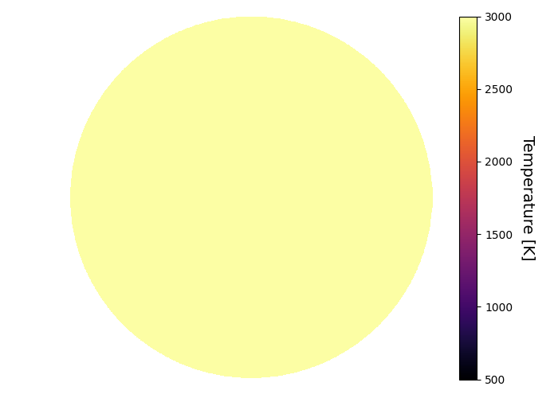
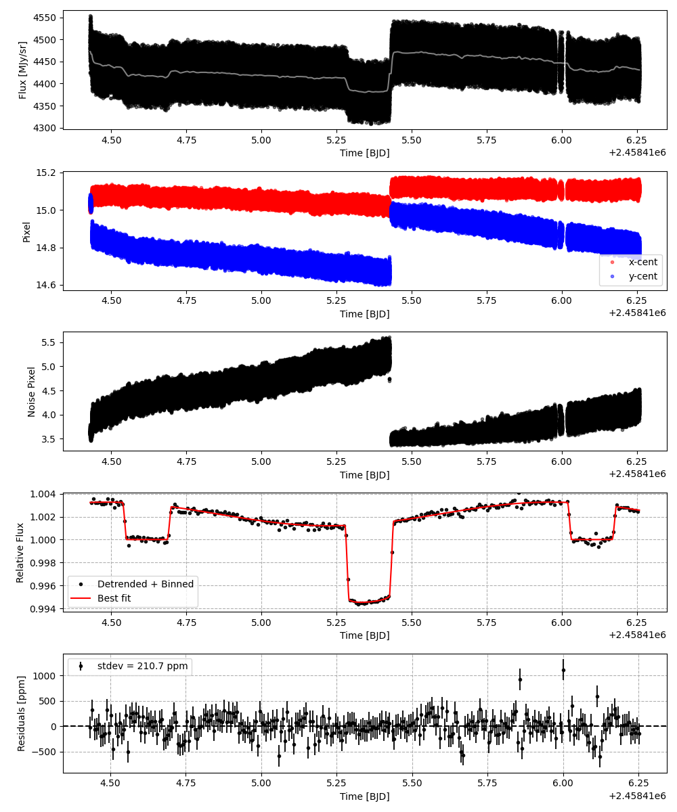
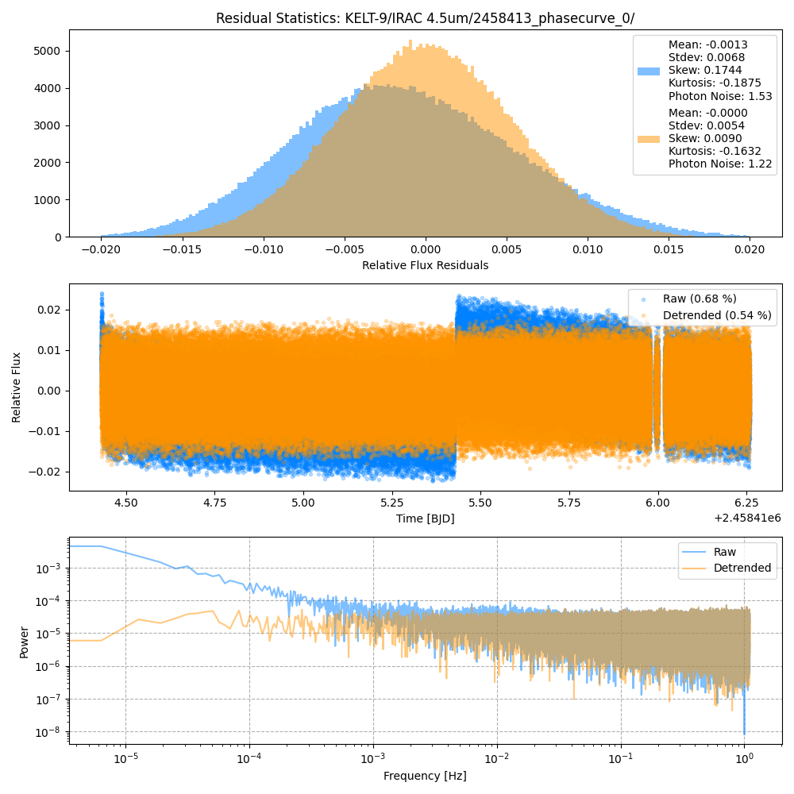
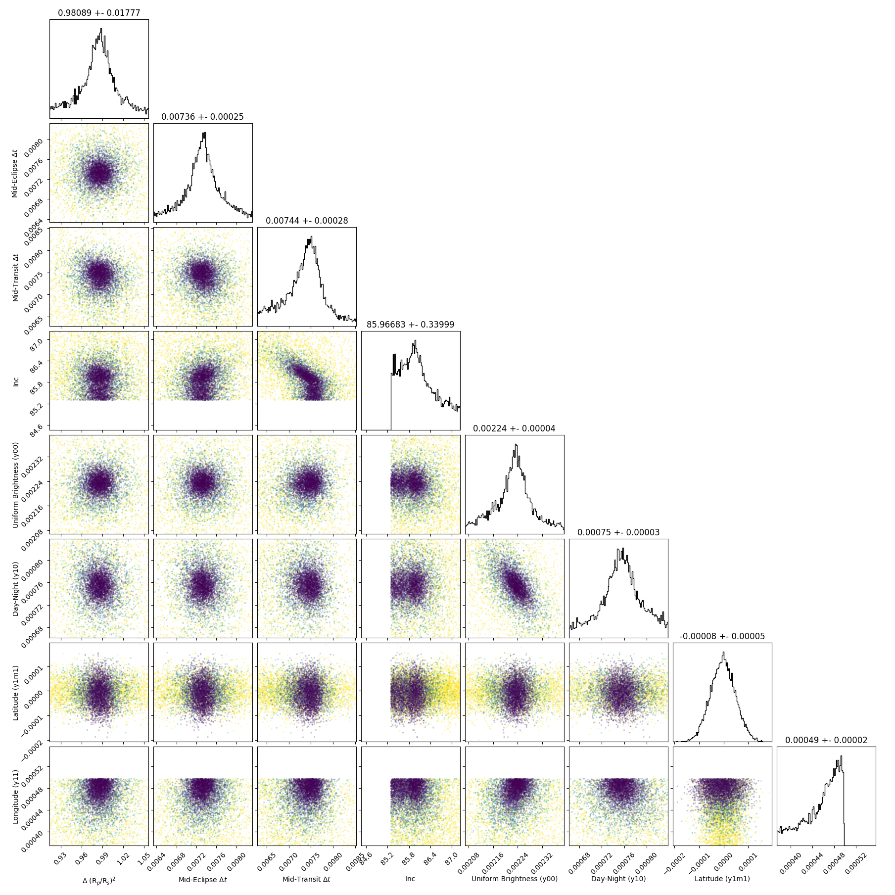
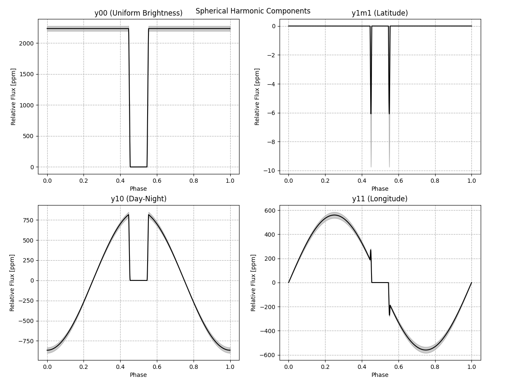
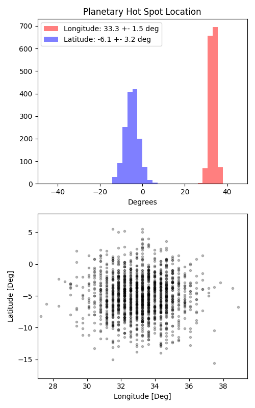

```
# target: kelt-9
# filter: IRAC 4.5um
# tmid: 2458415.332517 +- 0.000278
# emid: 2458414.618836 +- 0.000248
# transit_depth: 0.006694+-0.000020
# eclipse_depth: 0.003250 +- 0.000053
# nightside_amp: 0.001229 +- 0.000072
# hotspot_amp: 0.003266 +- 0.000053
# hotspot_lon[deg]: 33.255132 +- 1.540506
# hotspot_lat[deg]: -5.014663 +- 3.237995
time,flux,err,xcent,ycent,npp,phase,raw_flux,phasecurve
2458414.430043,1.002775,0.004701,15.027597,15.023751,3.589204,0.372536,4484.213033,1.003240
2458414.430048,0.998614,0.004708,15.032005,15.026622,3.582145,0.372539,4470.259181,1.003240
2458414.430052,1.002706,0.004702,15.012820,15.032468,3.589142,0.372542,4481.570723,1.003240
2458414.430057,1.010426,0.004681,15.032971,15.030944,3.654555,0.372545,4521.856849,1.003240
2458414.430061,0.994299,0.004717,15.027961,15.028342,3.651113,0.372548,4453.021207,1.003240

...
```

[timeseries.csv](timeseries.csv)

```python
import pandas as pd

df = pd.read_csv('timeseries.csv', comment='#')

# extract comments from the file
with open('timeseries.csv', 'r') as f:
    comments = [line for line in f if line.startswith('#')]

# clean and convert to a dictionary
comments_dict = dict()
for comment in comments:
    key, value = comment[1:].strip().split(': ')
    comments_dict[key] = value

# print the comments
print(comments_dict)
```















