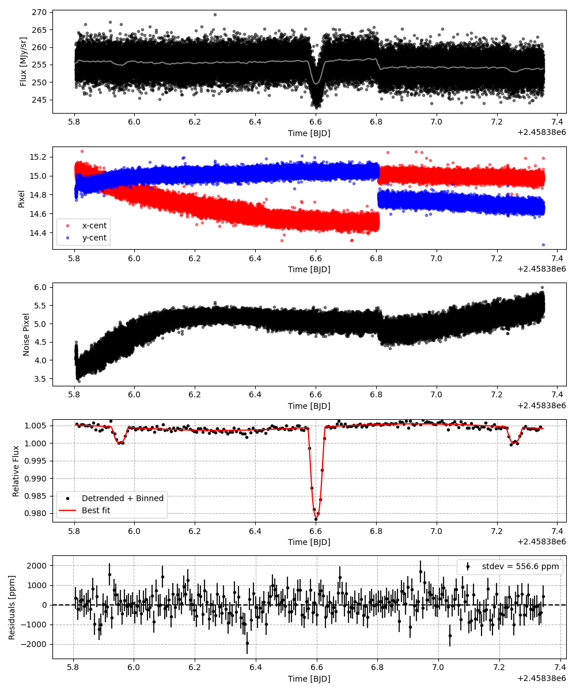
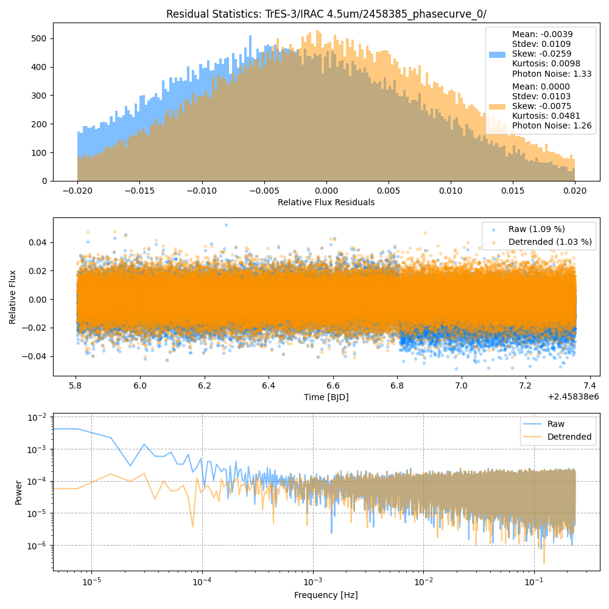
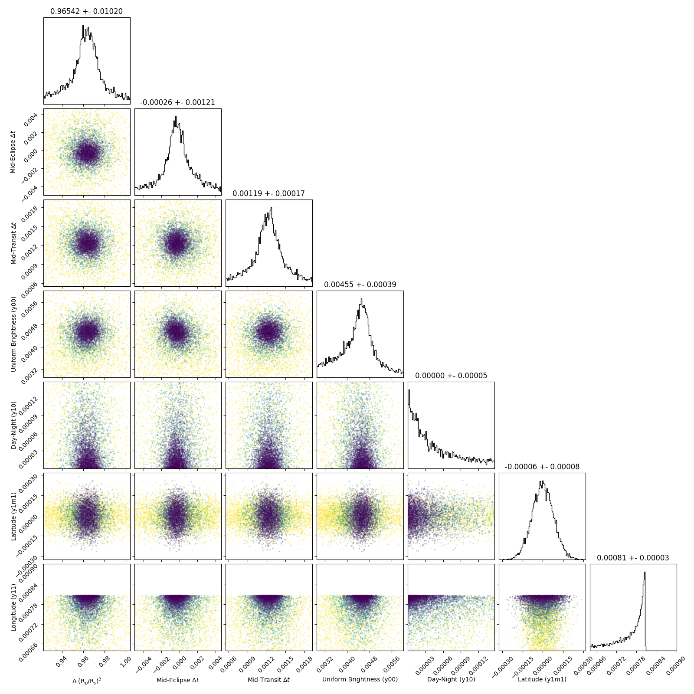
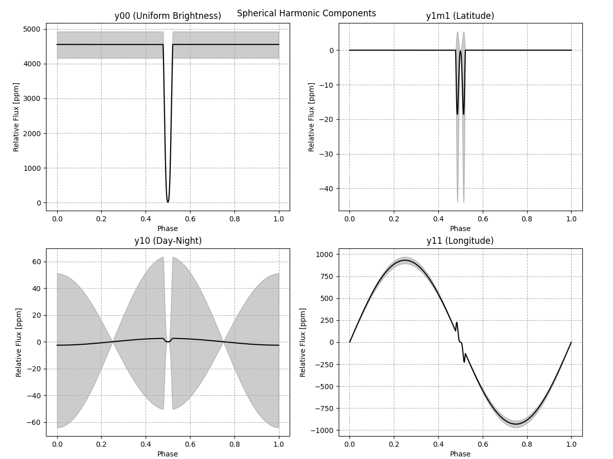
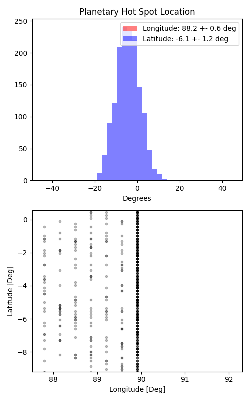

```
# target: tres-3
# filter: IRAC 4.5um
# tmid: 2458386.602624 +- 0.000172
# emid: 2458385.951177 +- 0.001211
# transit_depth: 0.026141+-0.000064
# eclipse_depth: 0.004964 +- 0.000388
# nightside_amp: 0.004968 +- 0.000589
# hotspot_amp: 0.005485 +- 0.000388
# hotspot_lon[deg]: 89.912023 +- 0.598125
# hotspot_lat[deg]: -4.310850 +- 1.221857
time,flux,err,xcent,ycent,npp,phase,raw_flux,phasecurve
2458385.805615,1.000921,0.008841,15.101559,14.869704,4.070171,0.388591,253.559291,1.005156
2458385.805638,1.010204,0.008801,15.100936,14.857752,4.056934,0.388608,255.838460,1.005156
2458385.805660,1.030338,0.008719,15.068903,14.855324,4.016630,0.388626,260.688295,1.005156
2458385.805706,0.996061,0.008859,15.060859,14.804083,4.049891,0.388660,252.479270,1.005156
2458385.805729,0.986034,0.008908,15.067436,14.897605,3.942842,0.388678,249.759741,1.005156

...
```

[timeseries.csv](timeseries.csv)

```python
import pandas as pd

df = pd.read_csv('timeseries.csv', comment='#')

# extract comments from the file
with open('timeseries.csv', 'r') as f:
    comments = [line for line in f if line.startswith('#')]

# clean and convert to a dictionary
comments_dict = dict()
for comment in comments:
    key, value = comment[1:].strip().split(': ')
    comments_dict[key] = value

# print the comments
print(comments_dict)
```













