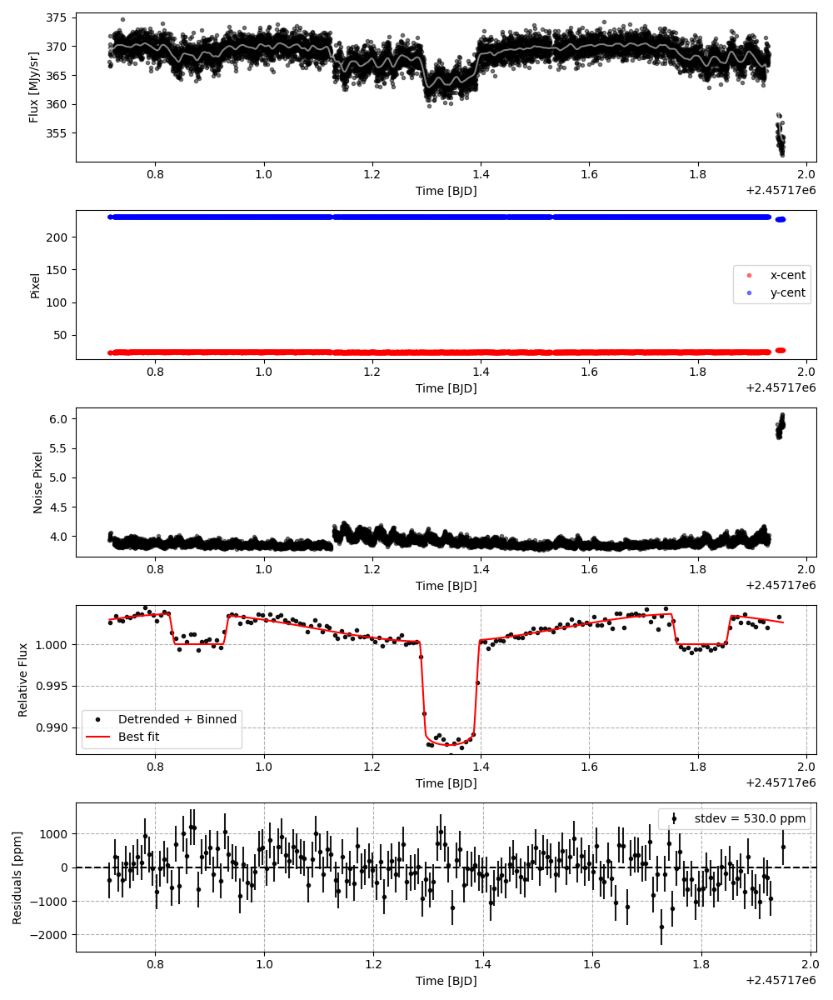
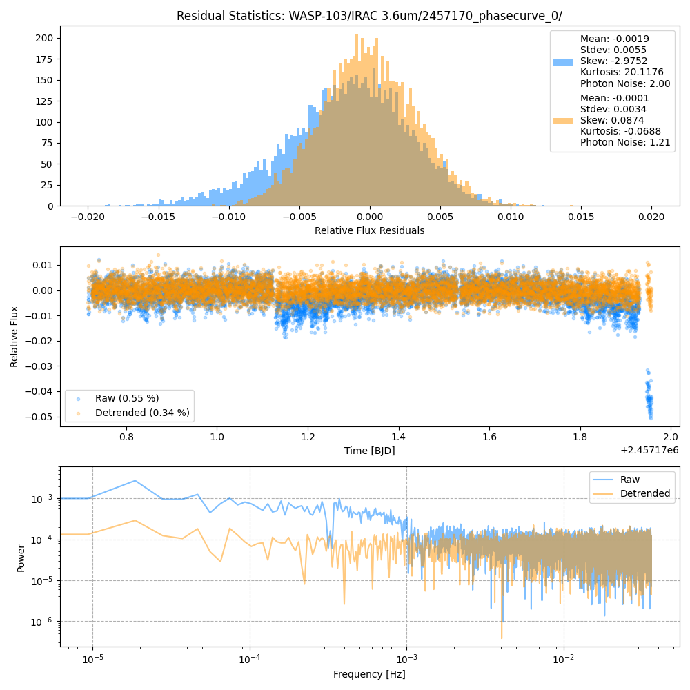
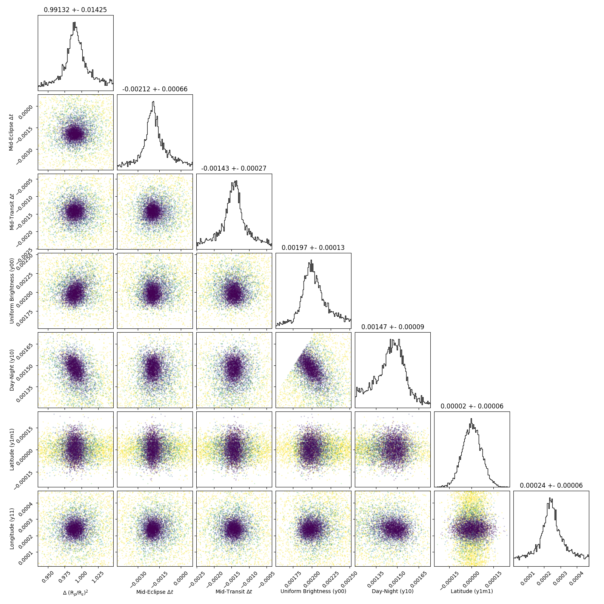
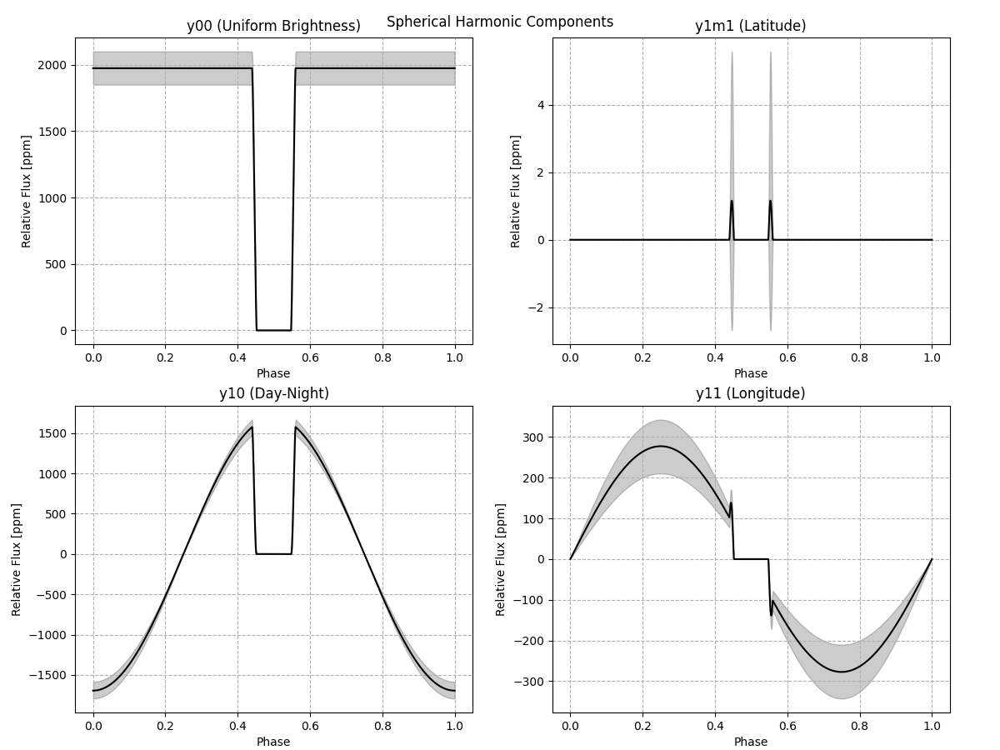
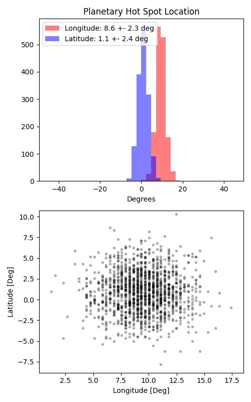

```
# target: wasp-103
# filter: IRAC 3.6um
# tmid: 2457171.340154 +- 0.000271
# emid: 2457170.880752 +- 0.000655
# transit_depth: 0.012936+-0.000063
# eclipse_depth: 0.003635 +- 0.000159
# nightside_amp: 0.000783 +- 0.000292
# hotspot_amp: 0.003635 +- 0.000159
# hotspot_lon[deg]: 9.325513 +- 2.301419
# hotspot_lat[deg]: 0.967742 +- 2.448668
time,flux,err,xcent,ycent,npp,phase,raw_flux,phasecurve
2457170.715838,0.998167,0.002781,23.091107,231.063455,3.940172,0.321857,367.360422,1.002963
2457170.715986,1.003069,0.002776,23.085973,231.084062,4.042857,0.322017,368.689372,1.002964
2457170.716138,0.996531,0.002782,23.099541,231.088413,4.001610,0.322182,366.592577,1.002966
2457170.716592,0.996116,0.002784,23.109948,231.076500,3.946057,0.322672,366.586005,1.002970
2457170.716745,1.008130,0.002769,23.090082,231.059571,3.957845,0.322837,370.355966,1.002971

...
```

[timeseries.csv](timeseries.csv)

```python
import pandas as pd

df = pd.read_csv('timeseries.csv', comment='#')

# extract comments from the file
with open('timeseries.csv', 'r') as f:
    comments = [line for line in f if line.startswith('#')]

# clean and convert to a dictionary
comments_dict = dict()
for comment in comments:
    key, value = comment[1:].strip().split(': ')
    comments_dict[key] = value

# print the comments
print(comments_dict)
```













