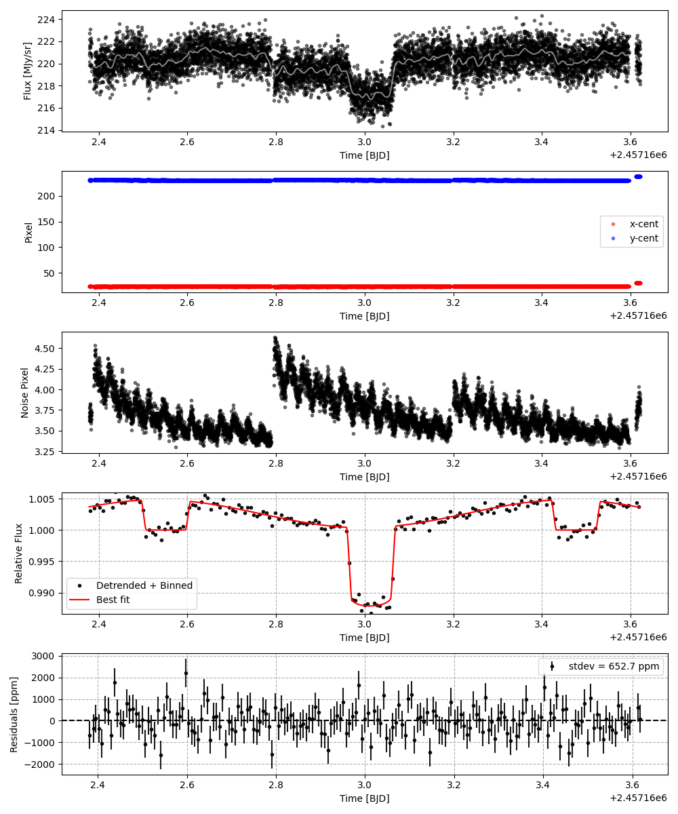
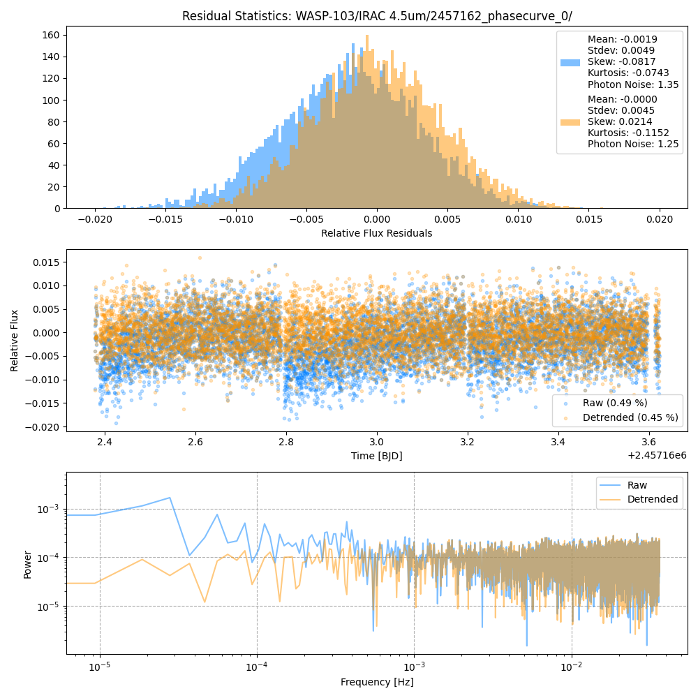
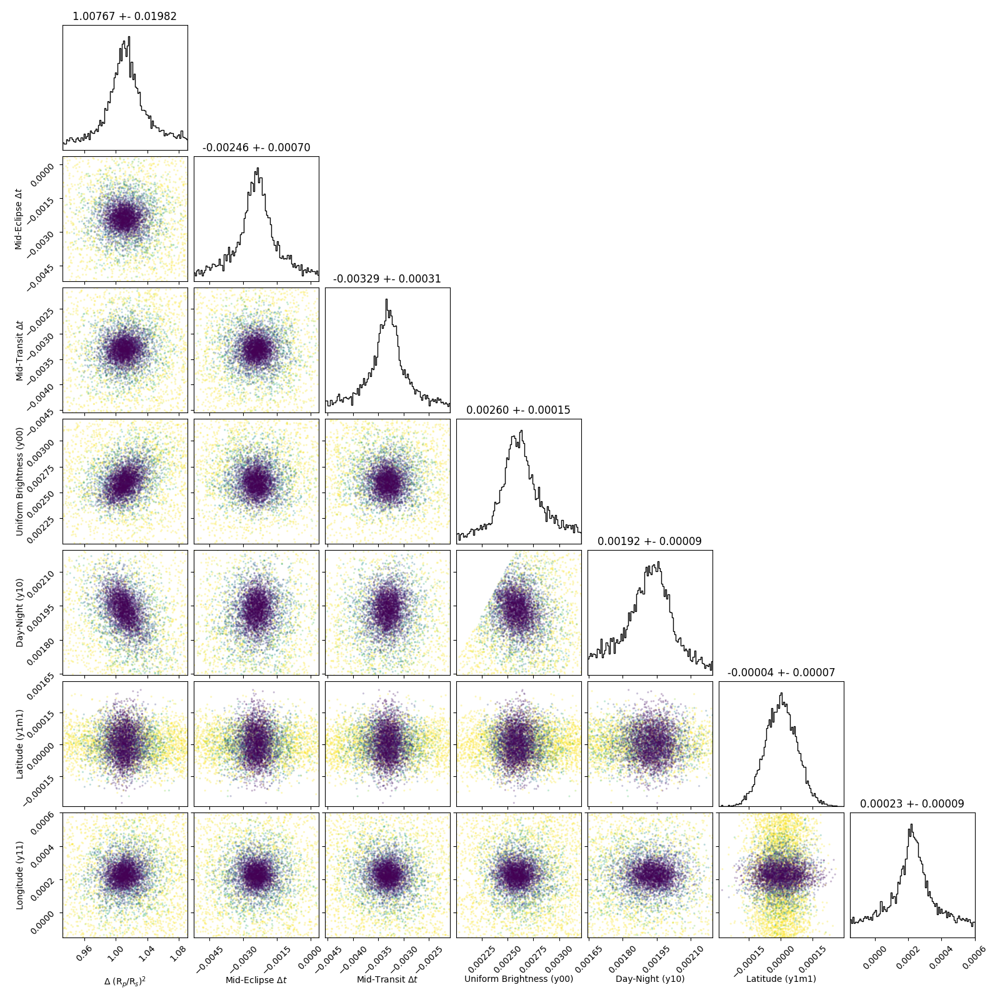
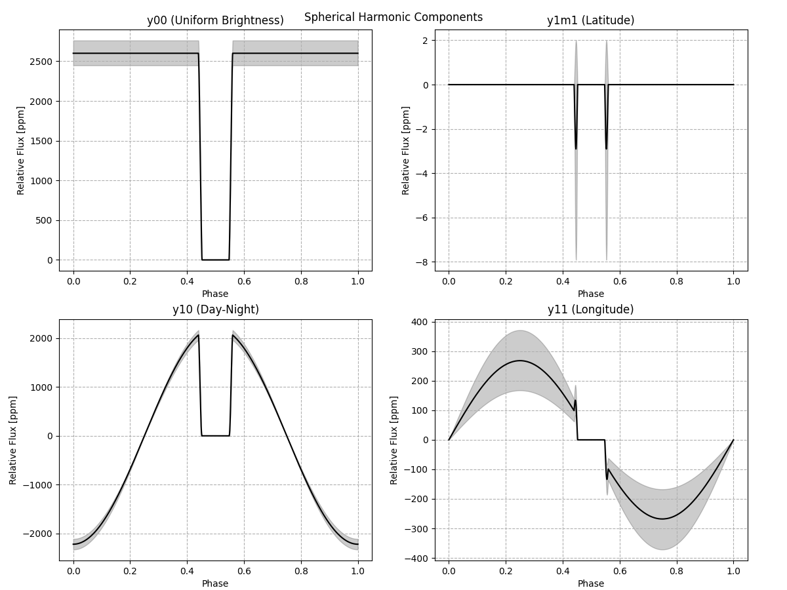
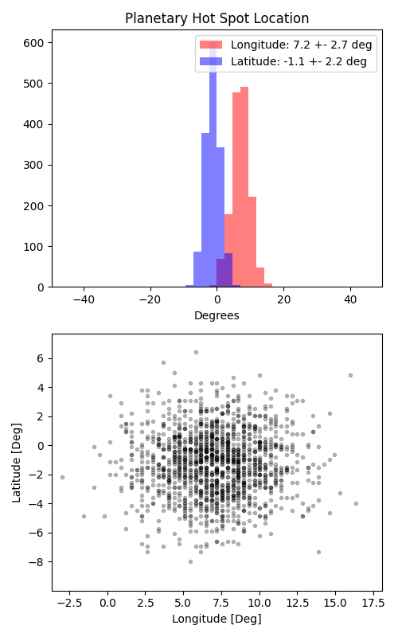

```
# target: wasp-103
# filter: IRAC 4.5um
# tmid: 2457163.011465 +- 0.000309
# emid: 2457162.551163 +- 0.000697
# transit_depth: 0.013129+-0.000073
# eclipse_depth: 0.004737 +- 0.000193
# nightside_amp: 0.000995 +- 0.000212
# hotspot_amp: 0.004737 +- 0.000193
# hotspot_lon[deg]: 7.214076 +- 2.719798
# hotspot_lat[deg]: -1.143695 +- 2.212845
time,flux,err,xcent,ycent,npp,phase,raw_flux,phasecurve
2457162.378381,0.991425,0.003864,23.052742,231.143261,3.619386,0.313299,218.395609,1.003707
2457162.378529,0.999717,0.003849,23.059610,231.154807,3.660745,0.313459,220.160626,1.003709
2457162.378677,1.006550,0.003836,23.041631,231.145246,3.765731,0.313619,221.628269,1.003711
2457162.378830,1.002601,0.003843,23.049731,231.135136,3.672781,0.313784,220.772008,1.003713
2457162.378983,0.998375,0.003850,23.045928,231.111210,3.681580,0.313949,219.872575,1.003715

...
```

[timeseries.csv](timeseries.csv)

```python
import pandas as pd

df = pd.read_csv('timeseries.csv', comment='#')

# extract comments from the file
with open('timeseries.csv', 'r') as f:
    comments = [line for line in f if line.startswith('#')]

# clean and convert to a dictionary
comments_dict = dict()
for comment in comments:
    key, value = comment[1:].strip().split(': ')
    comments_dict[key] = value

# print the comments
print(comments_dict)
```













