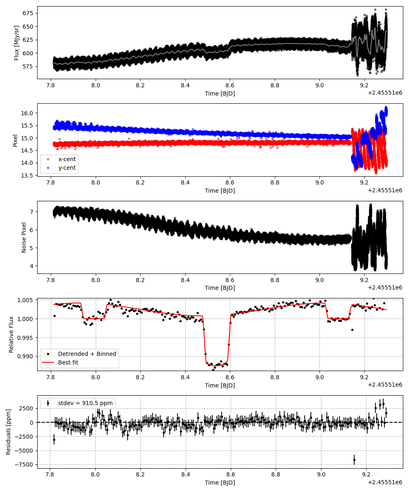
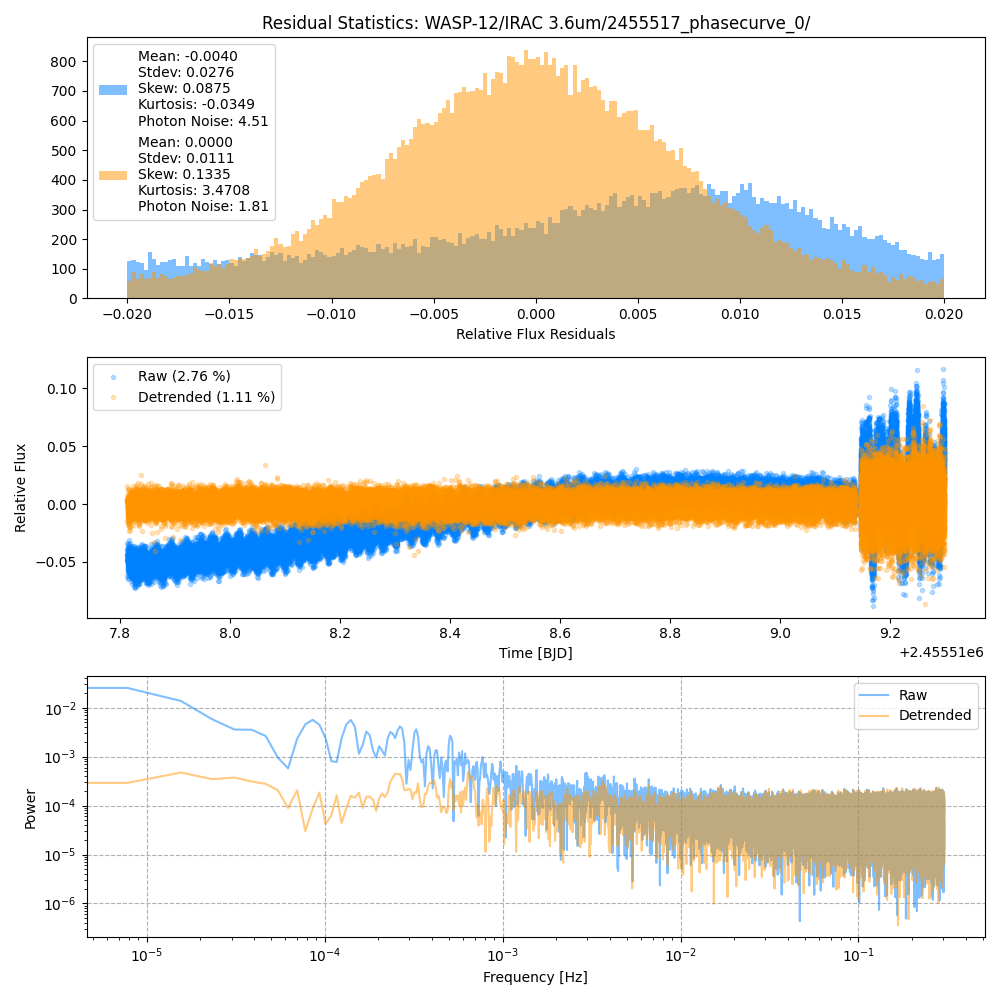
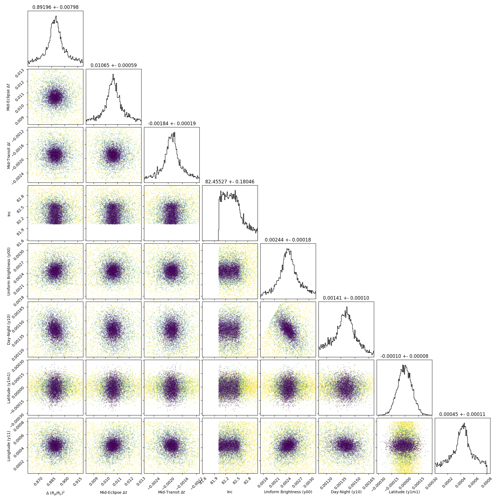
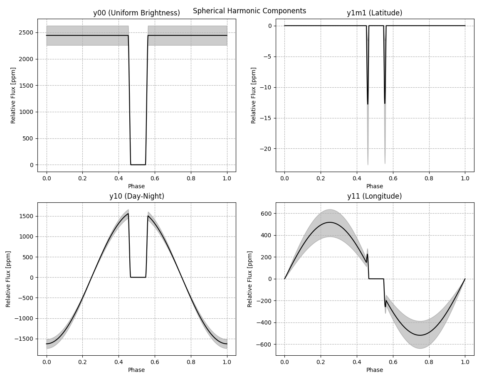
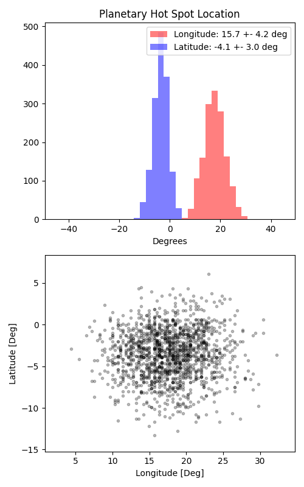

```
# target: wasp-12
# filter: <_io.TextIOWrapper name='DATA/WASP-12/IRAC 3.6um/2456638_phasecurve_0/timeseries.csv' mode='w' encoding='UTF-8'>
# tmid: 2455518.535221 +- 0.000195
# emid: 2455517.991801 +- 0.000587
# transit_depth: 0.013937+-0.000080
# eclipse_depth: 0.004151 +- 0.000216
# nightside_amp: 0.001392 +- 0.000297
# hotspot_amp: 0.004149 +- 0.000216
# hotspot_lon[deg]: 17.771261 +- 4.231743
# hotspot_lat[deg]: -3.431085 +- 2.953457
time,flux,err,xcent,ycent,npp,phase,raw_flux,phasecurve
2455517.813293,1.020419,0.005405,14.769676,15.437660,7.001015,0.344330,590.885285,1.003781
2455517.813315,1.009968,0.005431,14.769808,15.426096,7.012534,0.344351,585.093408,1.003782
2455517.813338,1.005476,0.005446,14.785921,15.428935,6.936558,0.344372,581.928016,1.003782
2455517.813361,1.001880,0.005451,14.764816,15.427753,7.088568,0.344393,580.789040,1.003782
2455517.813384,1.007173,0.005435,14.784699,15.384412,6.937606,0.344414,584.268194,1.003782

...
```

[timeseries.csv](timeseries.csv)

```python
import pandas as pd

df = pd.read_csv('timeseries.csv', comment='#')

# extract comments from the file
with open('timeseries.csv', 'r') as f:
    comments = [line for line in f if line.startswith('#')]

# clean and convert to a dictionary
comments_dict = dict()
for comment in comments:
    key, value = comment[1:].strip().split(': ')
    comments_dict[key] = value

# print the comments
print(comments_dict)
```













