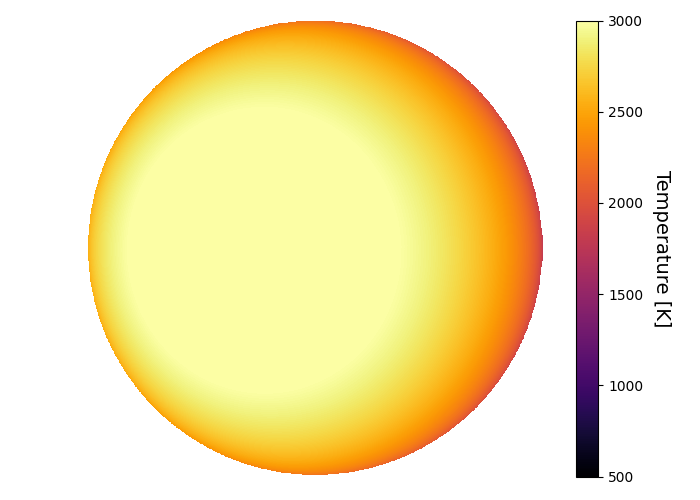
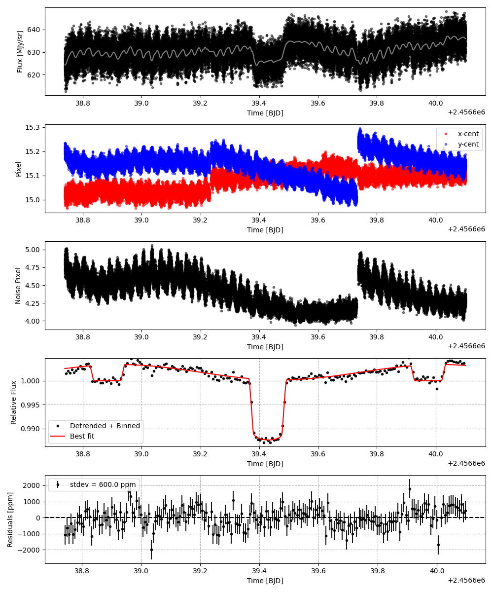
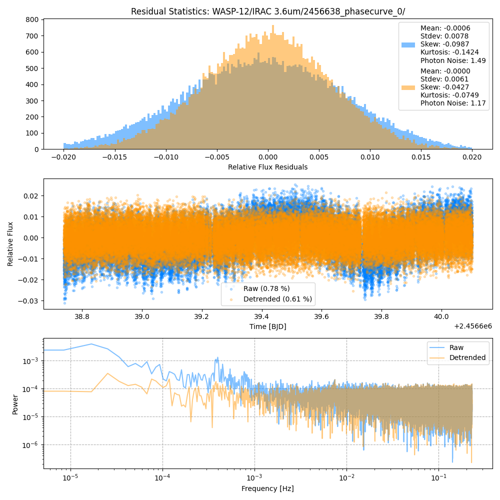
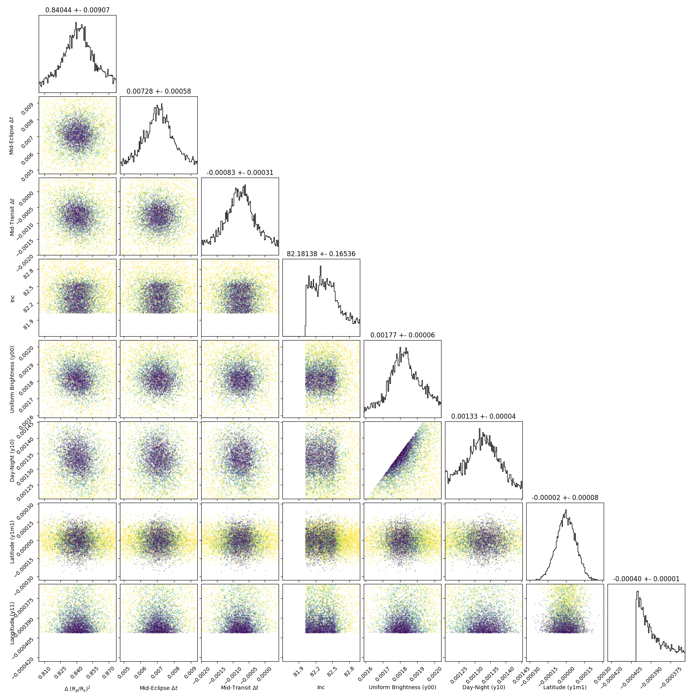
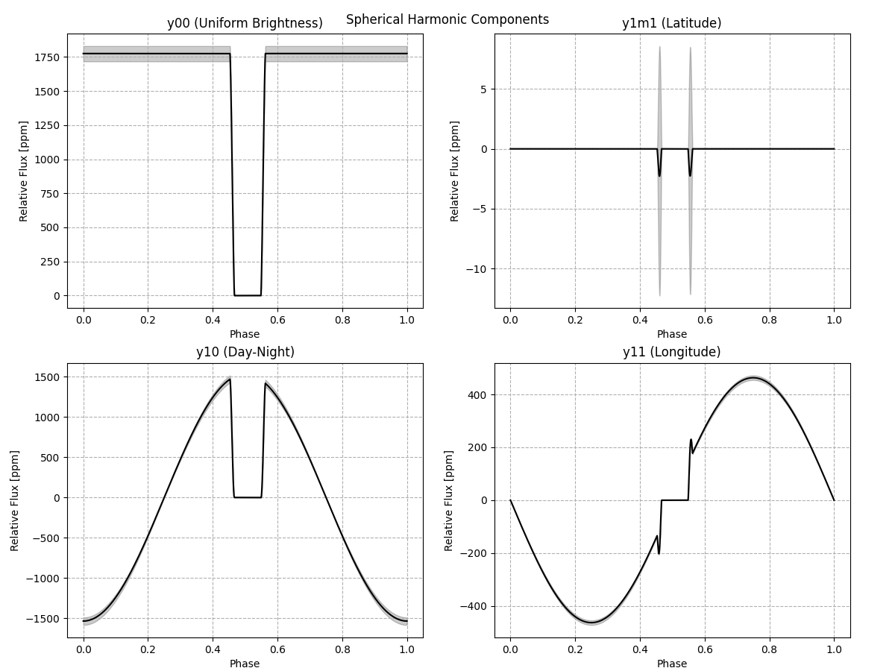
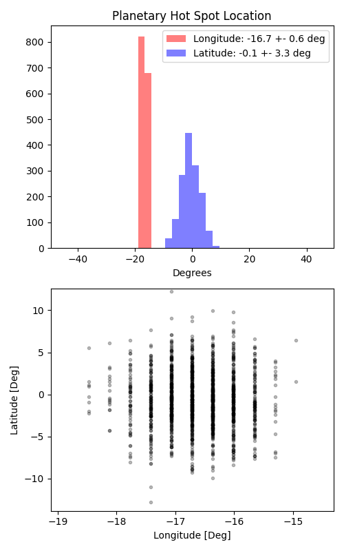

```
# target: wasp-12
# filter: IRAC 3.6um
# tmid: 2456639.432717 +- 0.000307
# emid: 2456638.883509 +- 0.000582
# transit_depth: 0.013044+-0.000028
# eclipse_depth: 0.003363 +- 0.000071
# nightside_amp: 0.000644 +- 0.000105
# hotspot_amp: 0.003363 +- 0.000071
# hotspot_lon[deg]: -16.715543 +- 0.601089
# hotspot_lat[deg]: -0.615836 +- 3.301671
time,flux,err,xcent,ycent,npp,phase,raw_flux,phasecurve
2456638.738872,1.002941,0.005240,15.023538,15.170809,4.732056,0.375363,628.754725,1.002535
2456638.738895,1.006304,0.005239,15.018220,15.171152,4.793059,0.375383,628.910266,1.002536
2456638.738918,0.992871,0.005263,14.980741,15.169093,4.753776,0.375404,623.273366,1.002536
2456638.738940,1.004948,0.005250,15.013262,15.211788,4.801209,0.375425,626.295595,1.002536
2456638.738963,1.001070,0.005265,15.014620,15.219060,4.869243,0.375446,622.593814,1.002536

...
```

[timeseries.csv](timeseries.csv)

```python
import pandas as pd

df = pd.read_csv('timeseries.csv', comment='#')

# extract comments from the file
with open('timeseries.csv', 'r') as f:
    comments = [line for line in f if line.startswith('#')]

# clean and convert to a dictionary
comments_dict = dict()
for comment in comments:
    key, value = comment[1:].strip().split(': ')
    comments_dict[key] = value

# print the comments
print(comments_dict)
```















