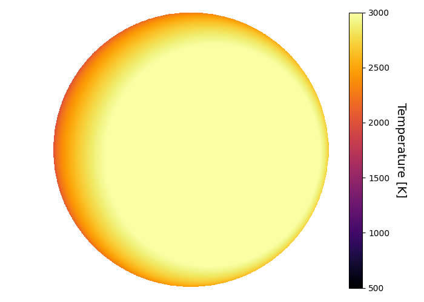
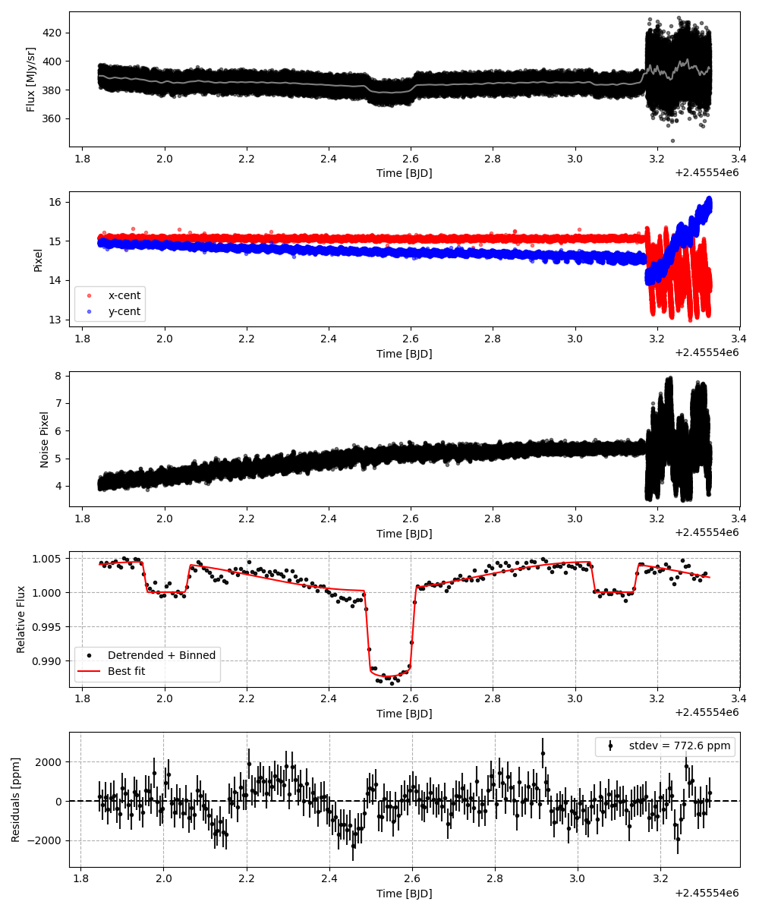
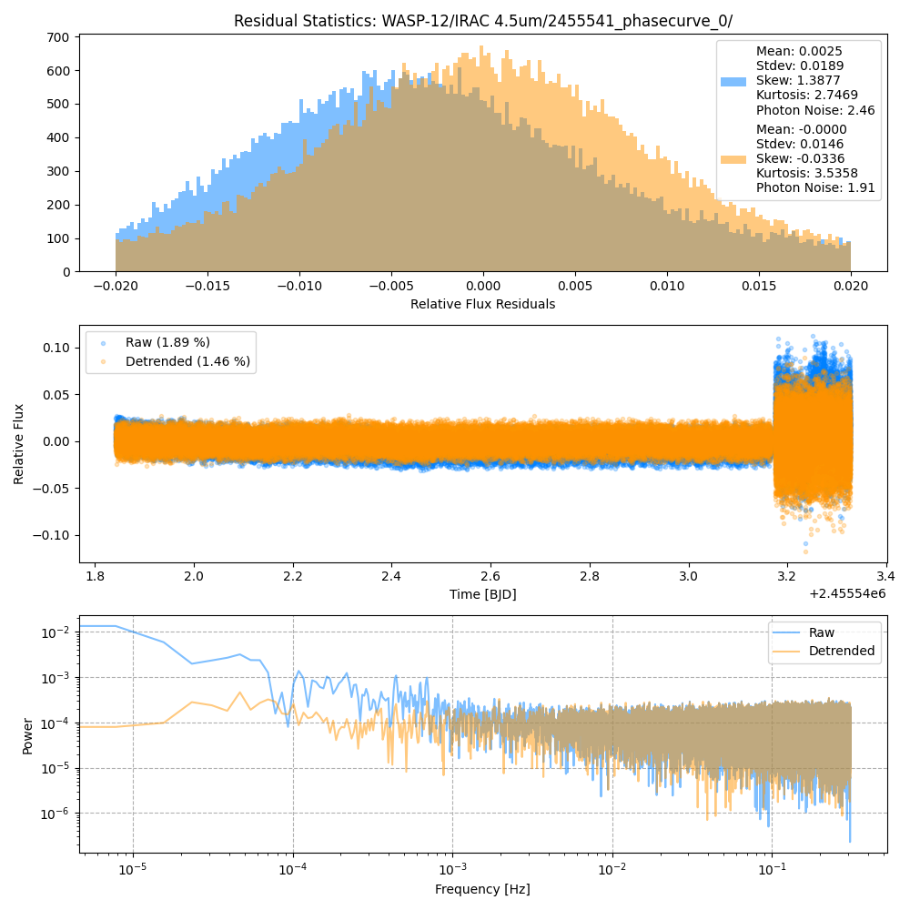
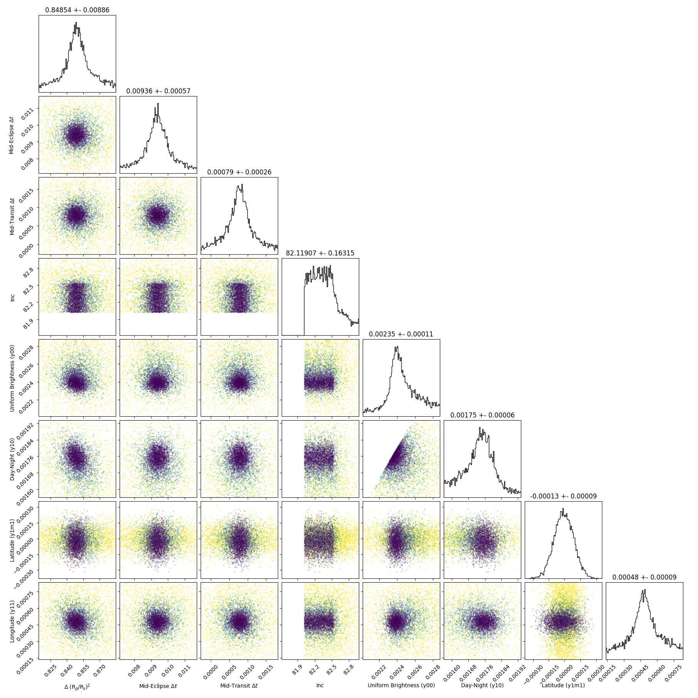
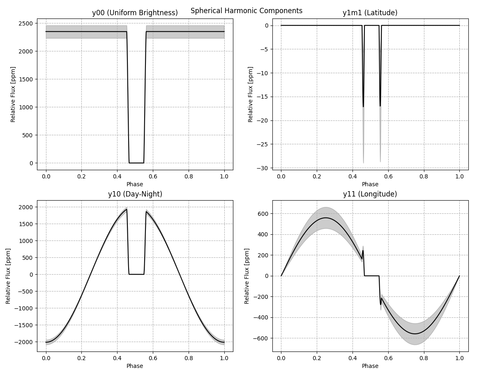
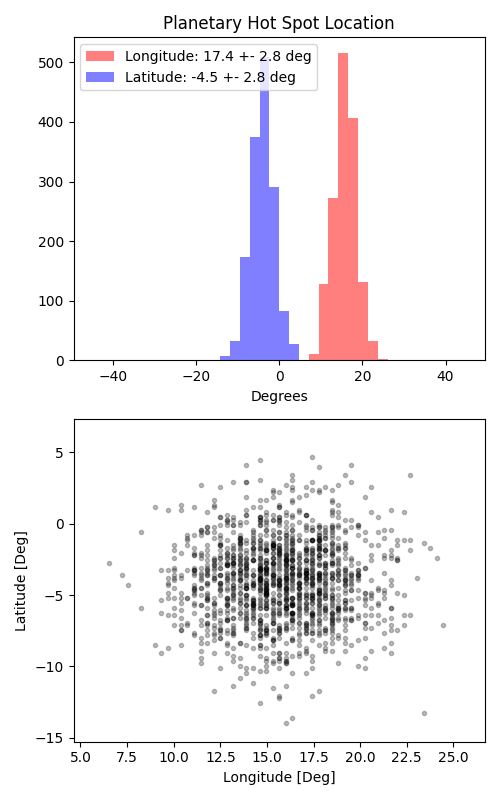

```
# target: wasp-12
# filter: IRAC 4.5um
# tmid: 2455542.542057 +- 0.000262
# emid: 2455542.004332 +- 0.000574
# transit_depth: 0.013251+-0.000050
# eclipse_depth: 0.004440 +- 0.000134
# nightside_amp: 0.000948 +- 0.000195
# hotspot_amp: 0.004437 +- 0.000134
# hotspot_lon[deg]: 15.659824 +- 2.758414
# hotspot_lat[deg]: -3.958944 +- 2.829332
time,flux,err,xcent,ycent,npp,phase,raw_flux,phasecurve
2455541.841938,1.012842,0.007110,15.090657,14.928592,3.995323,0.359102,391.995406,1.004060
2455541.841961,1.003409,0.007133,15.098768,14.978155,3.969408,0.359123,389.508579,1.004060
2455541.842024,1.011314,0.007101,15.075721,14.944315,4.158757,0.359180,393.051667,1.004060
2455541.842047,0.999774,0.007161,15.047785,14.923907,4.031951,0.359201,386.480969,1.004061
2455541.842069,0.999700,0.007147,15.099625,14.918705,4.136525,0.359222,387.943170,1.004061

...
```

[timeseries.csv](timeseries.csv)

```python
import pandas as pd

df = pd.read_csv('timeseries.csv', comment='#')

# extract comments from the file
with open('timeseries.csv', 'r') as f:
    comments = [line for line in f if line.startswith('#')]

# clean and convert to a dictionary
comments_dict = dict()
for comment in comments:
    key, value = comment[1:].strip().split(': ')
    comments_dict[key] = value

# print the comments
print(comments_dict)
```















