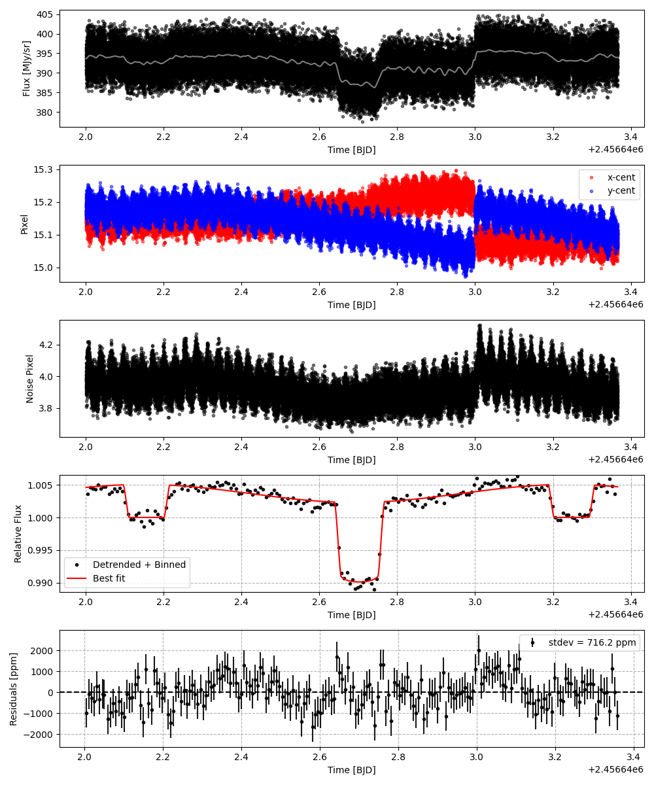
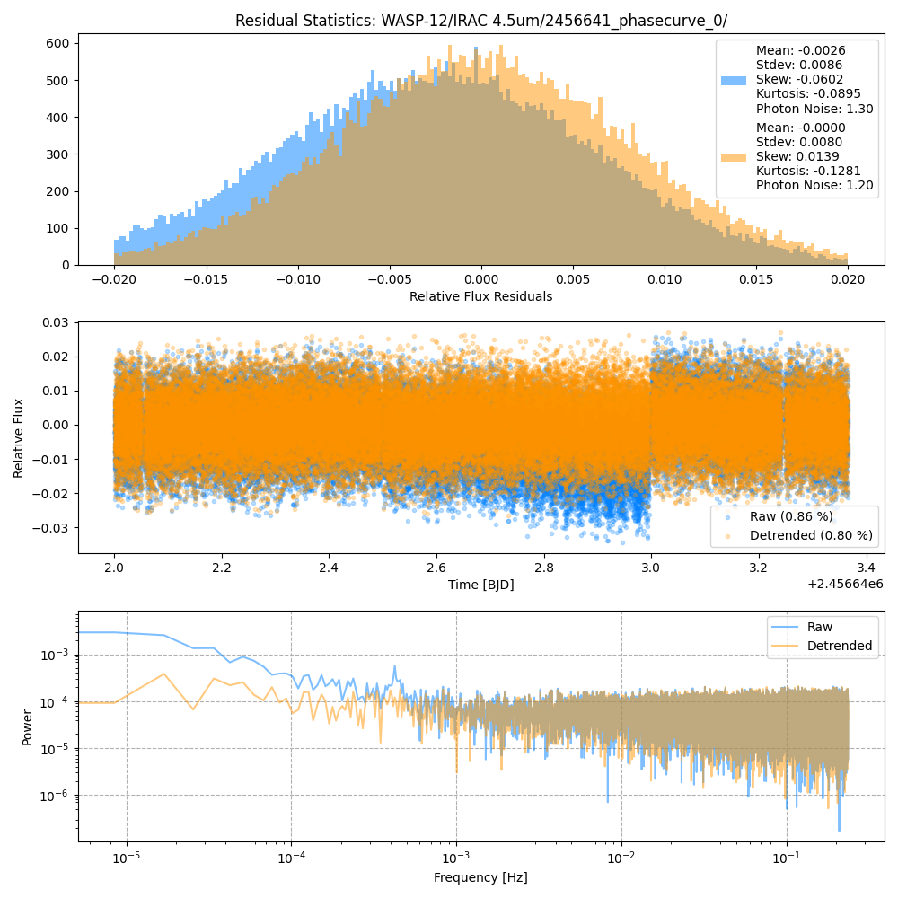
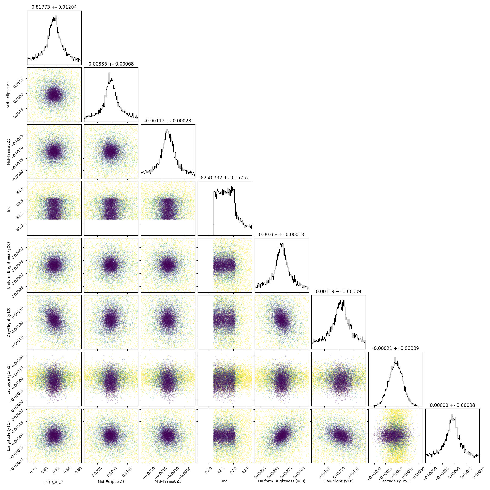
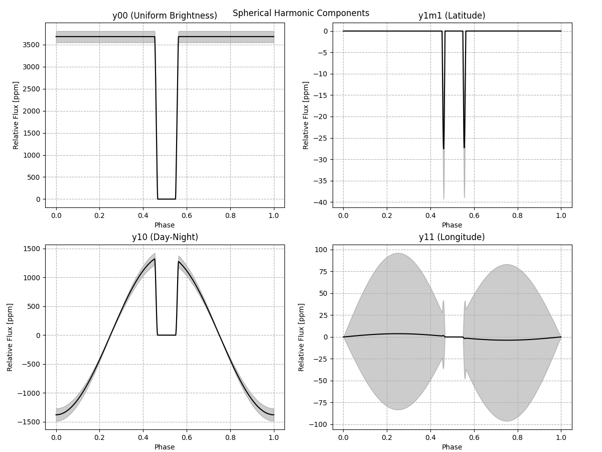
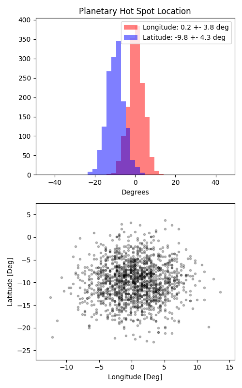

```
# target: wasp-12
# filter: <_io.TextIOWrapper name='DATA/WASP-12/IRAC 4.5um/2455541_phasecurve_0/timeseries.csv' mode='w' encoding='UTF-8'>
# tmid: 2456642.702123 +- 0.000285
# emid: 2456642.156180 +- 0.000678
# transit_depth: 0.012442+-0.000066
# eclipse_depth: 0.004988 +- 0.000168
# nightside_amp: 0.002556 +- 0.000263
# hotspot_amp: 0.004986 +- 0.000168
# hotspot_lon[deg]: 0.527859 +- 3.814784
# hotspot_lat[deg]: -9.765396 +- 4.323589
time,flux,err,xcent,ycent,npp,phase,raw_flux,phasecurve
2456642.000897,1.004558,0.007093,15.169308,15.158895,3.930811,0.365603,393.848816,1.004599
2456642.000920,0.992541,0.007142,15.169539,15.206863,3.979804,0.365624,388.465877,1.004599
2456642.000943,1.006205,0.007075,15.129760,15.164693,3.936170,0.365645,395.918123,1.004599
2456642.000965,1.006034,0.007085,15.160894,15.194625,3.917094,0.365665,394.744792,1.004599
2456642.000988,1.002224,0.007105,15.164557,15.197506,3.958915,0.365686,392.553636,1.004600

...
```

[timeseries.csv](timeseries.csv)

```python
import pandas as pd

df = pd.read_csv('timeseries.csv', comment='#')

# extract comments from the file
with open('timeseries.csv', 'r') as f:
    comments = [line for line in f if line.startswith('#')]

# clean and convert to a dictionary
comments_dict = dict()
for comment in comments:
    key, value = comment[1:].strip().split(': ')
    comments_dict[key] = value

# print the comments
print(comments_dict)
```













