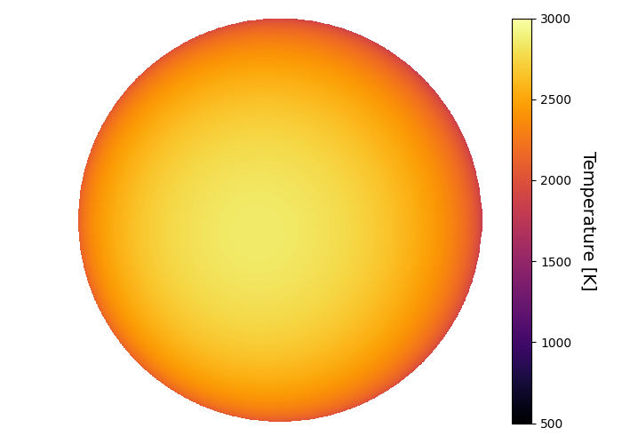
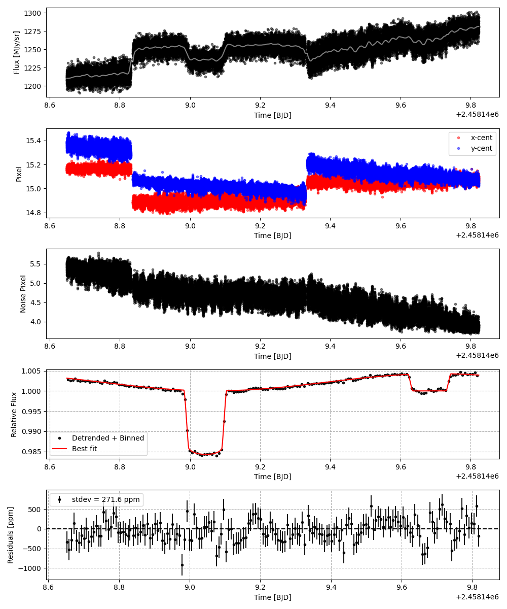
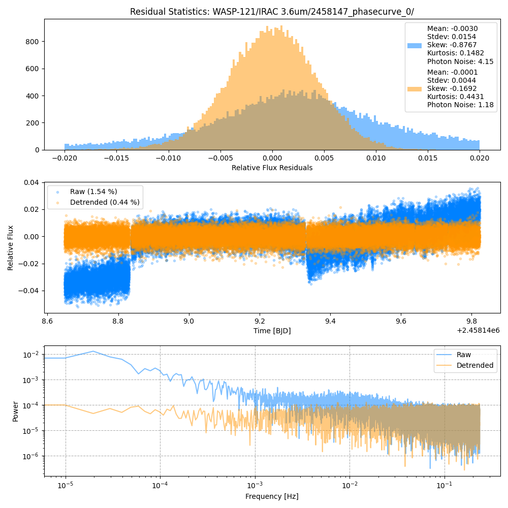
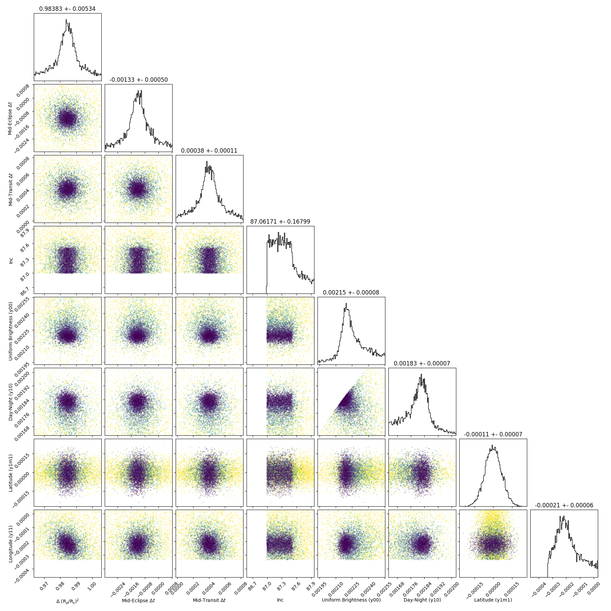
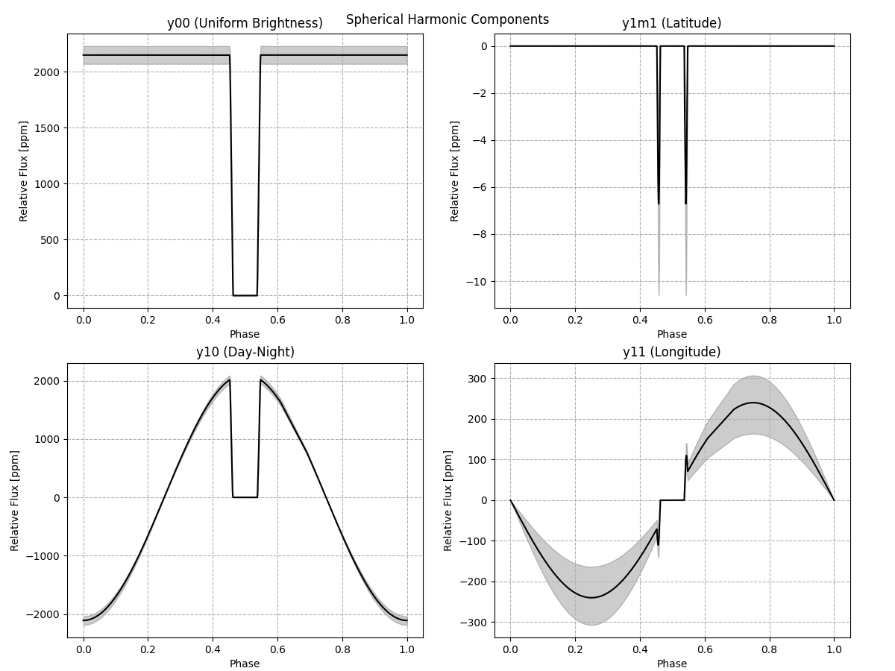
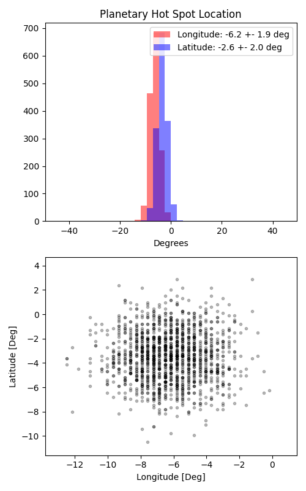

```
# target: wasp-121
# filter: IRAC 3.6um
# tmid: 2458149.045472 +- 0.000106
# emid: 2458149.682813 +- 0.000498
# transit_depth: 0.016118+-0.000045
# eclipse_depth: 0.004226 +- 0.000113
# nightside_amp: 0.000393 +- 0.000165
# hotspot_amp: 0.004213 +- 0.000113
# hotspot_lon[deg]: -6.158358 +- 1.913216
# hotspot_lat[deg]: -3.431085 +- 2.035881
time,flux,err,xcent,ycent,npp,phase,raw_flux,phasecurve
2458148.648789,0.994893,0.003780,15.183995,15.315795,5.237708,0.688954,1208.144748,1.003163
2458148.648812,0.998938,0.003775,15.170892,15.338369,5.225087,0.688972,1211.050708,1.003162
2458148.648835,0.993384,0.003789,15.154467,15.336584,5.324095,0.688990,1202.111617,1.003162
2458148.648858,0.997311,0.003785,15.143436,15.346131,5.324218,0.689008,1205.022215,1.003162
2458148.648880,1.006149,0.003767,15.155062,15.337933,5.320752,0.689026,1216.534521,1.003162

...
```

[timeseries.csv](timeseries.csv)

```python
import pandas as pd

df = pd.read_csv('timeseries.csv', comment='#')

# extract comments from the file
with open('timeseries.csv', 'r') as f:
    comments = [line for line in f if line.startswith('#')]

# clean and convert to a dictionary
comments_dict = dict()
for comment in comments:
    key, value = comment[1:].strip().split(': ')
    comments_dict[key] = value

# print the comments
print(comments_dict)
```















