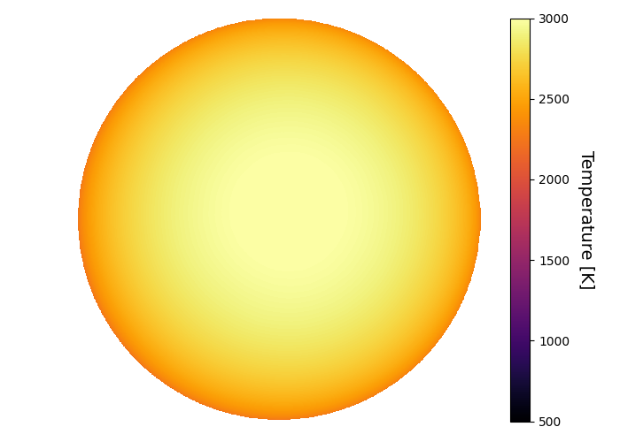
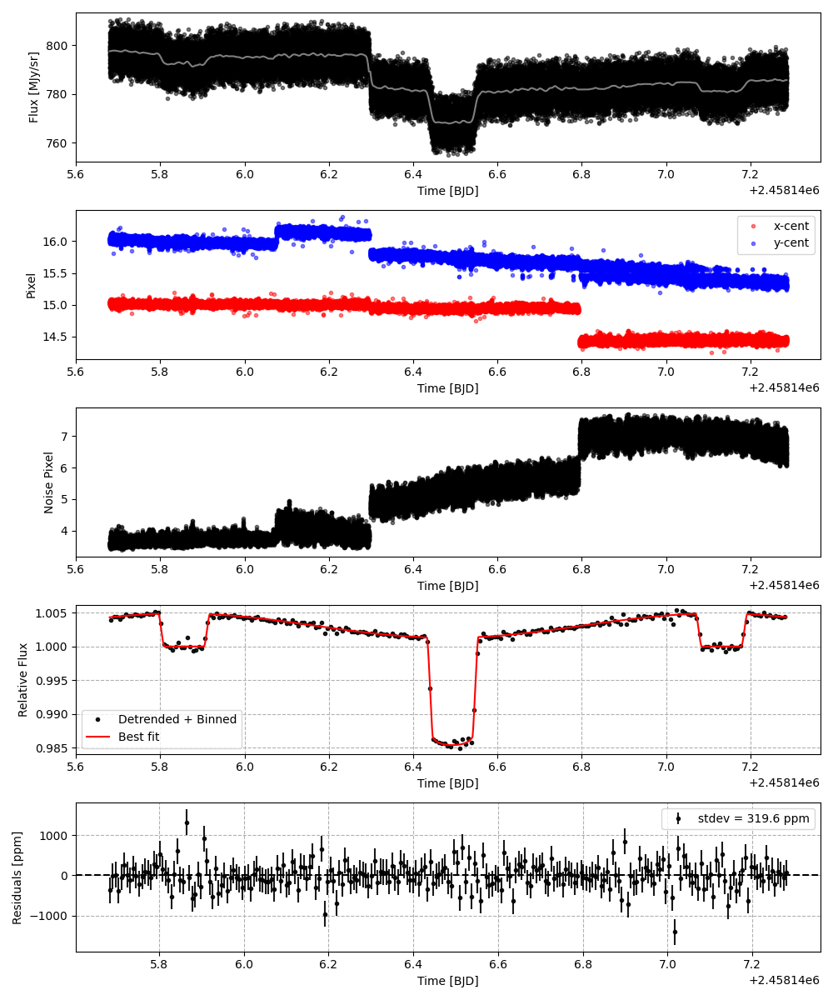
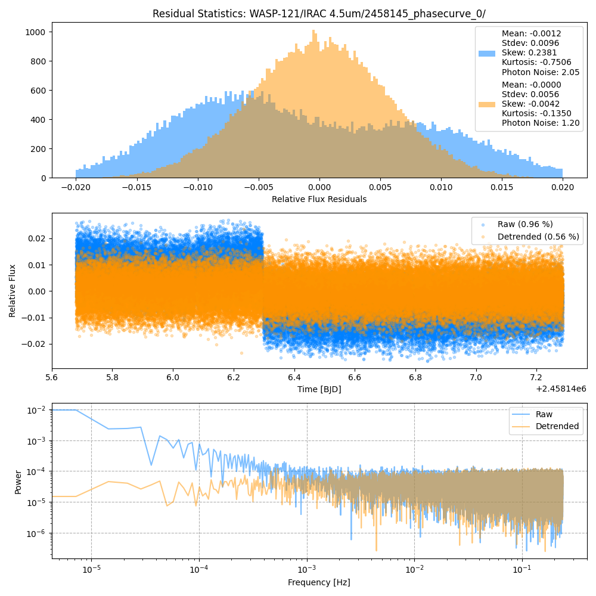
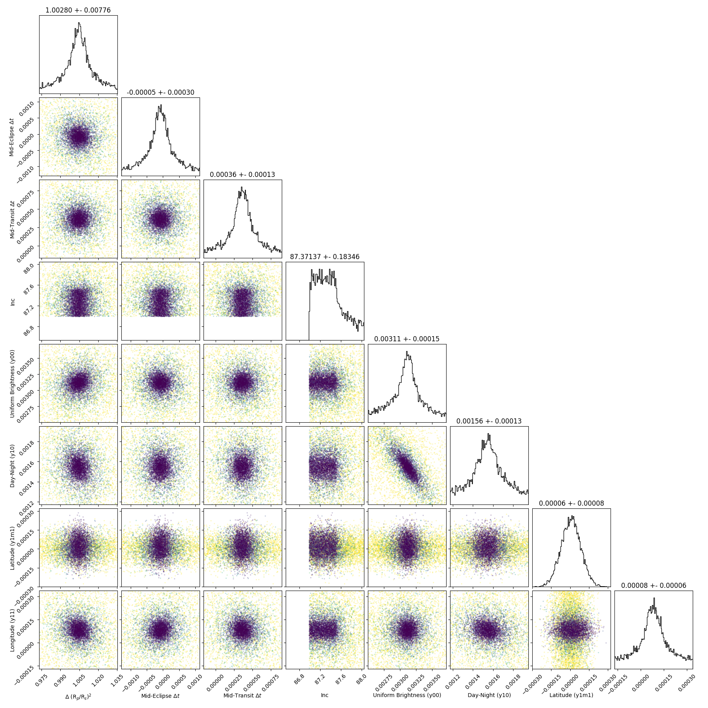
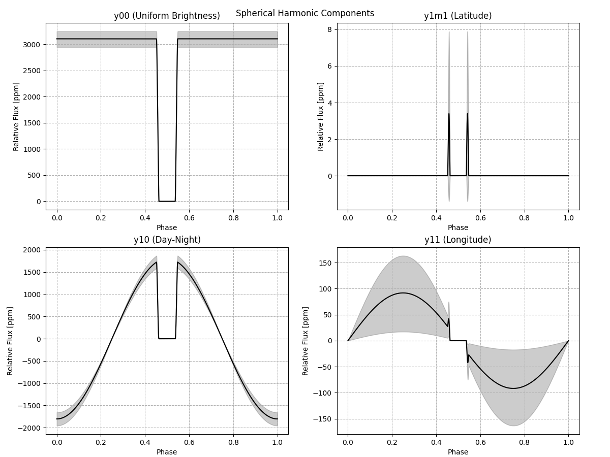
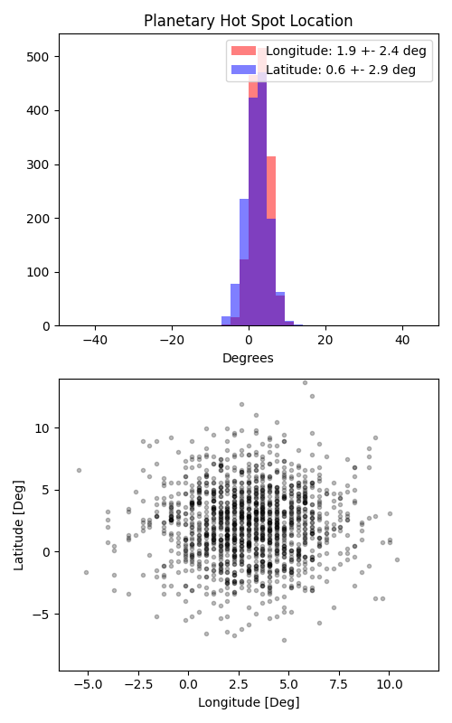

```
# target: wasp-121
# filter: IRAC 4.5um
# tmid: 2458146.492994 +- 0.000133
# emid: 2458145.856755 +- 0.000304
# transit_depth: 0.016171+-0.000086
# eclipse_depth: 0.004842 +- 0.000209
# nightside_amp: 0.001545 +- 0.000409
# hotspot_amp: 0.004838 +- 0.000209
# hotspot_lon[deg]: 2.991202 +- 2.366405
# hotspot_lat[deg]: 2.199413 +- 2.941239
time,flux,err,xcent,ycent,npp,phase,raw_flux,phasecurve
2458145.680105,1.007191,0.004978,15.013533,16.037621,3.569792,0.361444,799.762585,1.004338
2458145.680128,1.000160,0.004996,15.020750,16.017308,3.583121,0.361462,793.906609,1.004338
2458145.680151,1.010505,0.004971,15.018423,16.011543,3.569973,0.361480,801.812847,1.004338
2458145.680174,1.000389,0.004990,15.026538,16.013095,3.484375,0.361498,795.787252,1.004339
2458145.680196,0.998923,0.004990,15.043648,16.063133,3.543107,0.361516,795.961134,1.004339

...
```

[timeseries.csv](timeseries.csv)

```python
import pandas as pd

df = pd.read_csv('timeseries.csv', comment='#')

# extract comments from the file
with open('timeseries.csv', 'r') as f:
    comments = [line for line in f if line.startswith('#')]

# clean and convert to a dictionary
comments_dict = dict()
for comment in comments:
    key, value = comment[1:].strip().split(': ')
    comments_dict[key] = value

# print the comments
print(comments_dict)
```















