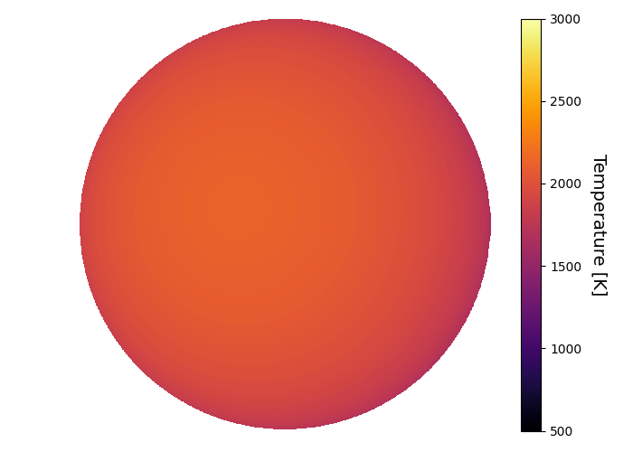
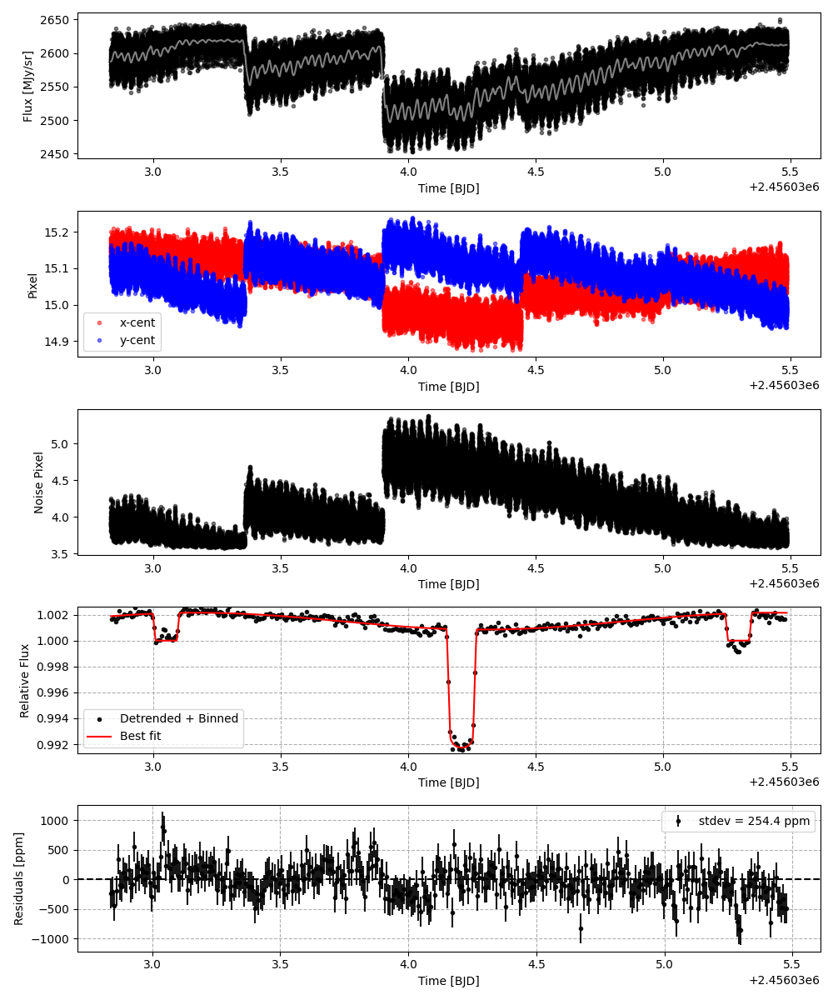
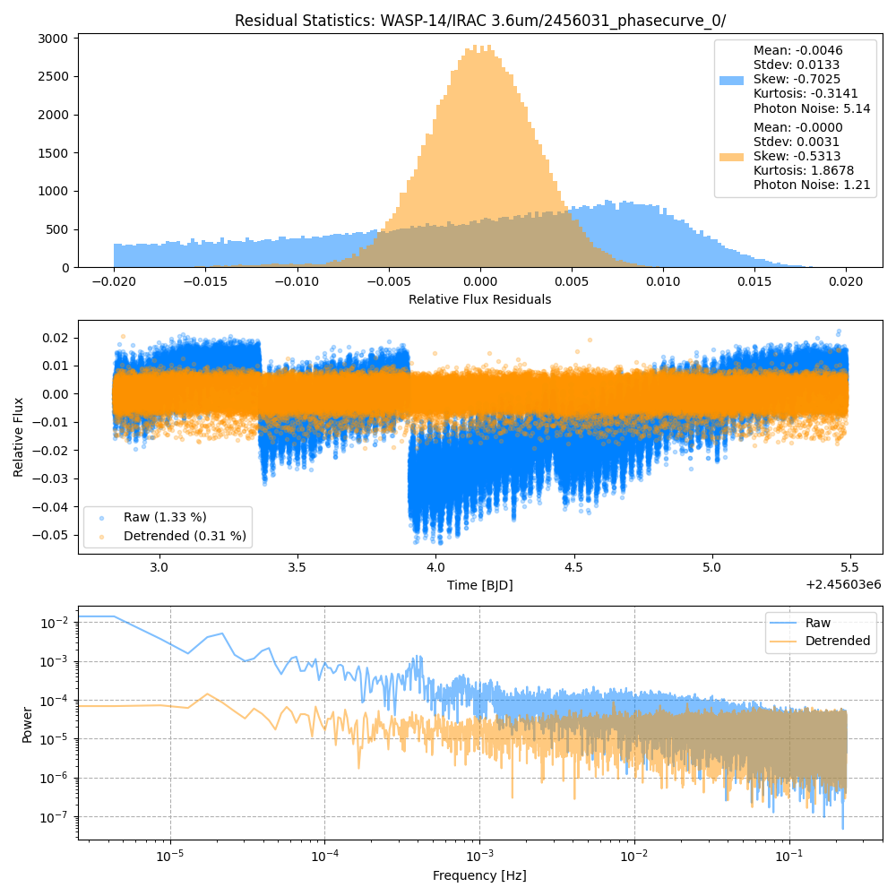
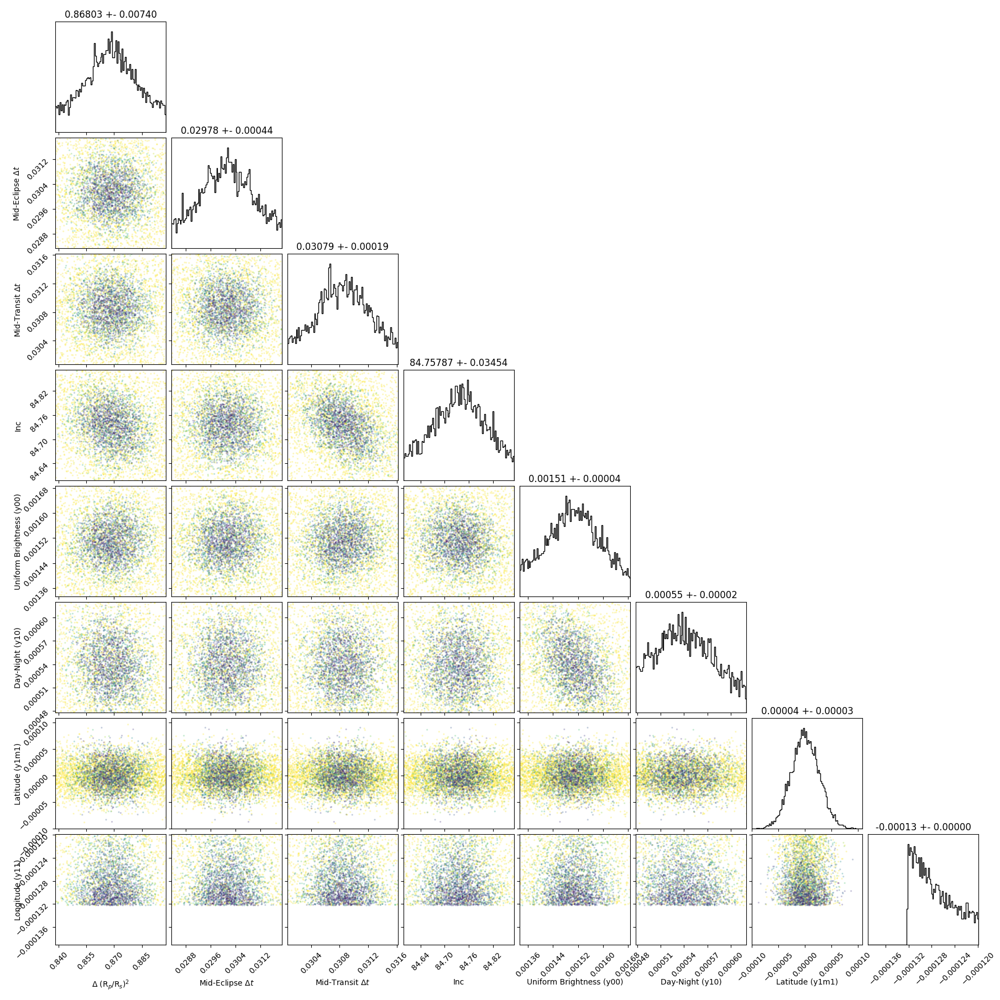
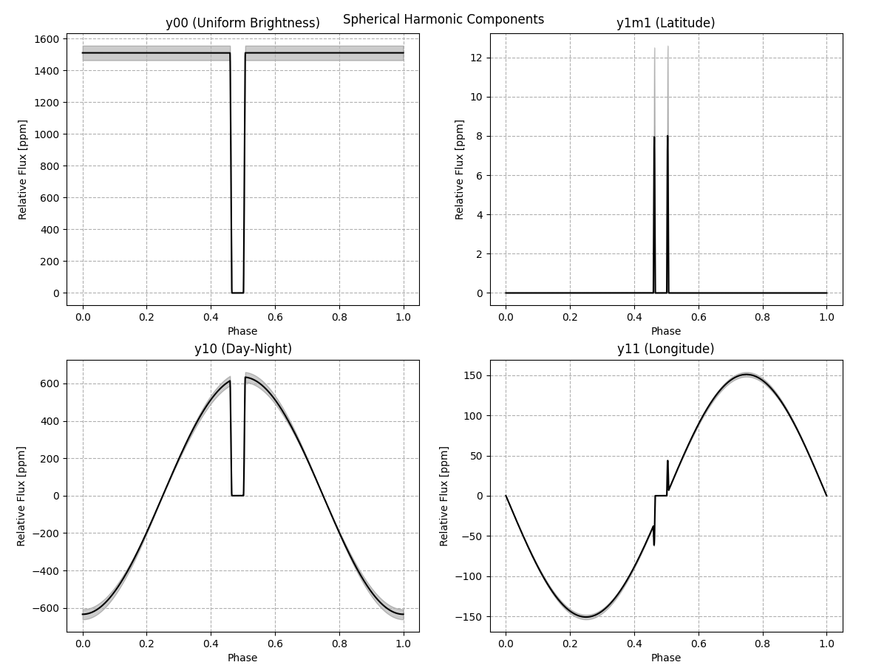
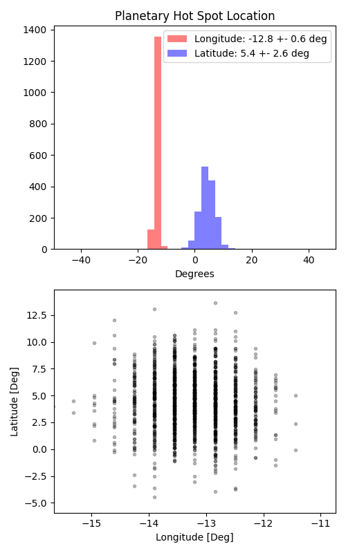

```
# target: wasp-14
# filter: IRAC 3.6um
# tmid: 2456034.210981 +- 0.000194
# emid: 2456033.052028 +- 0.000442
# transit_depth: 0.009205+-0.000019
# eclipse_depth: 0.002160 +- 0.000053
# nightside_amp: 0.000941 +- 0.000074
# hotspot_amp: 0.002162 +- 0.000053
# hotspot_lon[deg]: -13.196481 +- 0.614252
# hotspot_lat[deg]: 4.486804 +- 2.604596
time,flux,err,xcent,ycent,npp,phase,raw_flux,phasecurve
2456032.835539,0.999967,0.002579,15.146883,15.087851,3.858383,0.387033,2595.333984,1.001893
2456032.835562,1.001985,0.002581,15.150173,15.104917,3.919358,0.387043,2590.359834,1.001893
2456032.835584,0.999223,0.002583,15.157879,15.098259,3.876566,0.387053,2586.660615,1.001893
2456032.835607,1.002622,0.002581,15.155301,15.106620,3.911867,0.387064,2591.391483,1.001893
2456032.835630,1.000647,0.002583,15.148469,15.105749,3.917843,0.387074,2587.344687,1.001893

...
```

[timeseries.csv](timeseries.csv)

```python
import pandas as pd

df = pd.read_csv('timeseries.csv', comment='#')

# extract comments from the file
with open('timeseries.csv', 'r') as f:
    comments = [line for line in f if line.startswith('#')]

# clean and convert to a dictionary
comments_dict = dict()
for comment in comments:
    key, value = comment[1:].strip().split(': ')
    comments_dict[key] = value

# print the comments
print(comments_dict)
```















