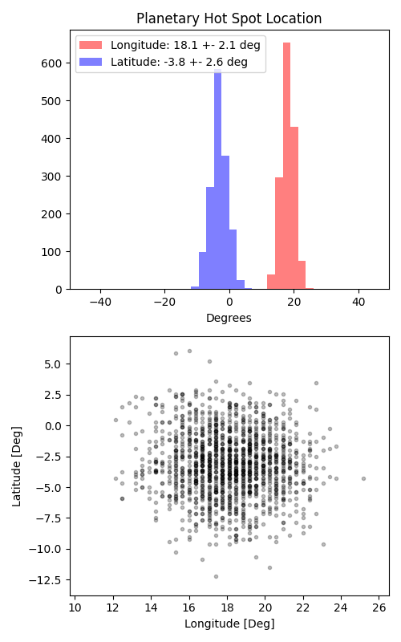

```
# target: wasp-14
# filter: IRAC 4.5um
# tmid: 2456043.182570 +- 0.000190
# emid: 2456042.027371 +- 0.000558
# transit_depth: 0.009268+-0.000025
# eclipse_depth: 0.002327 +- 0.000074
# nightside_amp: 0.000829 +- 0.000095
# hotspot_amp: 0.002327 +- 0.000074
# hotspot_lon[deg]: 18.123167 +- 2.101572
# hotspot_lat[deg]: -3.255132 +- 2.626543
time,flux,err,xcent,ycent,npp,phase,raw_flux,phasecurve
2456041.821317,1.004149,0.003427,15.139682,15.153979,4.134100,0.391687,1687.110867,1.002273
2456041.821339,1.004711,0.003425,15.130738,15.154628,4.121521,0.391697,1688.916440,1.002273
2456041.821362,1.000215,0.003435,15.126448,15.158607,4.142310,0.391707,1679.166958,1.002273
2456041.821385,1.000141,0.003437,15.121410,15.158133,4.167799,0.391718,1677.594691,1.002273
2456041.821408,1.001243,0.003435,15.113942,15.160057,4.159379,0.391728,1679.538059,1.002273

...
```

[timeseries.csv](timeseries.csv)

```python
import pandas as pd

df = pd.read_csv('timeseries.csv', comment='#')

# extract comments from the file
with open('timeseries.csv', 'r') as f:
    comments = [line for line in f if line.startswith('#')]

# clean and convert to a dictionary
comments_dict = dict()
for comment in comments:
    key, value = comment[1:].strip().split(': ')
    comments_dict[key] = value

# print the comments
print(comments_dict)
```




