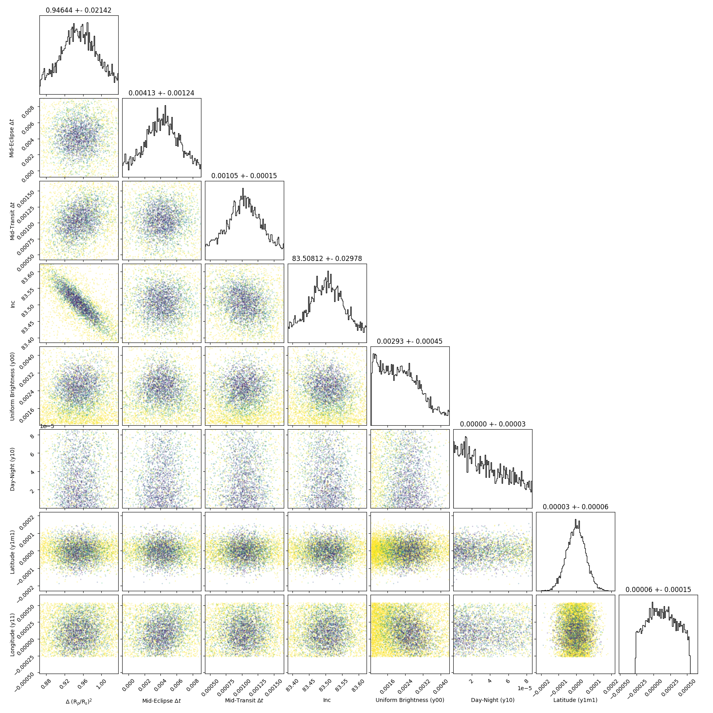

```
# target: wasp-140
# filter: IRAC 4.5um
# tmid: 2458486.482179 +- 0.000154
# emid: 2458485.428417 +- 0.001238
# transit_depth: 0.021982+-0.000147
# eclipse_depth: 0.002938 +- 0.000468
# nightside_amp: 0.002947 +- 0.000878
# hotspot_amp: 0.003000 +- 0.000468
# hotspot_lon[deg]: 78.123167 +- 60.462720
# hotspot_lat[deg]: 15.747801 +- 34.500376
time,flux,err,xcent,ycent,npp,phase,raw_flux,phasecurve
2458485.228080,0.999105,0.004540,15.170413,15.176225,5.030608,0.440414,961.396622,1.002958
2458485.228103,1.005192,0.004526,15.170134,15.148143,5.012058,0.440424,967.258236,1.002958
2458485.228126,1.007806,0.004521,15.148422,15.163799,4.765800,0.440435,969.765627,1.002958
2458485.228149,1.005349,0.004523,15.149688,15.149345,4.840126,0.440445,968.495521,1.002958
2458485.228172,0.997144,0.004542,15.155949,15.140555,4.806931,0.440455,960.663958,1.002958

...
```

[timeseries.csv](timeseries.csv)

```python
import pandas as pd

df = pd.read_csv('timeseries.csv', comment='#')

# extract comments from the file
with open('timeseries.csv', 'r') as f:
    comments = [line for line in f if line.startswith('#')]

# clean and convert to a dictionary
comments_dict = dict()
for comment in comments:
    key, value = comment[1:].strip().split(': ')
    comments_dict[key] = value

# print the comments
print(comments_dict)
```





