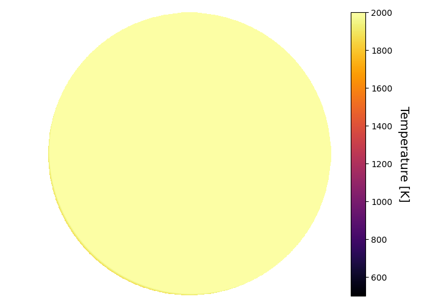
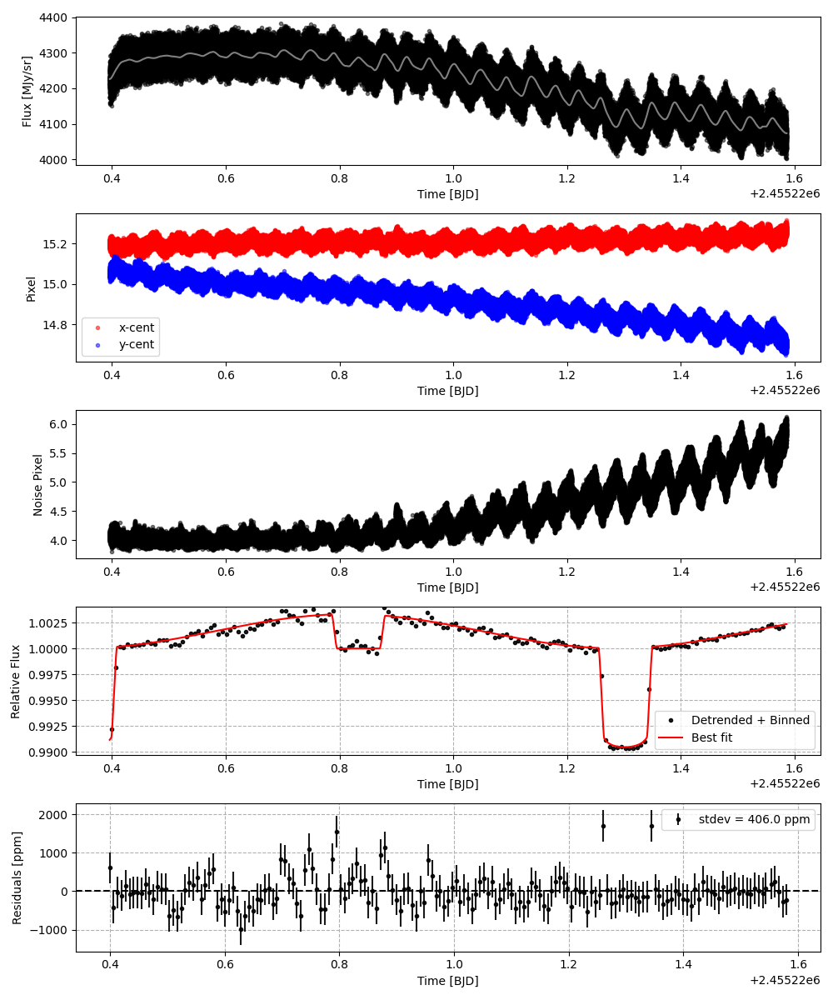
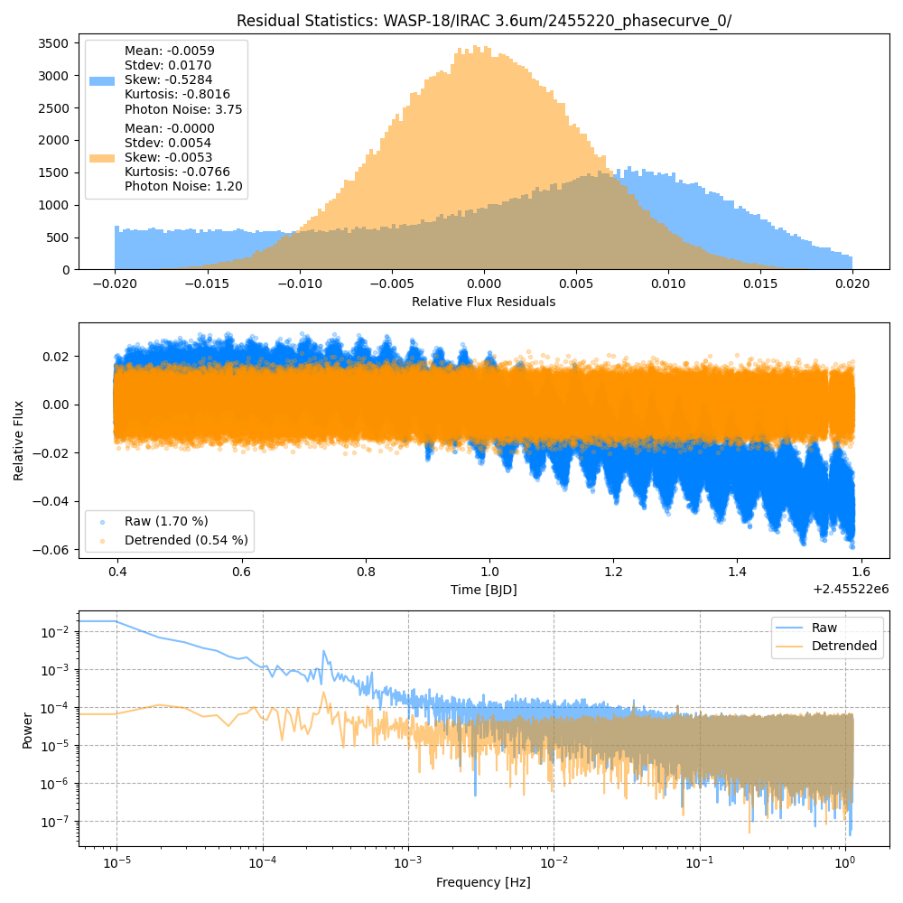
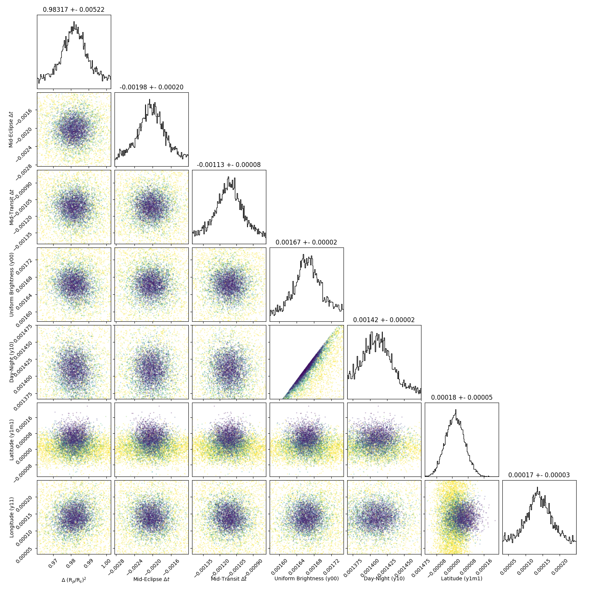
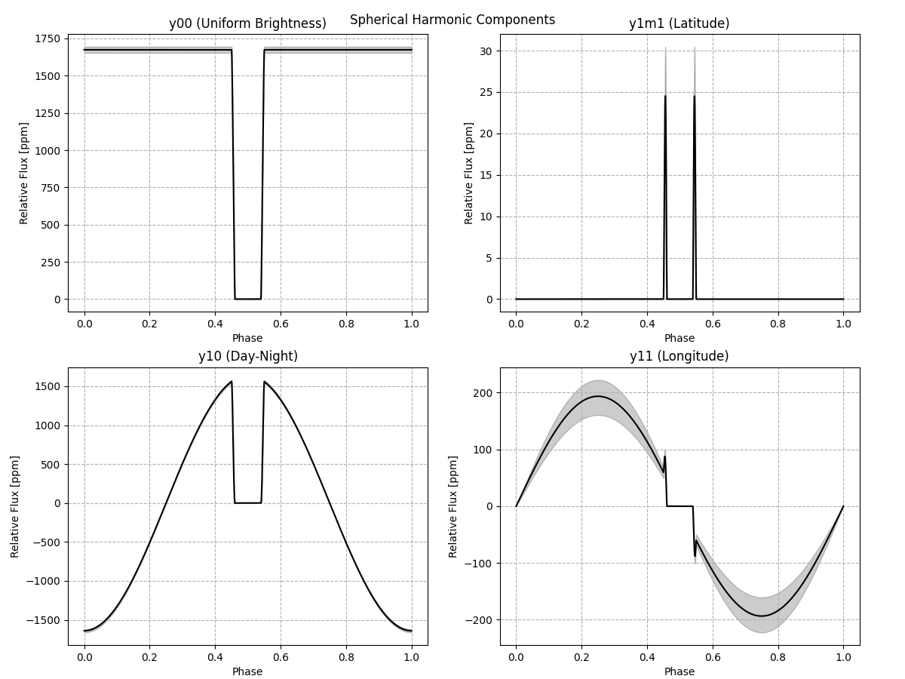
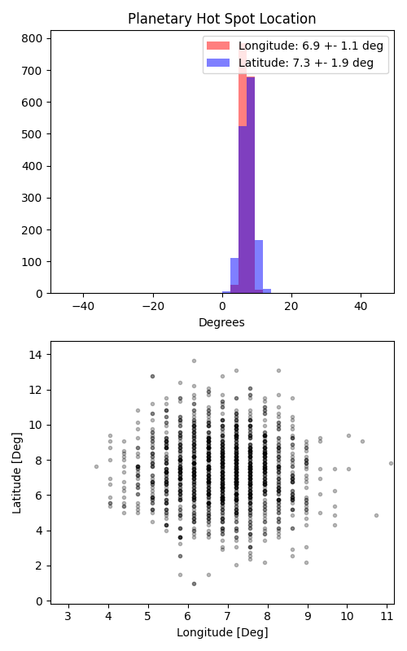

```
# target: wasp-18
# filter: IRAC 3.6um
# tmid: 2455221.301110 +- 0.000083
# emid: 2455220.833223 +- 0.000201
# transit_depth: 0.010014+-0.000013
# eclipse_depth: 0.003282 +- 0.000031
# nightside_amp: 0.000470 +- 0.000054
# hotspot_amp: 0.003267 +- 0.000031
# hotspot_lon[deg]: 6.862170 +- 1.077210
# hotspot_lat[deg]: 7.302053 +- 1.867206
time,flux,err,xcent,ycent,npp,phase,raw_flux,phasecurve
2455220.395952,0.997330,0.004508,15.189616,15.061853,4.063491,0.035822,4247.198488,0.991161
2455220.395956,0.996505,0.004507,15.207828,15.046542,4.082373,0.035827,4248.448236,0.991161
2455220.395961,0.995211,0.004514,15.206650,15.046858,4.131115,0.035832,4235.861118,0.991162
2455220.395965,0.979760,0.004547,15.220130,15.073790,4.133723,0.035837,4175.590289,0.991162
2455220.395970,0.993709,0.004519,15.203347,15.056203,4.040674,0.035842,4227.344322,0.991162

...
```

[timeseries.csv](timeseries.csv)

```python
import pandas as pd

df = pd.read_csv('timeseries.csv', comment='#')

# extract comments from the file
with open('timeseries.csv', 'r') as f:
    comments = [line for line in f if line.startswith('#')]

# clean and convert to a dictionary
comments_dict = dict()
for comment in comments:
    key, value = comment[1:].strip().split(': ')
    comments_dict[key] = value

# print the comments
print(comments_dict)
```















