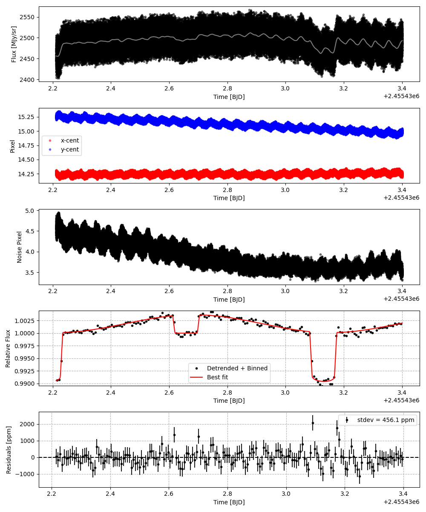
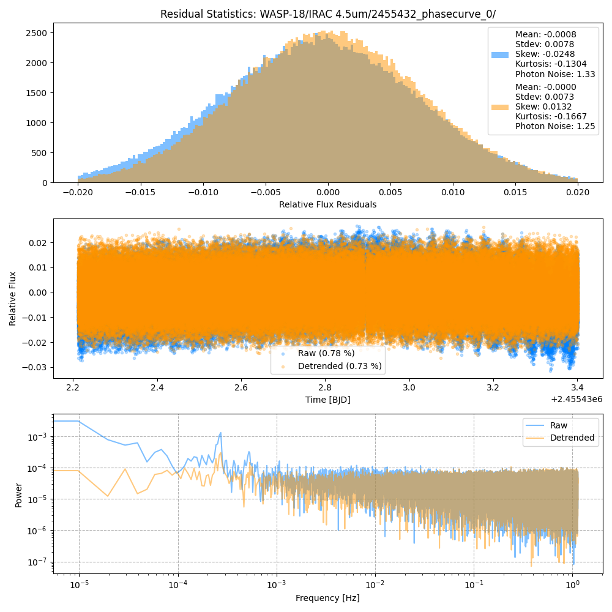
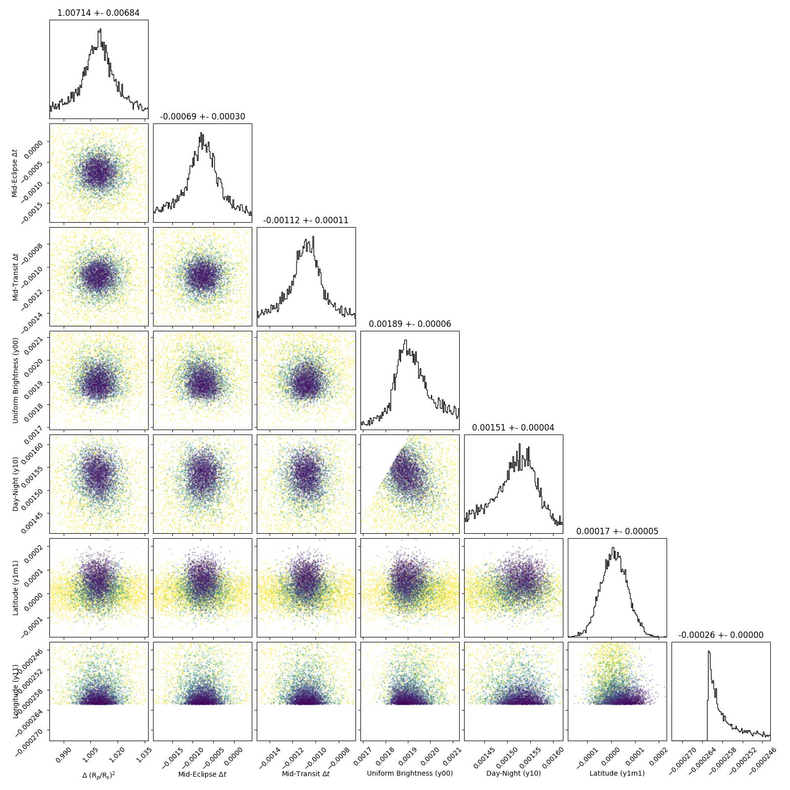
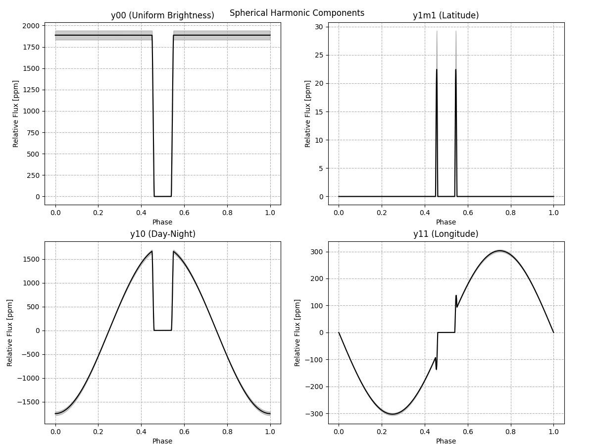
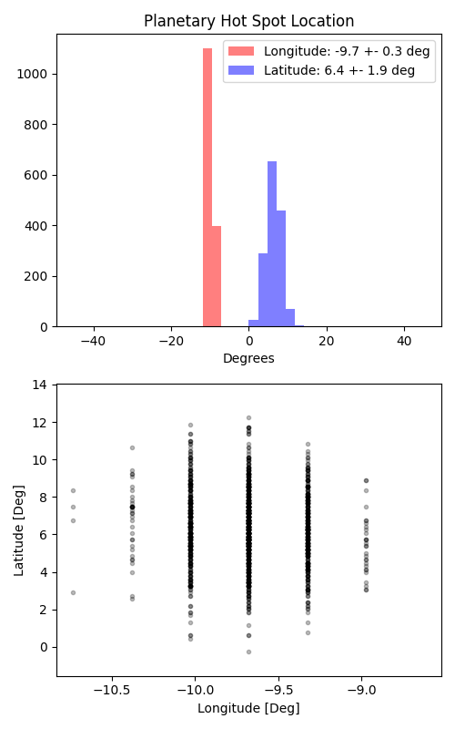

```
# target: wasp-18
# filter: IRAC 4.5um
# tmid: 2455433.132921 +- 0.000107
# emid: 2455432.658685 +- 0.000301
# transit_depth: 0.010253+-0.000027
# eclipse_depth: 0.003631 +- 0.000069
# nightside_amp: 0.000652 +- 0.000103
# hotspot_amp: 0.003618 +- 0.000069
# hotspot_lon[deg]: -9.677419 +- 0.289187
# hotspot_lat[deg]: 6.246334 +- 1.948543
time,flux,err,xcent,ycent,npp,phase,raw_flux,phasecurve
2455432.211914,0.984492,0.006368,14.252995,15.273905,4.694789,0.025728,2443.493346,0.990557
2455432.211919,1.002344,0.006318,14.286221,15.219847,4.600020,0.025733,2482.759185,0.990557
2455432.211923,0.992912,0.006350,14.276283,15.248352,4.600773,0.025738,2457.540737,0.990557
2455432.211928,0.990655,0.006357,14.257873,15.237179,4.587003,0.025743,2452.310291,0.990557
2455432.211932,0.990777,0.006353,14.266839,15.273666,4.647316,0.025747,2455.406314,0.990557

...
```

[timeseries.csv](timeseries.csv)

```python
import pandas as pd

df = pd.read_csv('timeseries.csv', comment='#')

# extract comments from the file
with open('timeseries.csv', 'r') as f:
    comments = [line for line in f if line.startswith('#')]

# clean and convert to a dictionary
comments_dict = dict()
for comment in comments:
    key, value = comment[1:].strip().split(': ')
    comments_dict[key] = value

# print the comments
print(comments_dict)
```













