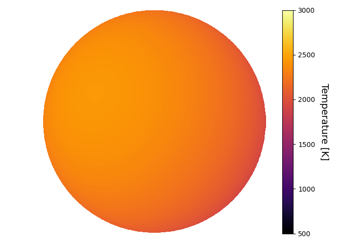
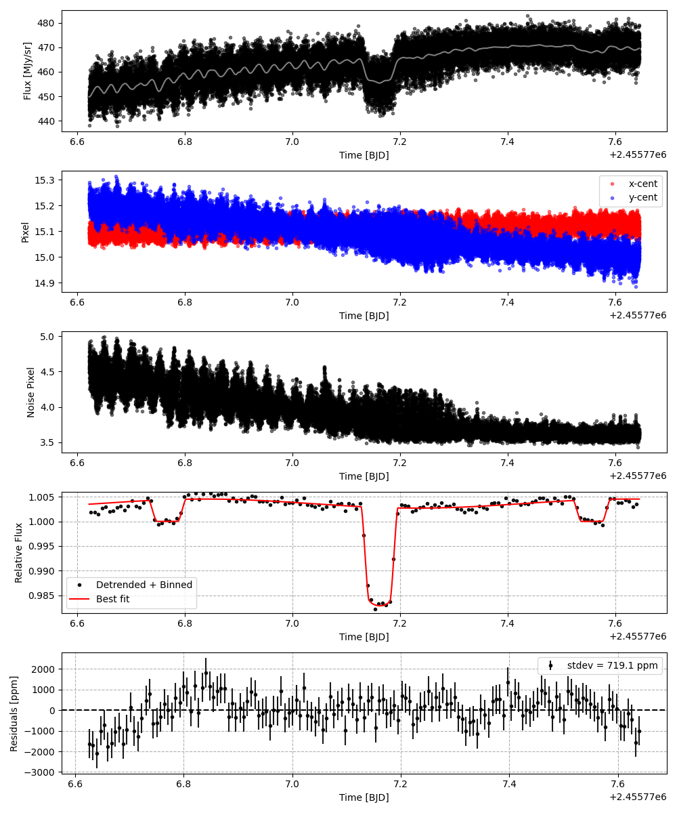
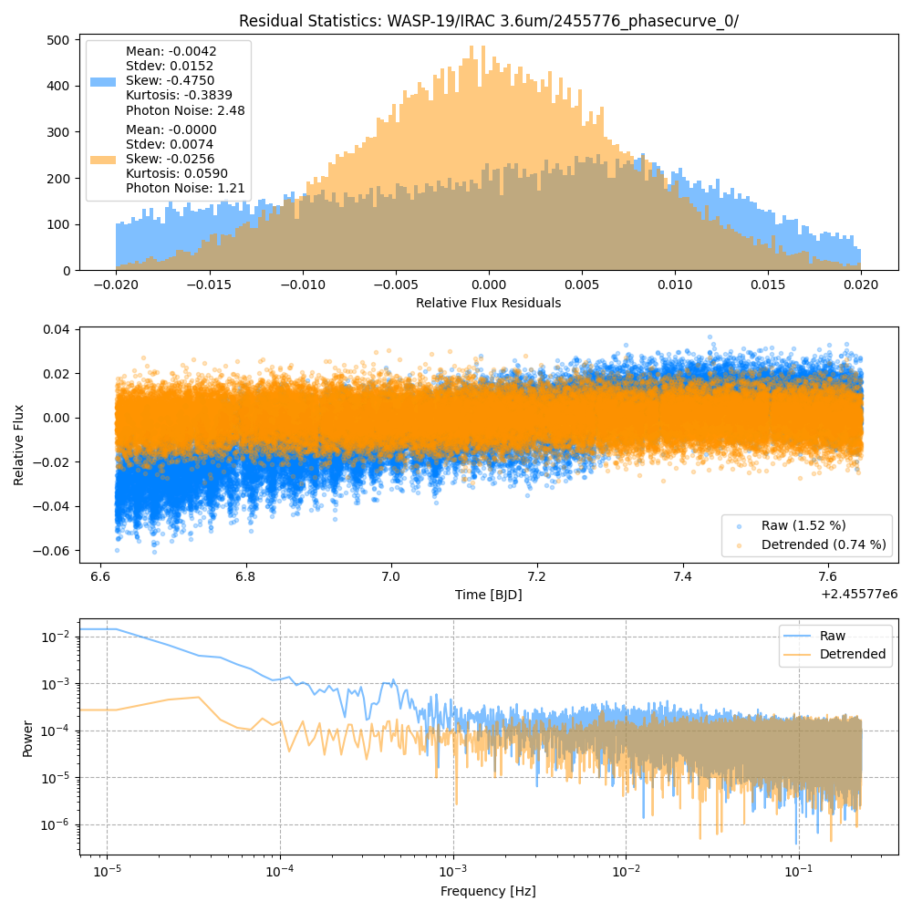
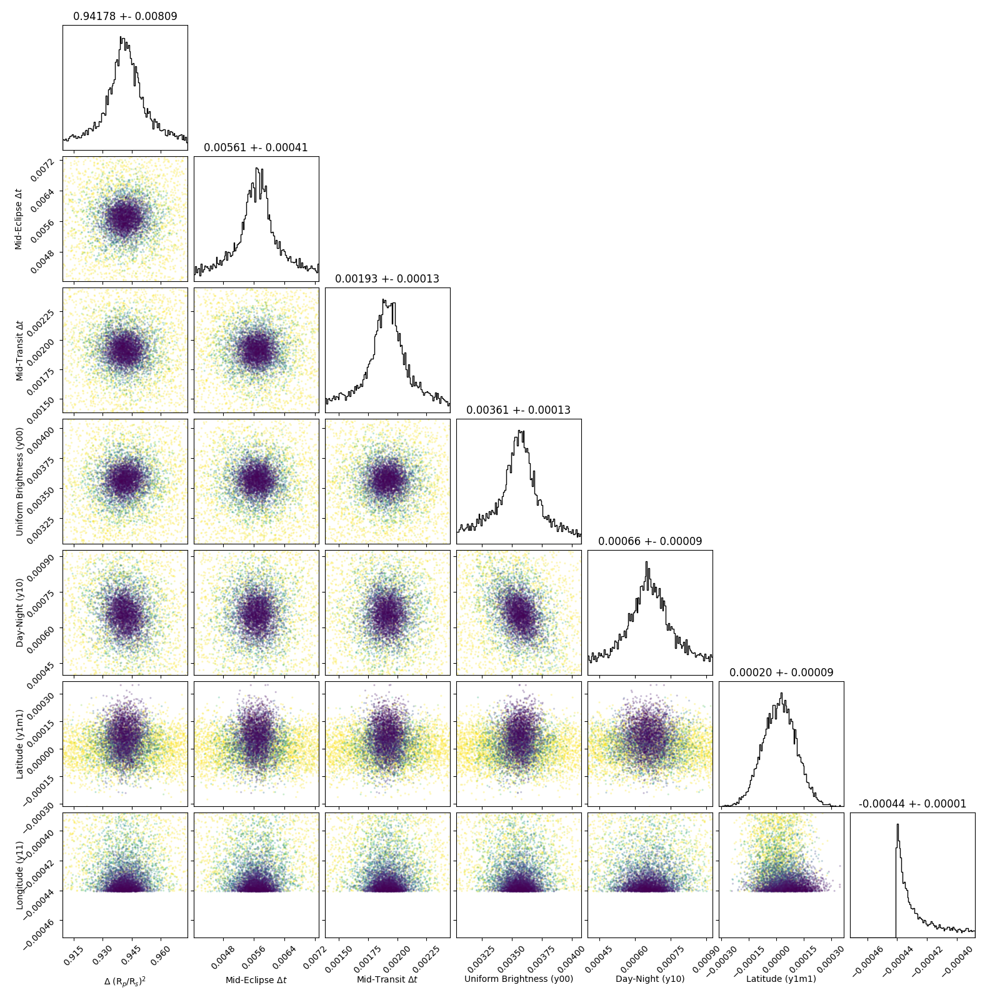
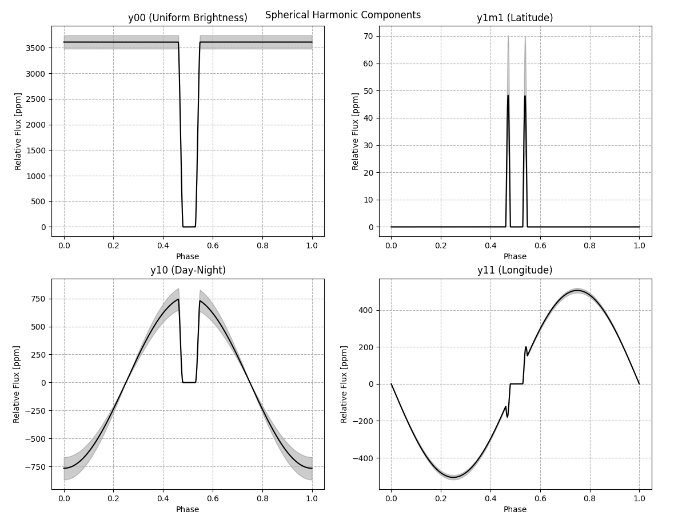
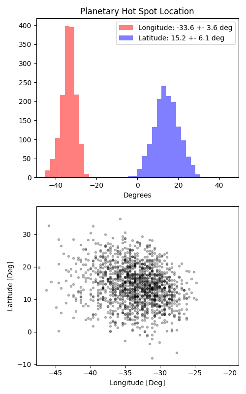

```
# target: wasp-19
# filter: IRAC 3.6um
# tmid: 2455777.162871 +- 0.000134
# emid: 2455776.767849 +- 0.000410
# transit_depth: 0.020494+-0.000059
# eclipse_depth: 0.004529 +- 0.000159
# nightside_amp: 0.003390 +- 0.000257
# hotspot_amp: 0.004529 +- 0.000159
# hotspot_lon[deg]: -33.255132 +- 3.624146
# hotspot_lat[deg]: 14.164223 +- 6.114429
time,flux,err,xcent,ycent,npp,phase,raw_flux,phasecurve
2455776.622116,1.000924,0.006209,15.102405,15.204644,4.581255,0.320353,447.820786,1.003481
2455776.622139,1.001398,0.006208,15.077930,15.240189,4.550110,0.320382,447.935374,1.003481
2455776.622162,0.988467,0.006231,15.069675,15.199463,4.491648,0.320411,444.654716,1.003481
2455776.622185,1.007535,0.006195,15.073789,15.244423,4.616322,0.320440,449.734260,1.003482
2455776.622207,1.004511,0.006197,15.089601,15.209963,4.561910,0.320468,449.533881,1.003482

...
```

[timeseries.csv](timeseries.csv)

```python
import pandas as pd

df = pd.read_csv('timeseries.csv', comment='#')

# extract comments from the file
with open('timeseries.csv', 'r') as f:
    comments = [line for line in f if line.startswith('#')]

# clean and convert to a dictionary
comments_dict = dict()
for comment in comments:
    key, value = comment[1:].strip().split(': ')
    comments_dict[key] = value

# print the comments
print(comments_dict)
```















