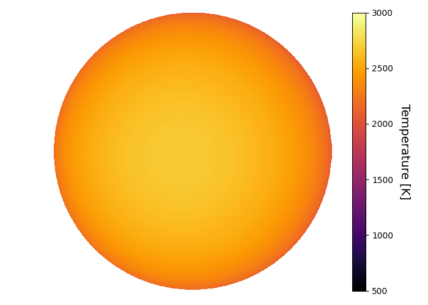

```
# target: wasp-19
# filter: IRAC 4.5um
# tmid: 2455787.418317 +- 0.000253
# emid: 2455787.023569 +- 0.000646
# transit_depth: 0.021504+-0.000090
# eclipse_depth: 0.005388 +- 0.000257
# nightside_amp: 0.002447 +- 0.000390
# hotspot_amp: 0.005391 +- 0.000257
# hotspot_lon[deg]: -5.102639 +- 5.484918
# hotspot_lat[deg]: -2.199413 +- 3.813130
time,flux,err,xcent,ycent,npp,phase,raw_flux,phasecurve
2455786.883194,1.005952,0.008407,14.396077,15.324884,6.254763,0.327126,280.360244,1.004337
2455786.883217,1.020927,0.008353,14.404498,15.334309,6.249796,0.327155,284.027822,1.004337
2455786.883262,0.989530,0.008482,14.431313,15.317814,6.219343,0.327213,275.452369,1.004338
2455786.883285,1.008940,0.008396,14.432810,15.331581,6.295796,0.327242,281.111617,1.004338
2455786.883308,0.994989,0.008473,14.409257,15.295789,6.009961,0.327271,276.041739,1.004338

...
```

[timeseries.csv](timeseries.csv)

```python
import pandas as pd

df = pd.read_csv('timeseries.csv', comment='#')

# extract comments from the file
with open('timeseries.csv', 'r') as f:
    comments = [line for line in f if line.startswith('#')]

# clean and convert to a dictionary
comments_dict = dict()
for comment in comments:
    key, value = comment[1:].strip().split(': ')
    comments_dict[key] = value

# print the comments
print(comments_dict)
```





