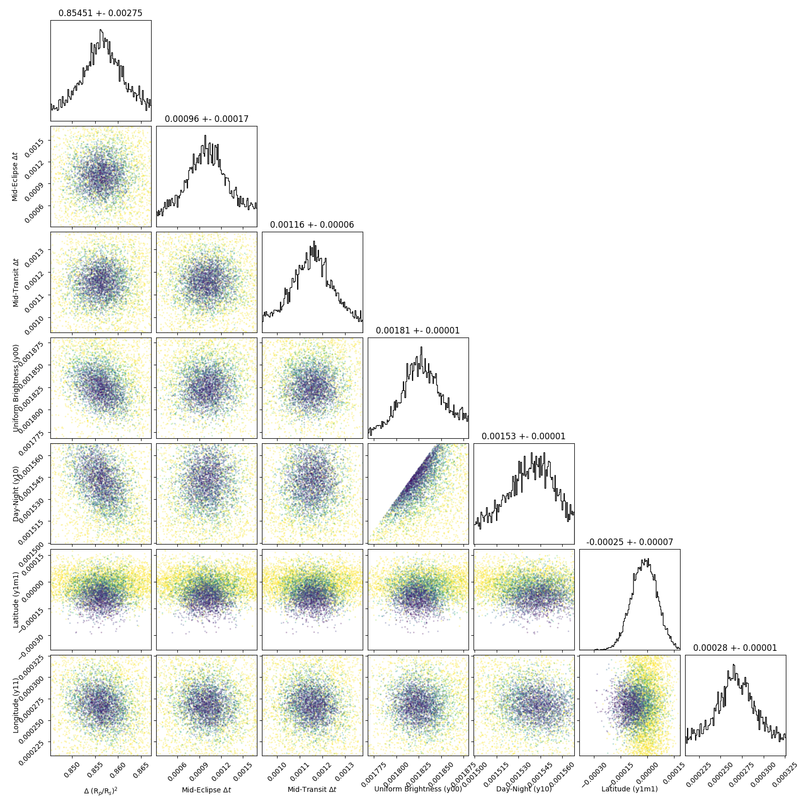

```
# target: wasp-33
# filter: IRAC 3.6um
# tmid: 2456024.742834 +- 0.000056
# emid: 2456024.136188 +- 0.000174
# transit_depth: 0.011897+-0.000010
# eclipse_depth: 0.003593 +- 0.000020
# nightside_amp: 0.000397 +- 0.000028
# hotspot_amp: 0.003591 +- 0.000020
# hotspot_lon[deg]: 10.381232 +- 0.543454
# hotspot_lat[deg]: -9.061584 +- 2.448066
time,flux,err,xcent,ycent,npp,phase,raw_flux,phasecurve
2456023.966602,0.998838,0.003450,15.059611,15.167474,4.458672,0.360985,7252.498453,1.003195
2456023.966607,0.999944,0.003446,15.057226,15.162260,4.434625,0.360989,7267.297164,1.003195
2456023.966611,1.002945,0.003450,15.051962,15.176490,4.495727,0.360992,7251.598287,1.003195
2456023.966616,1.002219,0.003450,15.053676,15.163228,4.511137,0.360996,7253.830277,1.003195
2456023.966620,1.004794,0.003448,15.052227,15.176713,4.537465,0.361000,7258.826191,1.003195

...
```

[timeseries.csv](timeseries.csv)

```python
import pandas as pd

df = pd.read_csv('timeseries.csv', comment='#')

# extract comments from the file
with open('timeseries.csv', 'r') as f:
    comments = [line for line in f if line.startswith('#')]

# clean and convert to a dictionary
comments_dict = dict()
for comment in comments:
    key, value = comment[1:].strip().split(': ')
    comments_dict[key] = value

# print the comments
print(comments_dict)
```





