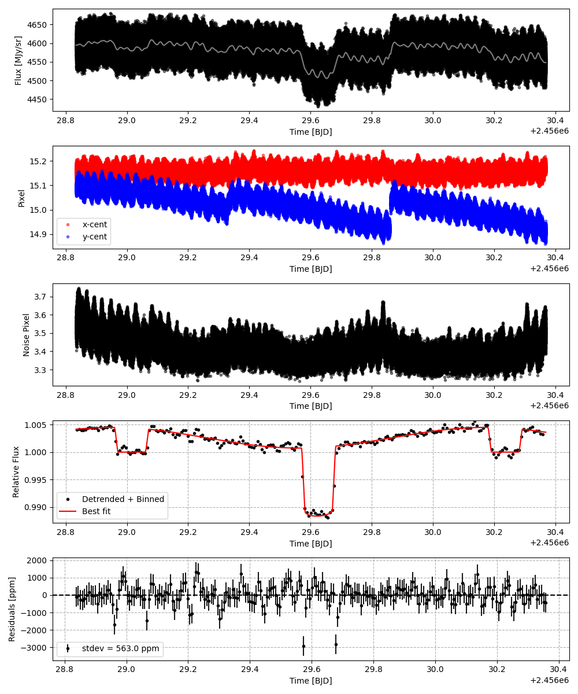
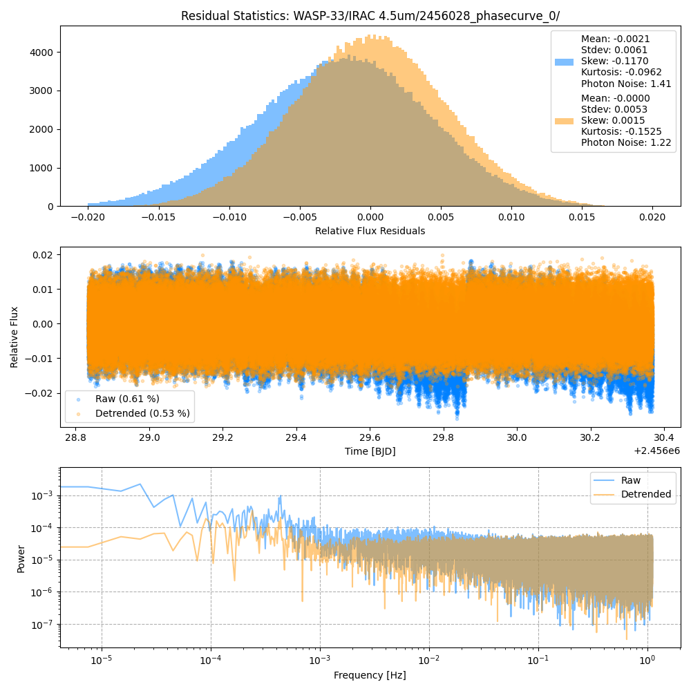
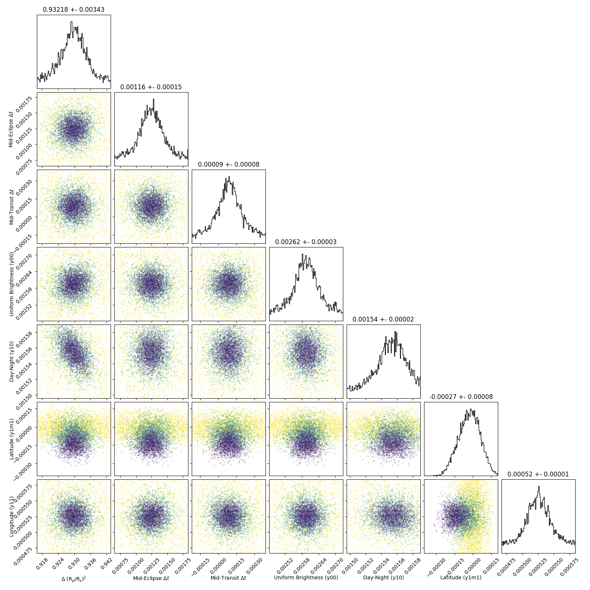
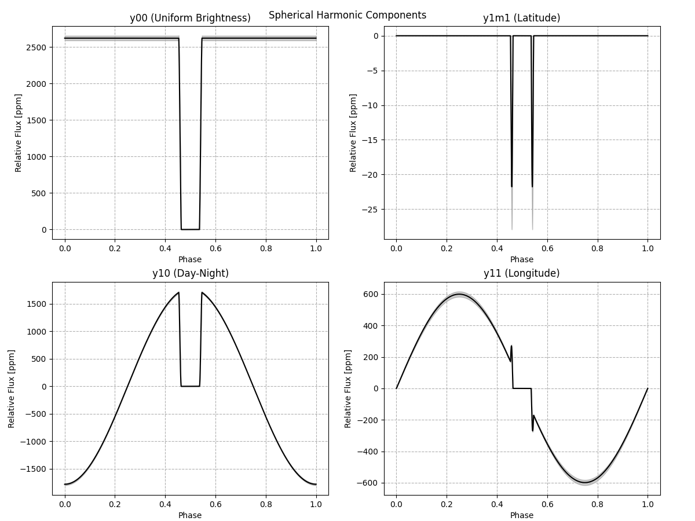
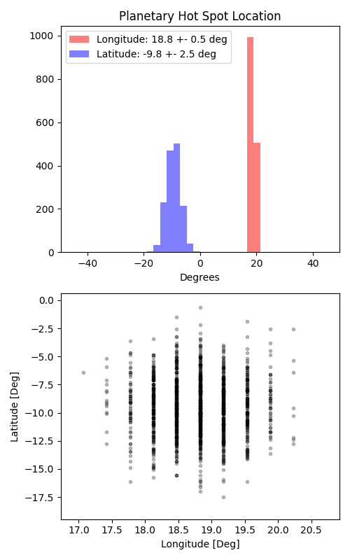

```
# target: wasp-33
# filter: IRAC 4.5um
# tmid: 2456029.619419 +- 0.000077
# emid: 2456029.015462 +- 0.000147
# transit_depth: 0.012956+-0.000015
# eclipse_depth: 0.004501 +- 0.000037
# nightside_amp: 0.001310 +- 0.000076
# hotspot_amp: 0.004500 +- 0.000037
# hotspot_lon[deg]: 18.826979 +- 0.524518
# hotspot_lat[deg]: -9.413490 +- 2.514170
time,flux,err,xcent,ycent,npp,phase,raw_flux,phasecurve
2456028.833888,1.012295,0.004632,15.205439,15.063029,3.547298,0.351154,4618.001205,1.004161
2456028.833897,1.002654,0.004651,15.190893,15.073553,3.528508,0.351162,4580.650557,1.004161
2456028.833902,1.005247,0.004641,15.185171,15.075423,3.497100,0.351165,4599.856211,1.004161
2456028.833906,1.000635,0.004656,15.201385,15.070583,3.529193,0.351169,4571.689525,1.004161
2456028.833911,0.997532,0.004664,15.197995,15.073701,3.564426,0.351173,4555.226106,1.004161

...
```

[timeseries.csv](timeseries.csv)

```python
import pandas as pd

df = pd.read_csv('timeseries.csv', comment='#')

# extract comments from the file
with open('timeseries.csv', 'r') as f:
    comments = [line for line in f if line.startswith('#')]

# clean and convert to a dictionary
comments_dict = dict()
for comment in comments:
    key, value = comment[1:].strip().split(': ')
    comments_dict[key] = value

# print the comments
print(comments_dict)
```













