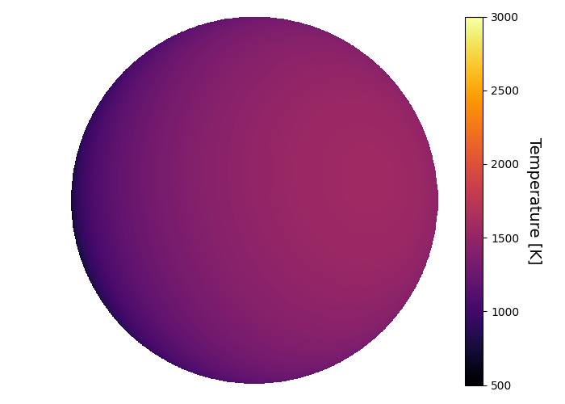
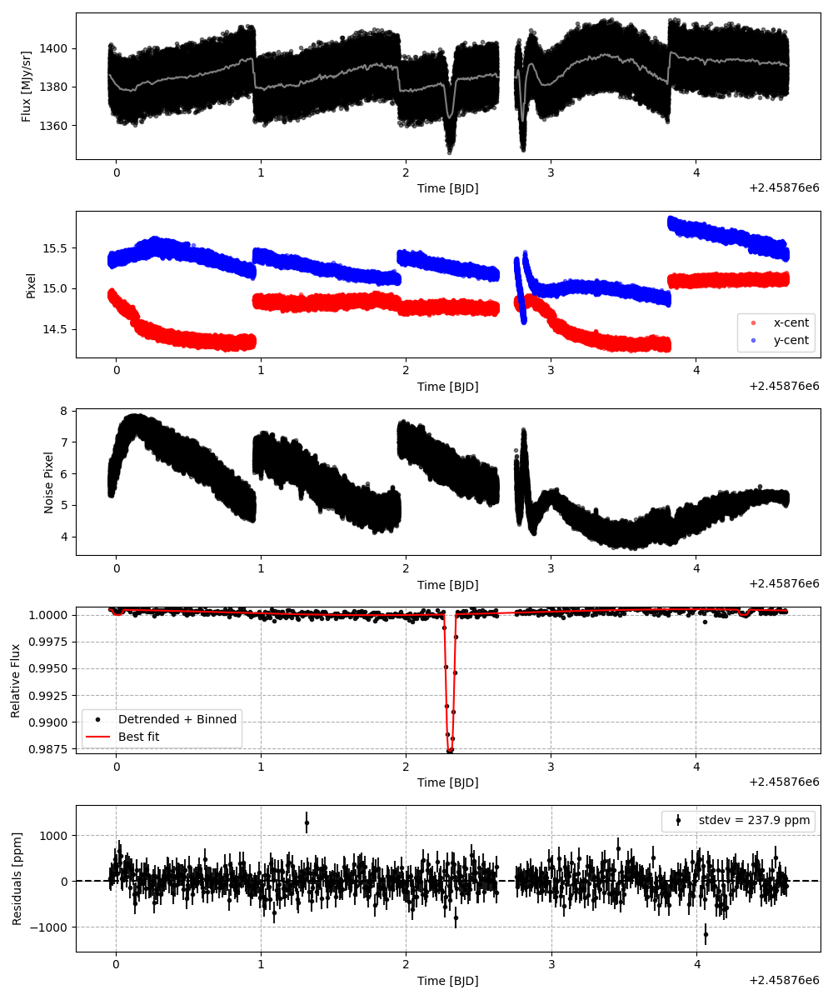
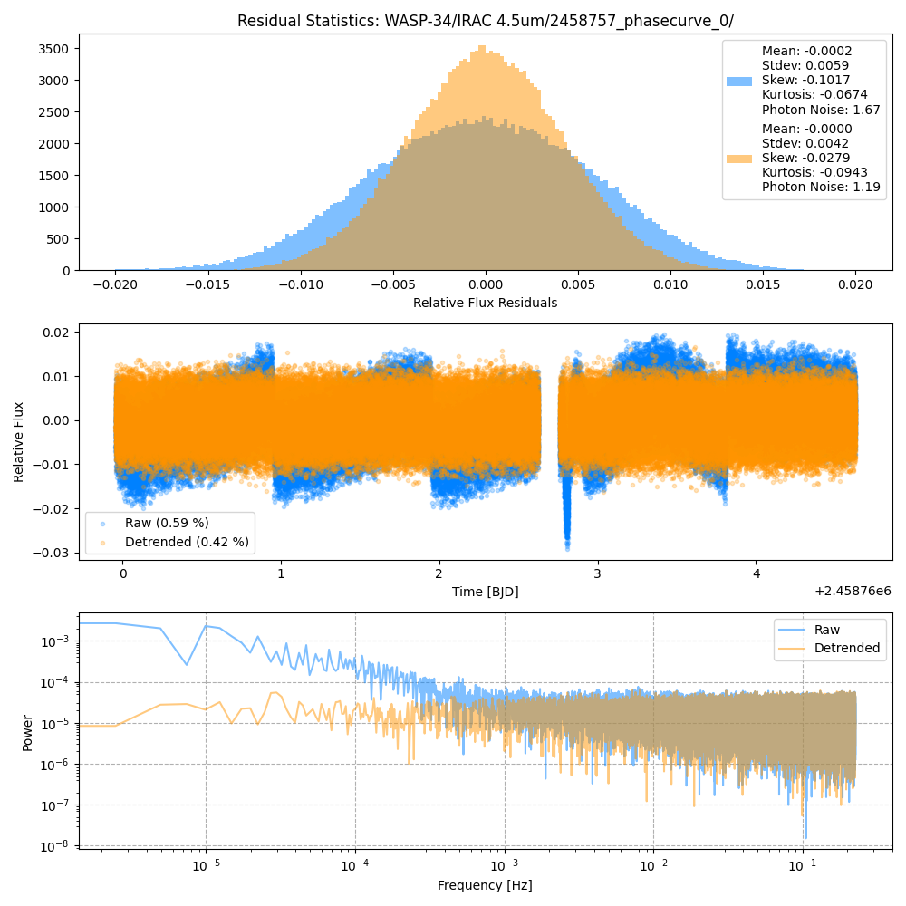
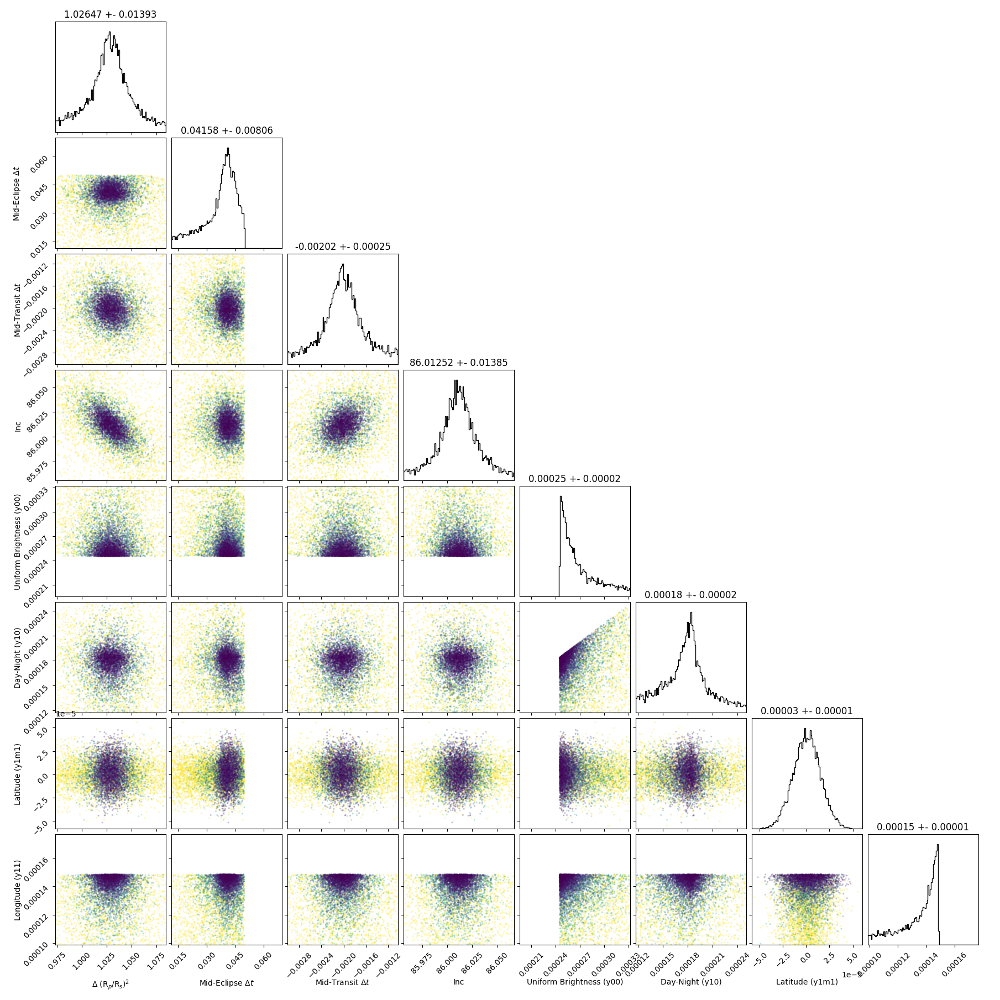
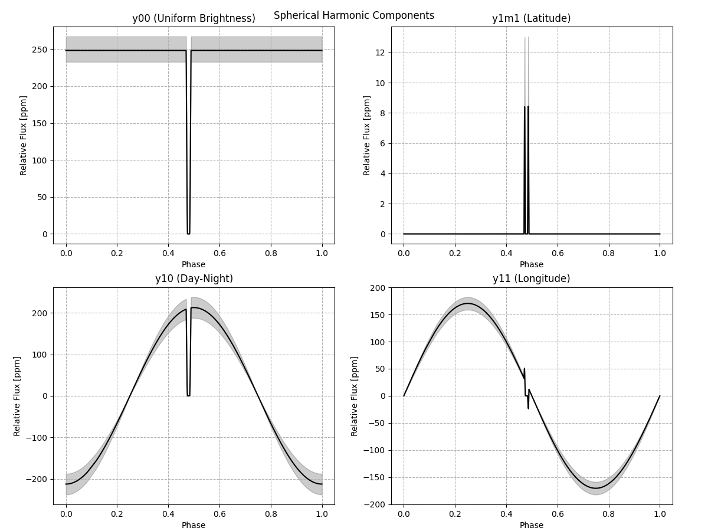
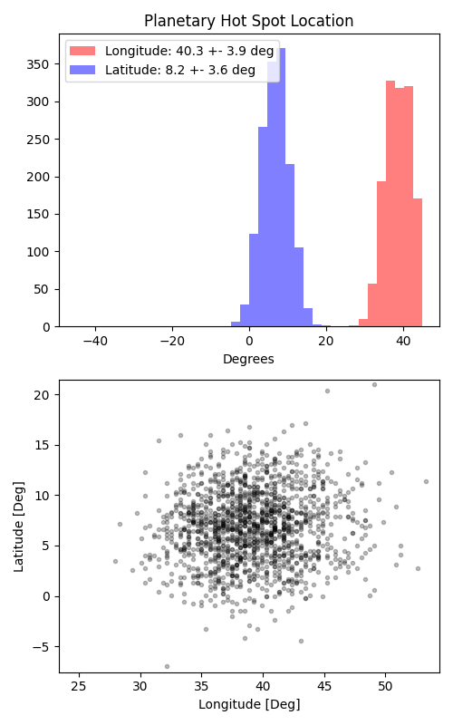

```
# target: wasp-34
# filter: IRAC 4.5um
# tmid: 2458762.304585 +- 0.000249
# emid: 2458760.012026 +- 0.008058
# transit_depth: 0.012783+-0.000012
# eclipse_depth: 0.000491 +- 0.000028
# nightside_amp: 0.000075 +- 0.000057
# hotspot_amp: 0.000521 +- 0.000028
# hotspot_lon[deg]: 38.885630 +- 3.881197
# hotspot_lat[deg]: 6.950147 +- 3.630176
time,flux,err,xcent,ycent,npp,phase,raw_flux,phasecurve
2458759.956828,0.999062,0.003790,14.893918,15.379654,6.220539,0.466330,1379.328301,1.000492
2458759.956850,0.998904,0.003790,14.883651,15.392590,6.332400,0.466336,1379.475734,1.000492
2458759.956896,0.998165,0.003792,14.884499,15.360958,6.203160,0.466346,1378.141524,1.000492
2458759.956919,1.001648,0.003781,14.889448,15.345026,5.979802,0.466351,1385.884538,1.000492
2458759.956941,1.001034,0.003784,14.884152,15.350762,6.061996,0.466357,1383.752559,1.000492

...
```

[timeseries.csv](timeseries.csv)

```python
import pandas as pd

df = pd.read_csv('timeseries.csv', comment='#')

# extract comments from the file
with open('timeseries.csv', 'r') as f:
    comments = [line for line in f if line.startswith('#')]

# clean and convert to a dictionary
comments_dict = dict()
for comment in comments:
    key, value = comment[1:].strip().split(': ')
    comments_dict[key] = value

# print the comments
print(comments_dict)
```















