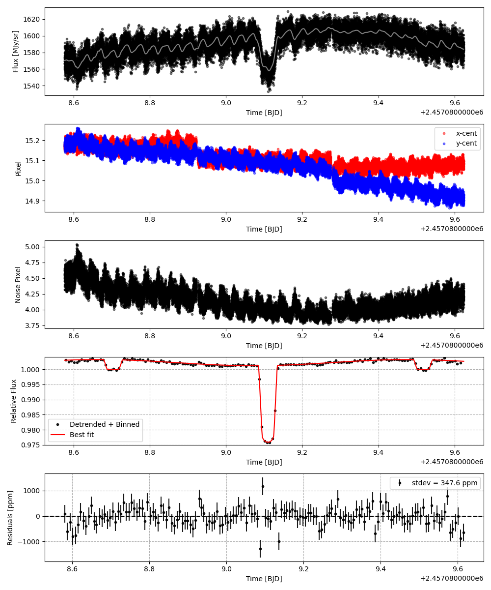
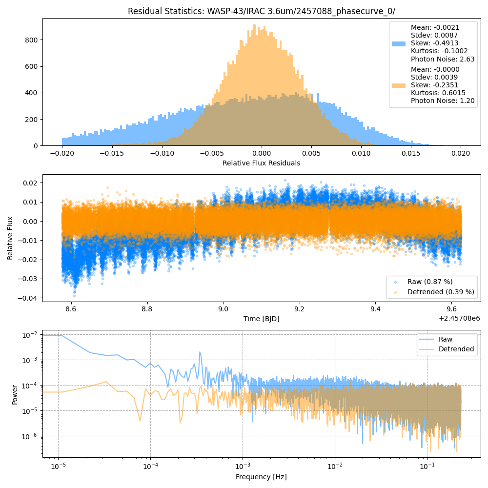
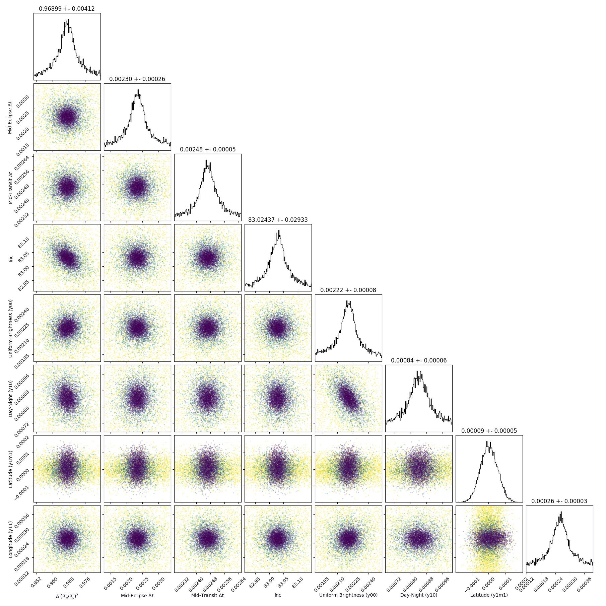
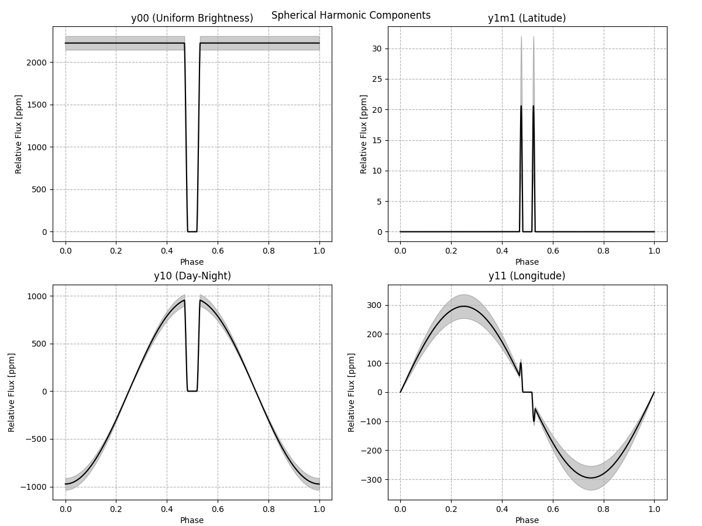
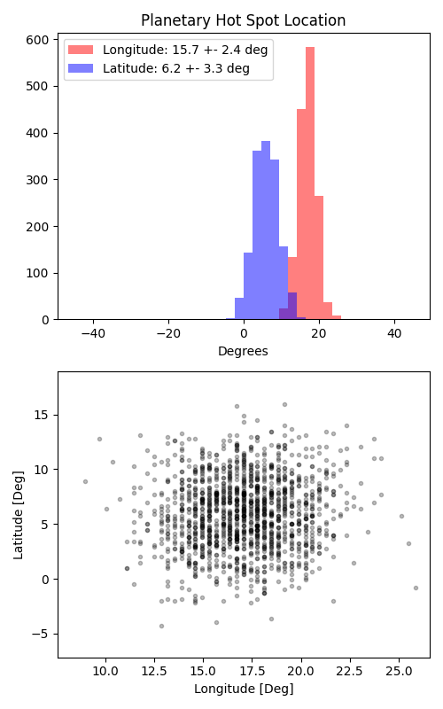

```
# target: wasp-43
# filter: IRAC 3.6um
# tmid: 2457089.110119 +- 0.000047
# emid: 2457088.703513 +- 0.000261
# transit_depth: 0.025858+-0.000040
# eclipse_depth: 0.003240 +- 0.000103
# nightside_amp: 0.001717 +- 0.000195
# hotspot_amp: 0.003240 +- 0.000103
# hotspot_lon[deg]: 17.067449 +- 2.380897
# hotspot_lat[deg]: 5.894428 +- 3.264345
time,flux,err,xcent,ycent,npp,phase,raw_flux,phasecurve
2457088.576845,0.993522,0.003326,15.173300,15.176325,4.454128,0.343997,1560.108751,1.003011
2457088.576868,1.010037,0.003299,15.172469,15.169589,4.455768,0.344025,1585.822812,1.003011
2457088.576891,1.005728,0.003306,15.184159,15.177625,4.473700,0.344053,1578.900722,1.003011
2457088.576914,1.005042,0.003312,15.171842,15.173284,4.507566,0.344081,1573.520580,1.003011
2457088.576936,1.004316,0.003315,15.173091,15.187610,4.529019,0.344109,1570.776996,1.003011

...
```

[timeseries.csv](timeseries.csv)

```python
import pandas as pd

df = pd.read_csv('timeseries.csv', comment='#')

# extract comments from the file
with open('timeseries.csv', 'r') as f:
    comments = [line for line in f if line.startswith('#')]

# clean and convert to a dictionary
comments_dict = dict()
for comment in comments:
    key, value = comment[1:].strip().split(': ')
    comments_dict[key] = value

# print the comments
print(comments_dict)
```













