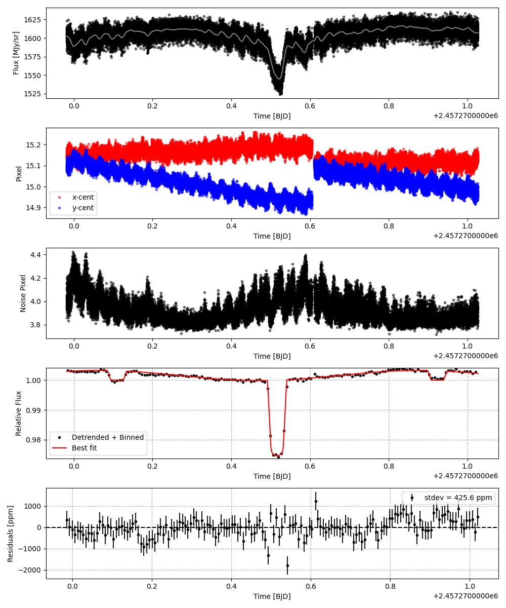
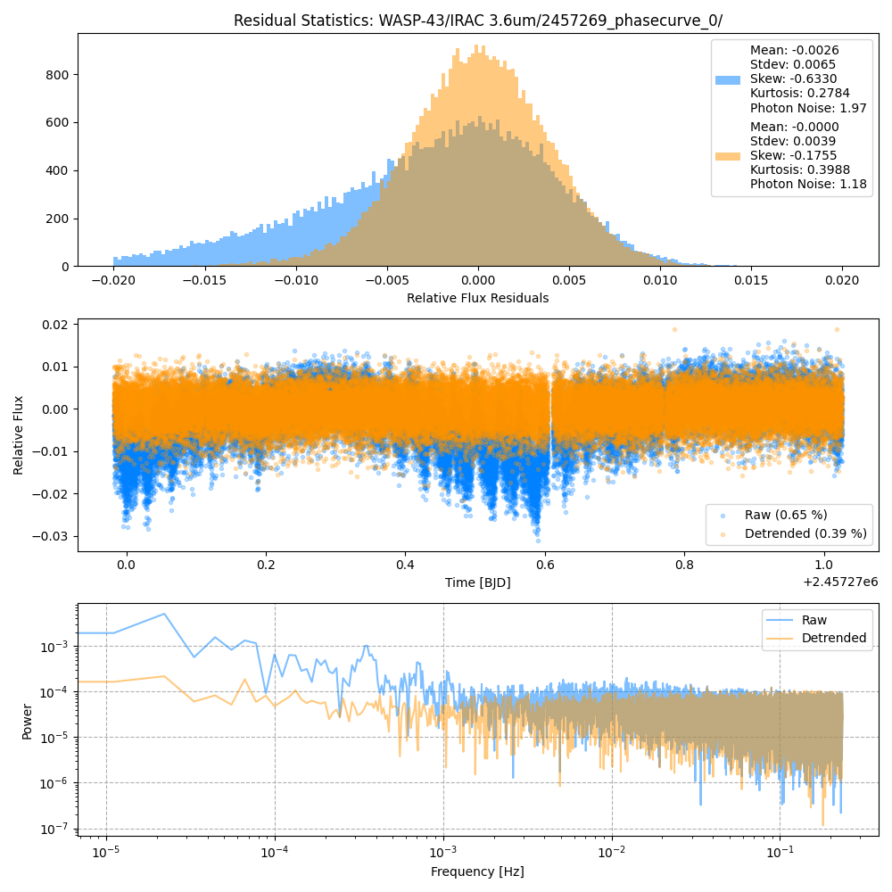
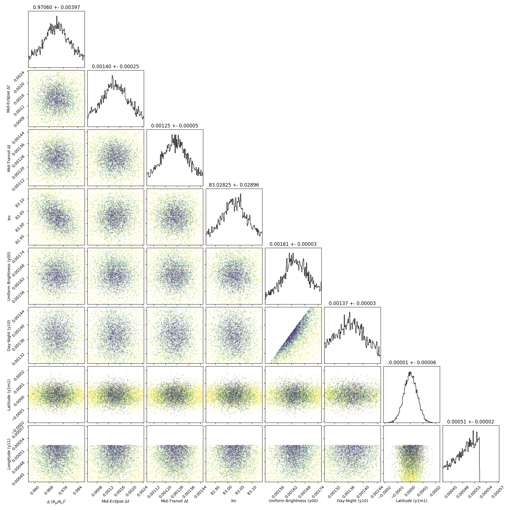
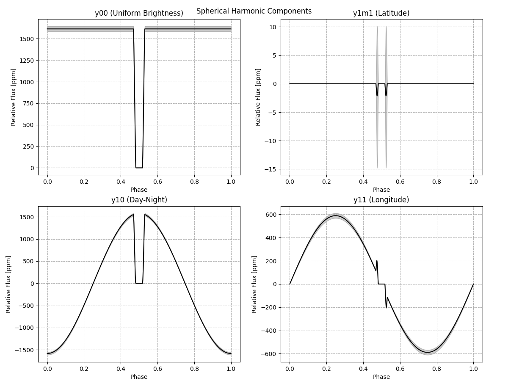
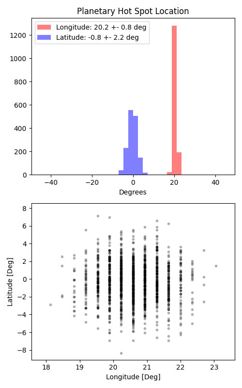

```
# target: wasp-43
# filter: <_io.TextIOWrapper name='DATA/WASP-43/IRAC 3.6um/2457088_phasecurve_0/timeseries.csv' mode='w' encoding='UTF-8'>
# tmid: 2457270.516062 +- 0.000048
# emid: 2457270.109555 +- 0.000249
# transit_depth: 0.026268+-0.000017
# eclipse_depth: 0.003303 +- 0.000044
# nightside_amp: 0.000865 +- 0.000050
# hotspot_amp: 0.003303 +- 0.000044
# hotspot_lon[deg]: 20.586510 +- 0.756751
# hotspot_lat[deg]: -0.263930 +- 2.209201
time,flux,err,xcent,ycent,npp,phase,raw_flux,phasecurve
2457269.982045,1.003769,0.003276,15.143443,15.074615,3.940274,0.343218,1608.676981,1.002980
2457269.982067,0.999431,0.003287,15.139618,15.092294,3.963453,0.343246,1597.847506,1.002980
2457269.982090,1.004370,0.003281,15.160697,15.105040,3.998278,0.343274,1603.680039,1.002981
2457269.982113,1.006795,0.003279,15.170469,15.093699,4.052110,0.343302,1605.537824,1.002981
2457269.982136,1.005922,0.003279,15.186570,15.100601,4.055906,0.343330,1605.135327,1.002981

...
```

[timeseries.csv](timeseries.csv)

```python
import pandas as pd

df = pd.read_csv('timeseries.csv', comment='#')

# extract comments from the file
with open('timeseries.csv', 'r') as f:
    comments = [line for line in f if line.startswith('#')]

# clean and convert to a dictionary
comments_dict = dict()
for comment in comments:
    key, value = comment[1:].strip().split(': ')
    comments_dict[key] = value

# print the comments
print(comments_dict)
```













