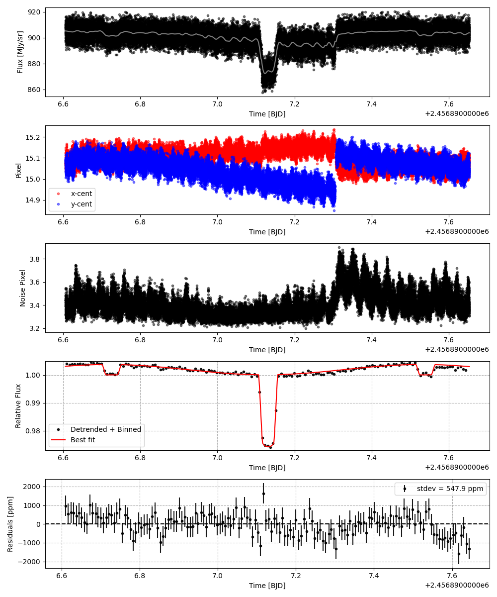
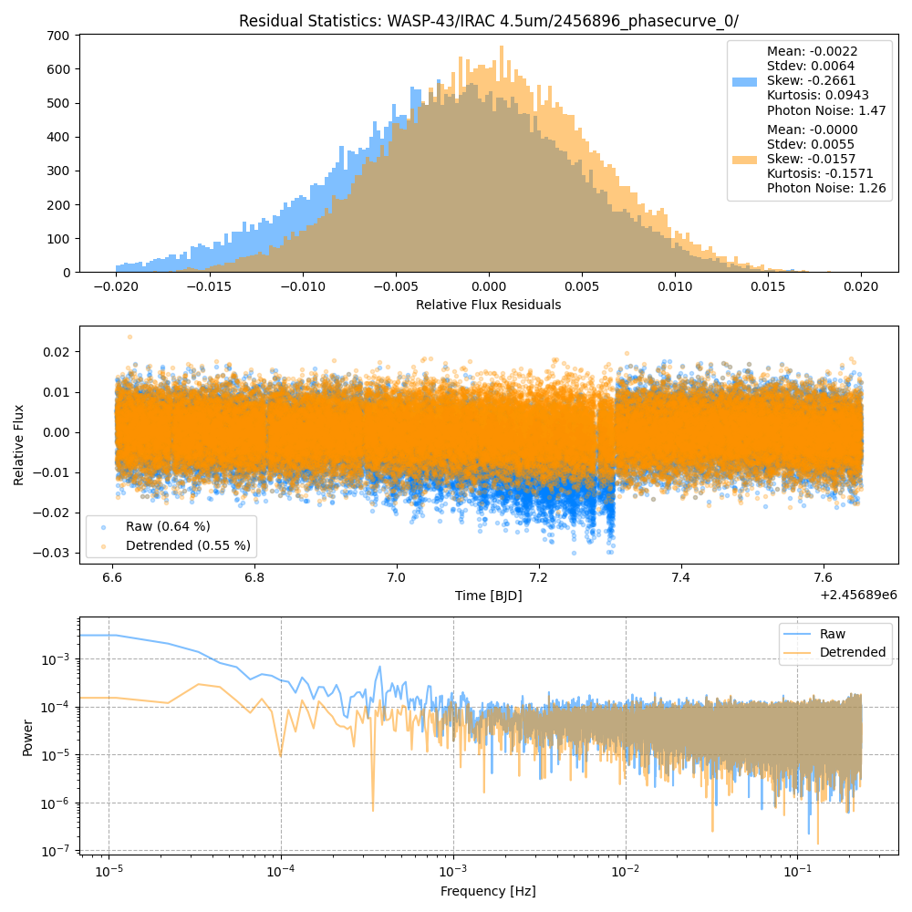
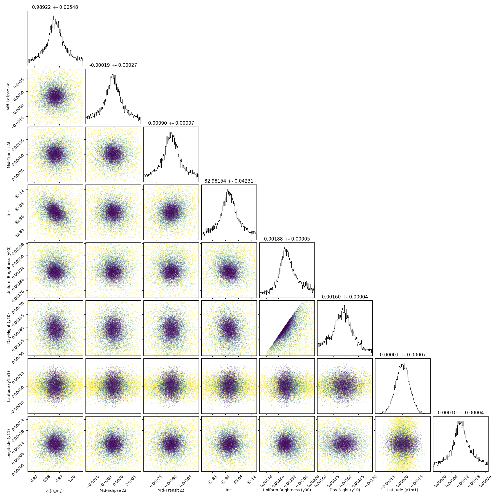
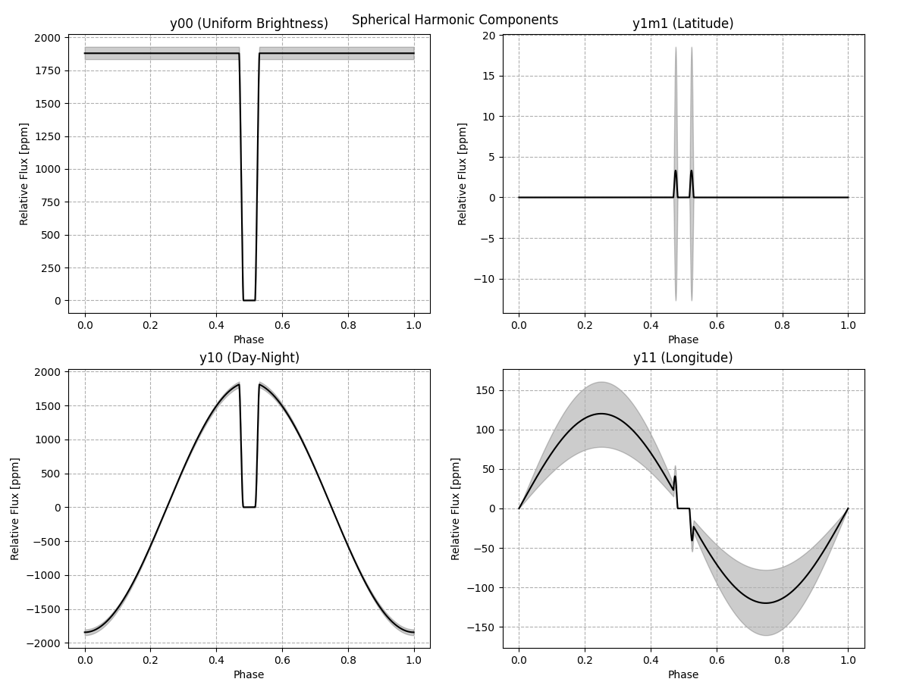
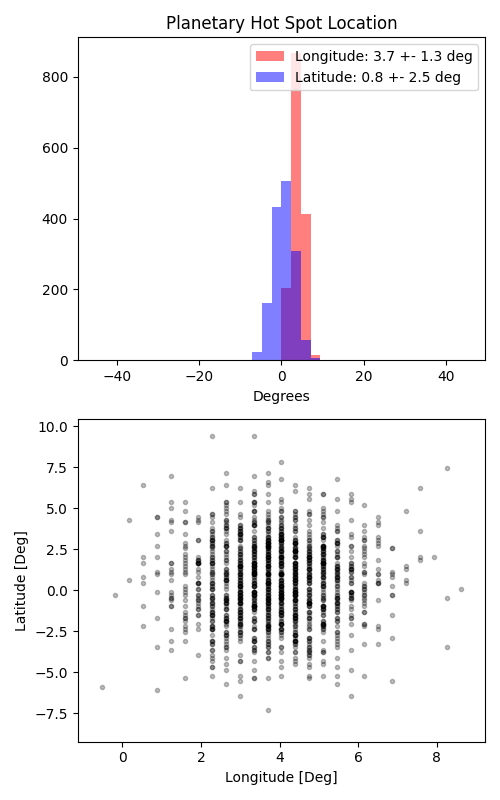

```
# target: wasp-43
# filter: <_io.TextIOWrapper name='DATA/WASP-43/IRAC 4.5um/2458752_phasecurve_0/timeseries.csv' mode='w' encoding='UTF-8'>
# tmid: 2456897.131703 +- 0.000069
# emid: 2456896.726136 +- 0.000274
# transit_depth: 0.026320+-0.000026
# eclipse_depth: 0.003700 +- 0.000064
# nightside_amp: 0.000610 +- 0.000106
# hotspot_amp: 0.003701 +- 0.000064
# hotspot_lon[deg]: 4.046921 +- 1.294819
# hotspot_lat[deg]: 0.615836 +- 2.458991
time,flux,err,xcent,ycent,npp,phase,raw_flux,phasecurve
2456896.606182,1.007786,0.004668,15.067461,15.084389,3.484044,0.352531,909.366093,1.003083
2456896.606205,1.008827,0.004665,15.069555,15.092369,3.542943,0.352559,910.431765,1.003083
2456896.606228,1.000548,0.004686,15.043668,15.115296,3.546838,0.352587,902.404965,1.003083
2456896.606251,1.009035,0.004665,15.073482,15.088467,3.443777,0.352615,910.744102,1.003084
2456896.606296,0.996997,0.004693,15.069664,15.059243,3.422706,0.352671,899.791986,1.003084

...
```

[timeseries.csv](timeseries.csv)

```python
import pandas as pd

df = pd.read_csv('timeseries.csv', comment='#')

# extract comments from the file
with open('timeseries.csv', 'r') as f:
    comments = [line for line in f if line.startswith('#')]

# clean and convert to a dictionary
comments_dict = dict()
for comment in comments:
    key, value = comment[1:].strip().split(': ')
    comments_dict[key] = value

# print the comments
print(comments_dict)
```













