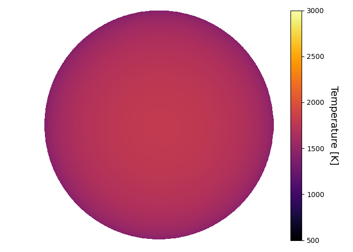
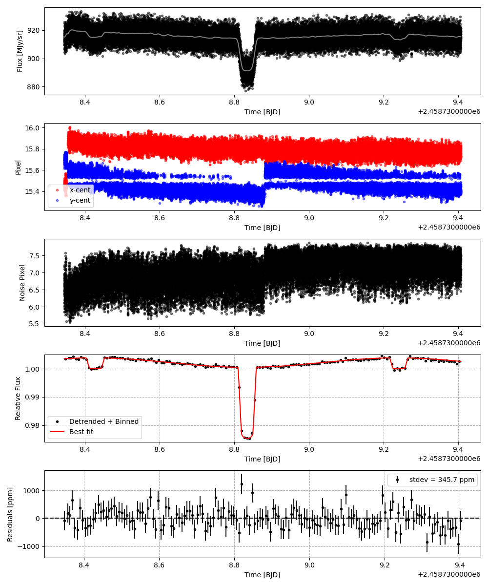
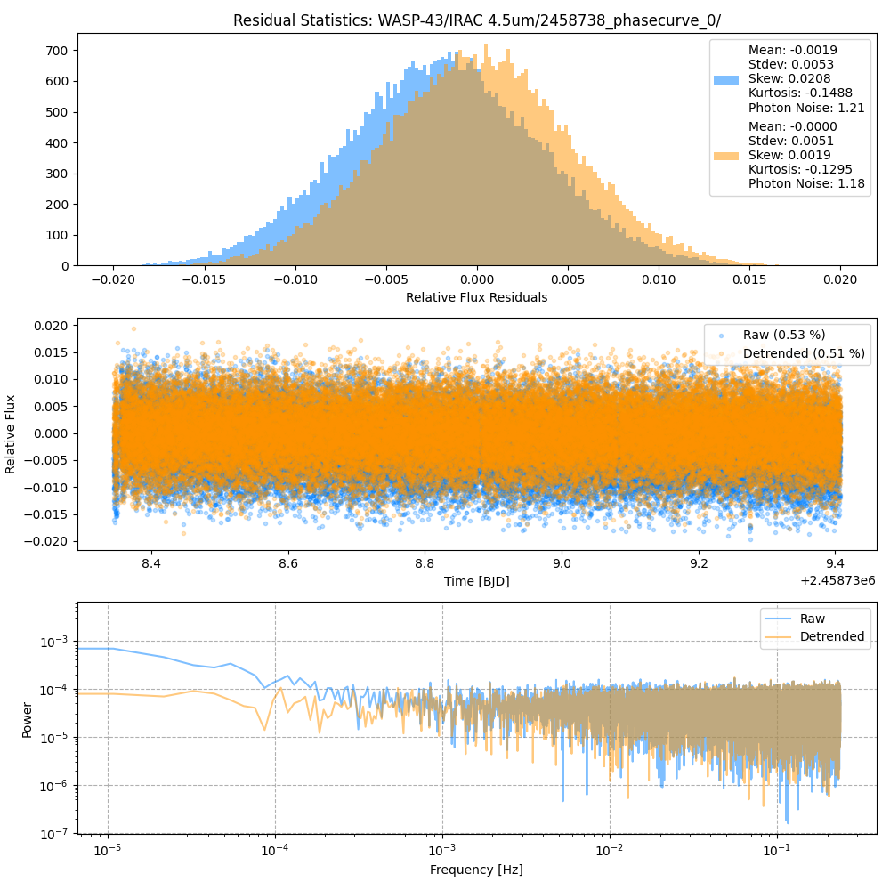
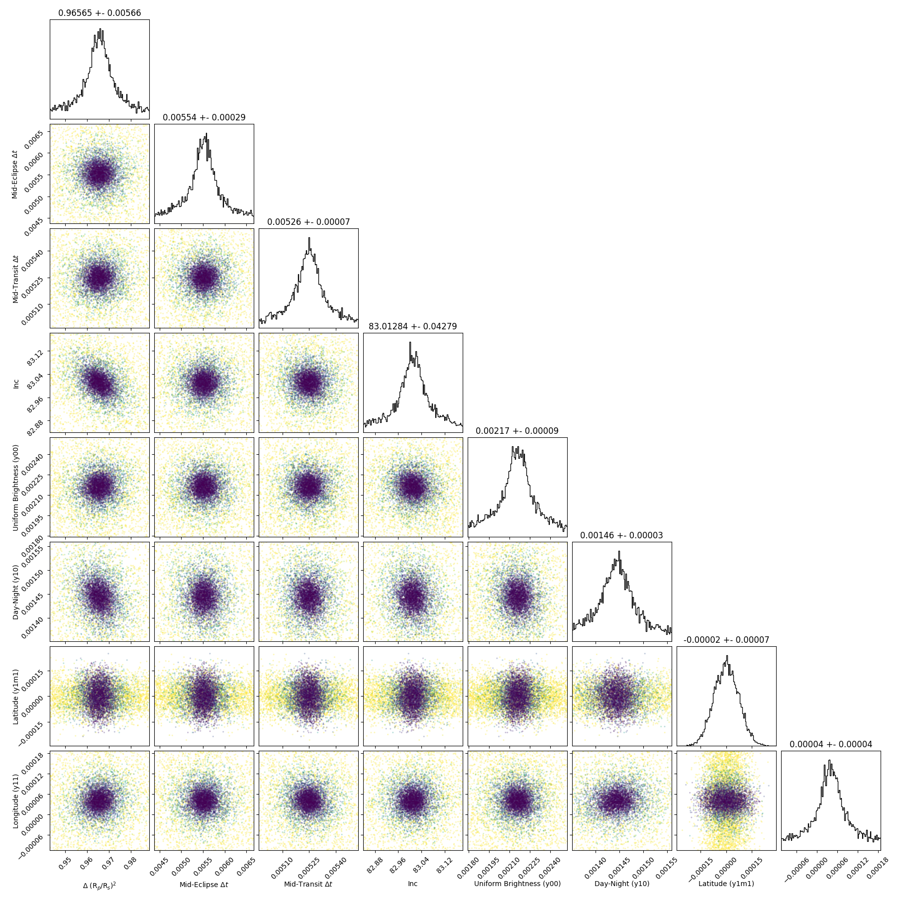
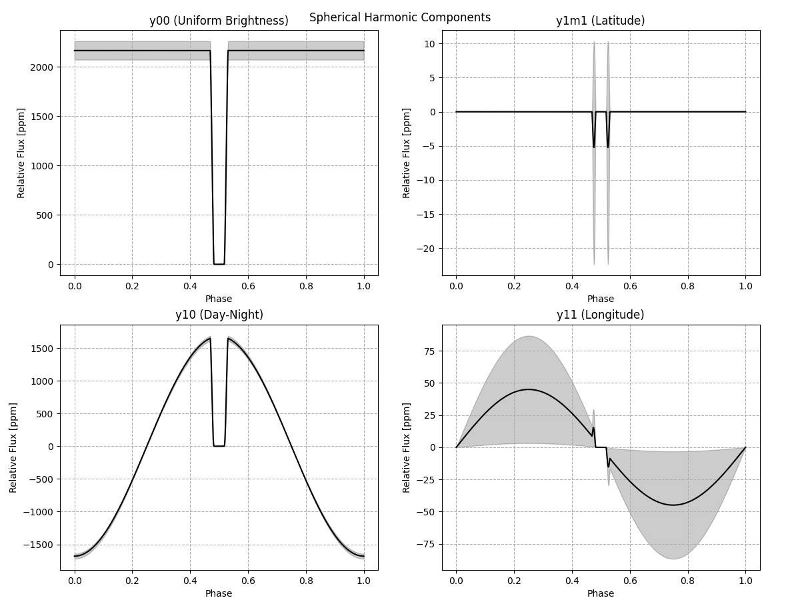
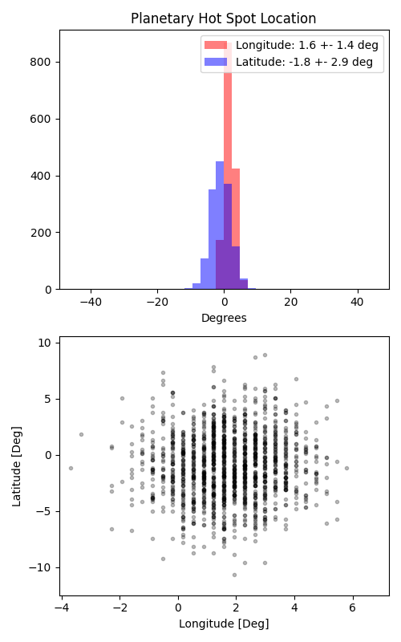

```
# target: wasp-43
# filter: IRAC 4.5um
# tmid: 2458738.834783 +- 0.000070
# emid: 2458738.427811 +- 0.000288
# transit_depth: 0.025635+-0.000035
# eclipse_depth: 0.003810 +- 0.000100
# nightside_amp: 0.000977 +- 0.000199
# hotspot_amp: 0.003810 +- 0.000100
# hotspot_lon[deg]: 1.583578 +- 1.417515
# hotspot_lat[deg]: -0.967742 +- 2.885336
time,flux,err,xcent,ycent,npp,phase,raw_flux,phasecurve
2458738.344358,1.003805,0.004655,15.434034,15.701976,6.382644,0.397416,914.726098,1.003535
2458738.344381,1.007399,0.004646,15.455675,15.695326,6.604717,0.397444,918.114760,1.003535
2458738.344404,0.995083,0.004673,15.487468,15.691139,6.733901,0.397472,907.409545,1.003536
2458738.344426,1.006648,0.004646,15.487125,15.676190,6.846570,0.397500,917.923777,1.003536
2458738.344449,1.008536,0.004642,15.472652,15.653208,6.826158,0.397528,919.735831,1.003536

...
```

[timeseries.csv](timeseries.csv)

```python
import pandas as pd

df = pd.read_csv('timeseries.csv', comment='#')

# extract comments from the file
with open('timeseries.csv', 'r') as f:
    comments = [line for line in f if line.startswith('#')]

# clean and convert to a dictionary
comments_dict = dict()
for comment in comments:
    key, value = comment[1:].strip().split(': ')
    comments_dict[key] = value

# print the comments
print(comments_dict)
```















