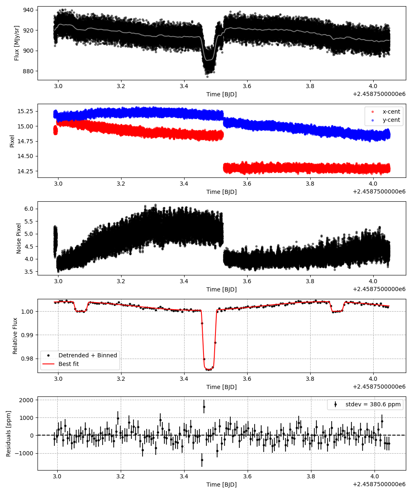

```
# target: wasp-43
# filter: <_io.TextIOWrapper name='DATA/WASP-43/IRAC 4.5um/2458738_phasecurve_0/timeseries.csv' mode='w' encoding='UTF-8'>
# tmid: 2458753.478143 +- 0.000069
# emid: 2458753.071578 +- 0.000312
# transit_depth: 0.026057+-0.000049
# eclipse_depth: 0.004050 +- 0.000131
# nightside_amp: 0.001316 +- 0.000155
# hotspot_amp: 0.004050 +- 0.000131
# hotspot_lon[deg]: 16.715543 +- 2.624455
# hotspot_lat[deg]: 5.190616 +- 2.632632
time,flux,err,xcent,ycent,npp,phase,raw_flux,phasecurve
2458752.987143,1.017157,0.004606,14.951642,15.189535,4.455973,0.396218,934.123653,1.003931
2458752.987166,1.014129,0.004613,14.958592,15.169536,4.378966,0.396246,931.414974,1.003931
2458752.987189,1.000243,0.004641,14.964085,15.156308,4.301072,0.396274,920.221534,1.003932
2458752.987212,0.998785,0.004647,14.984584,15.154138,4.188647,0.396302,917.751960,1.003932
2458752.987280,0.999983,0.004642,14.949853,15.152259,4.266846,0.396386,919.854173,1.003932

...
```

[timeseries.csv](timeseries.csv)

```python
import pandas as pd

df = pd.read_csv('timeseries.csv', comment='#')

# extract comments from the file
with open('timeseries.csv', 'r') as f:
    comments = [line for line in f if line.startswith('#')]

# clean and convert to a dictionary
comments_dict = dict()
for comment in comments:
    key, value = comment[1:].strip().split(': ')
    comments_dict[key] = value

# print the comments
print(comments_dict)
```





