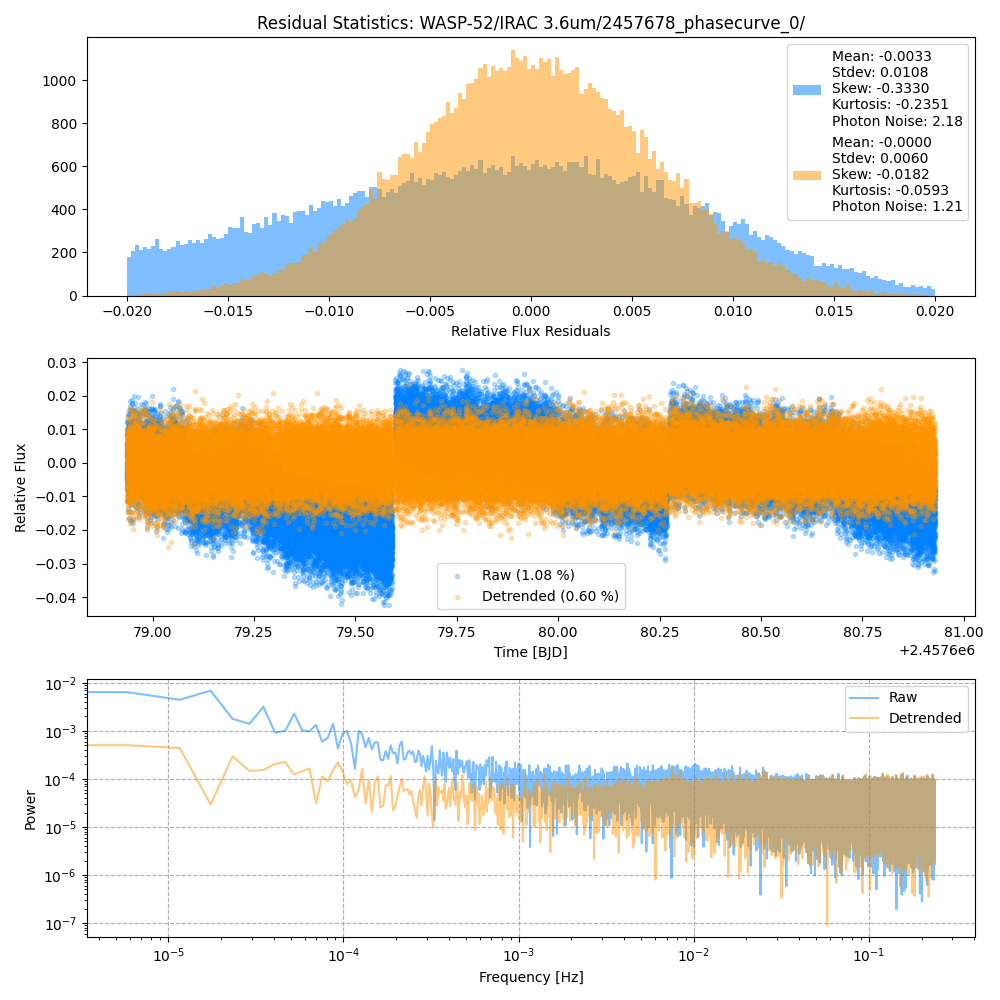

```
# target: wasp-52
# filter: IRAC 3.6um
# tmid: 2457679.942173 +- 0.000087
# emid: 2457679.064756 +- 0.000588
# transit_depth: 0.028095+-0.000028
# eclipse_depth: 0.003848 +- 0.000089
# nightside_amp: 0.003134 +- 0.000146
# hotspot_amp: 0.003916 +- 0.000089
# hotspot_lon[deg]: 46.979472 +- 0.806296
# hotspot_lat[deg]: -7.302053 +- 3.985155
time,flux,err,xcent,ycent,npp,phase,raw_flux,phasecurve
2457678.936863,1.002758,0.004929,15.060114,15.001823,3.931250,0.426905,710.328062,1.003880
2457678.936885,0.997297,0.004946,15.053149,14.985778,4.060411,0.426918,705.656544,1.003880
2457678.936908,1.010010,0.004915,15.033837,14.997130,4.069746,0.426931,714.622275,1.003880
2457678.936931,0.997225,0.004945,15.043621,14.992200,4.020206,0.426944,705.774316,1.003880
2457678.936954,0.999673,0.004941,15.051710,14.969559,4.051159,0.426957,706.872773,1.003880

...
```

[timeseries.csv](timeseries.csv)

```python
import pandas as pd

df = pd.read_csv('timeseries.csv', comment='#')

# extract comments from the file
with open('timeseries.csv', 'r') as f:
    comments = [line for line in f if line.startswith('#')]

# clean and convert to a dictionary
comments_dict = dict()
for comment in comments:
    key, value = comment[1:].strip().split(': ')
    comments_dict[key] = value

# print the comments
print(comments_dict)
```





