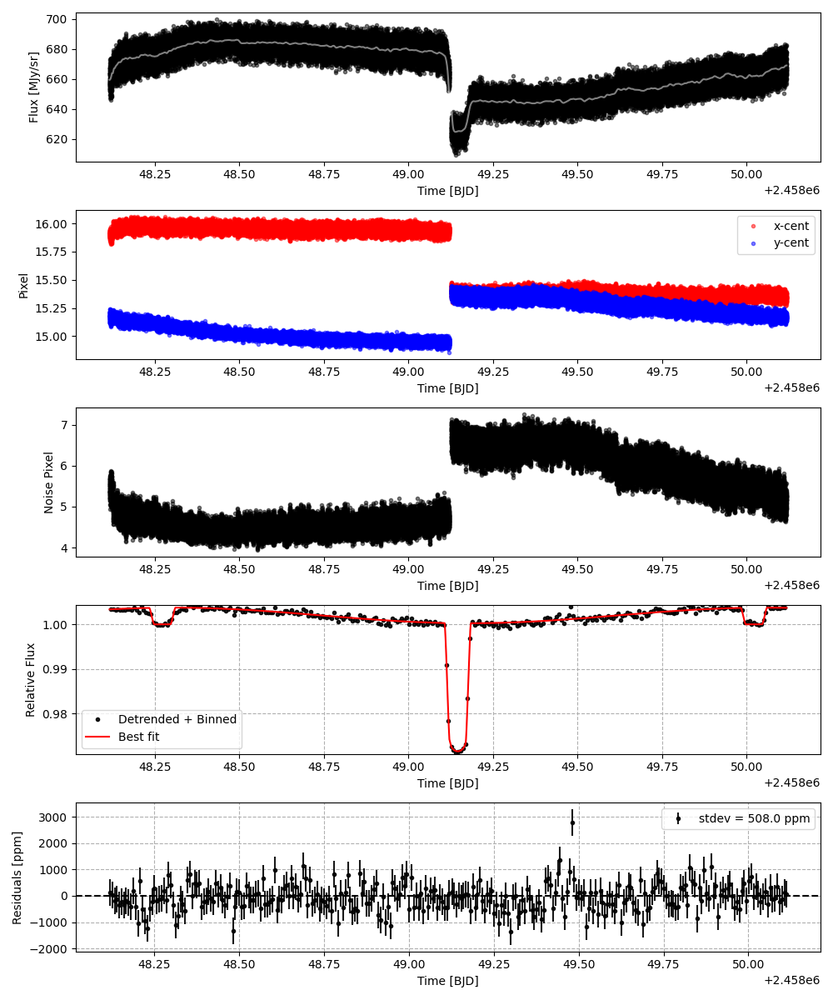
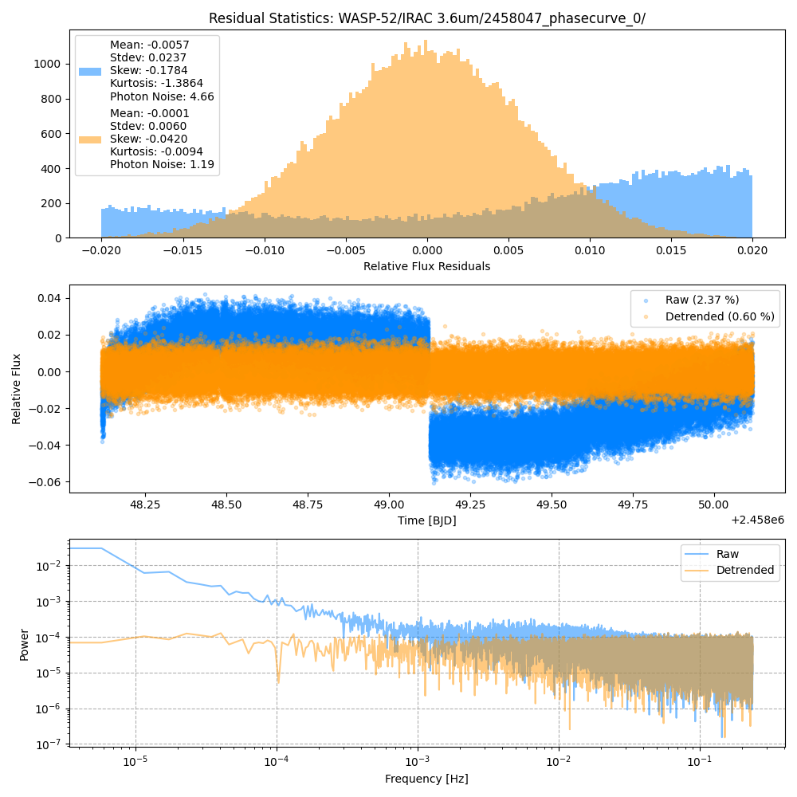
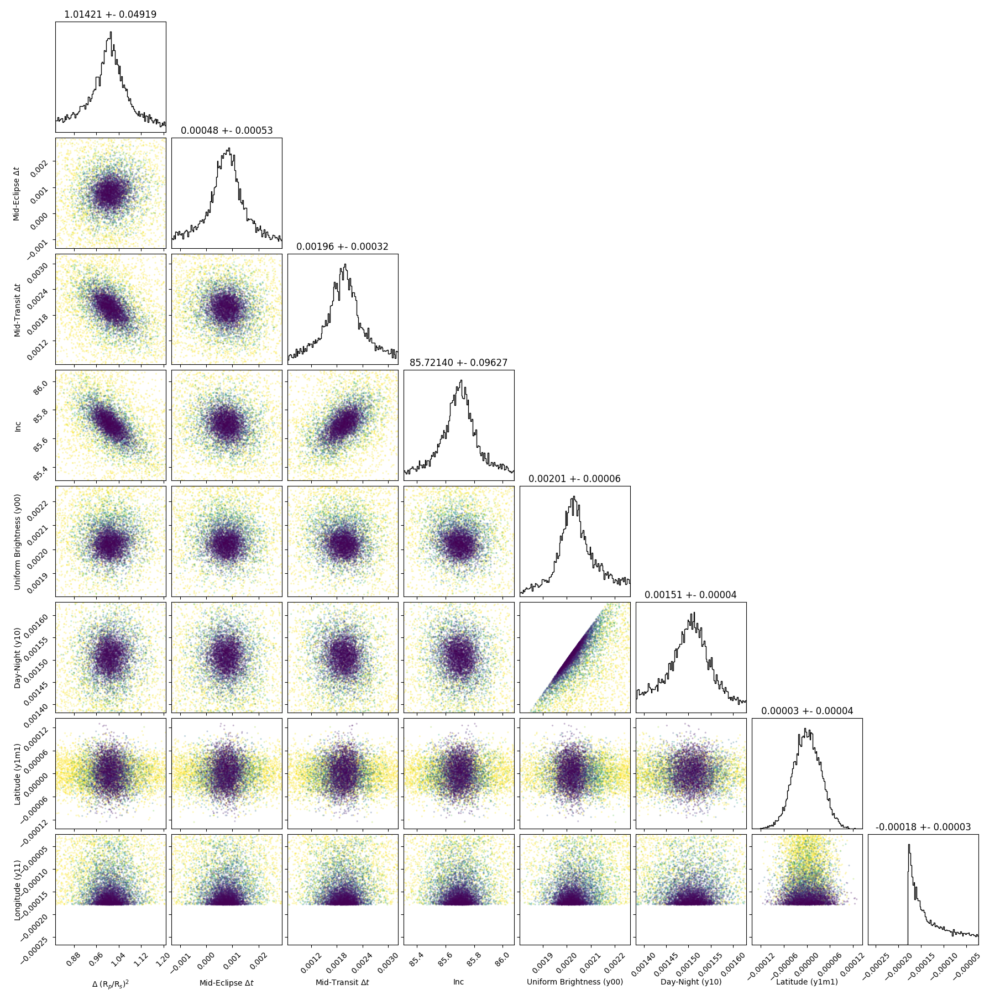
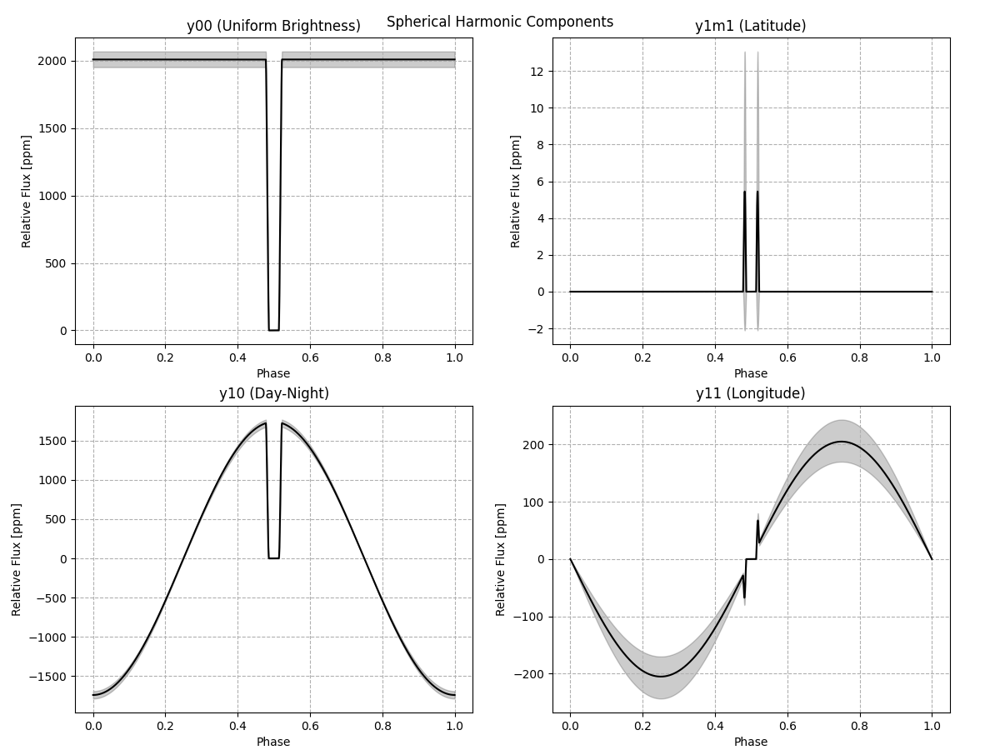
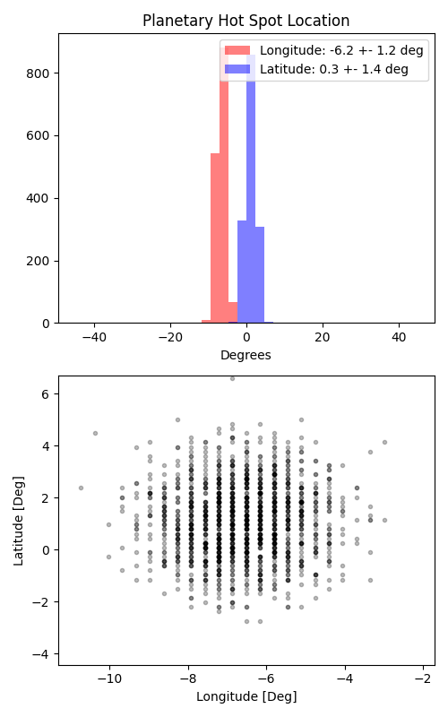

```
# target: wasp-52
# filter: <_io.TextIOWrapper name='DATA/WASP-52/IRAC 3.6um/2457678_phasecurve_0/timeseries.csv' mode='w' encoding='UTF-8'>
# tmid: 2458049.145776 +- 0.000325
# emid: 2458048.272214 +- 0.000532
# transit_depth: 0.028959+-0.000029
# eclipse_depth: 0.003757 +- 0.000076
# nightside_amp: 0.000451 +- 0.000085
# hotspot_amp: 0.003756 +- 0.000076
# hotspot_lon[deg]: -6.510264 +- 1.202629
# hotspot_lat[deg]: 1.143695 +- 1.391725
time,flux,err,xcent,ycent,npp,phase,raw_flux,phasecurve
2458048.115996,0.993899,0.005131,15.943367,15.182836,5.238072,0.410718,655.668740,1.003371
2458048.116019,0.998280,0.005123,15.938753,15.200589,5.288540,0.410731,657.713068,1.003371
2458048.116042,1.010930,0.005093,15.926627,15.182597,5.287351,0.410744,665.587786,1.003371
2458048.116065,1.005010,0.005106,15.938897,15.181130,5.283304,0.410757,662.084193,1.003371
2458048.116087,1.008592,0.005099,15.940496,15.174756,5.312751,0.410770,663.956462,1.003371

...
```

[timeseries.csv](timeseries.csv)

```python
import pandas as pd

df = pd.read_csv('timeseries.csv', comment='#')

# extract comments from the file
with open('timeseries.csv', 'r') as f:
    comments = [line for line in f if line.startswith('#')]

# clean and convert to a dictionary
comments_dict = dict()
for comment in comments:
    key, value = comment[1:].strip().split(': ')
    comments_dict[key] = value

# print the comments
print(comments_dict)
```













