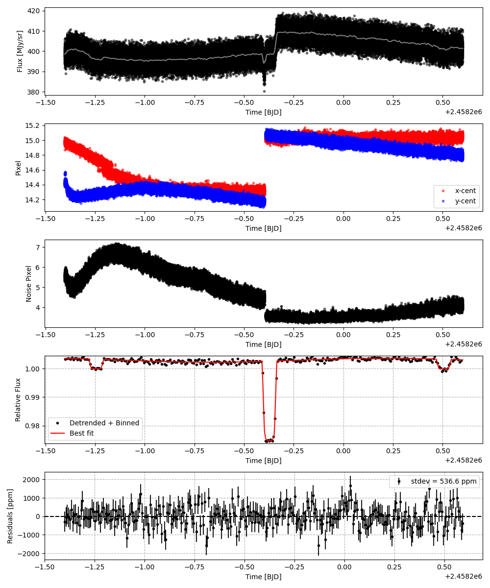

```
# target: wasp-52
# filter: IRAC 4.5um
# tmid: 2458199.627212 +- 0.000542
# emid: 2458198.755317 +- 0.000800
# transit_depth: 0.028211+-0.000074
# eclipse_depth: 0.003496 +- 0.000199
# nightside_amp: 0.002850 +- 0.000254
# hotspot_amp: 0.003669 +- 0.000199
# hotspot_lon[deg]: 61.055718 +- 5.703543
# hotspot_lat[deg]: -1.847507 +- 5.266524
time,flux,err,xcent,ycent,npp,phase,raw_flux,phasecurve
2458198.596069,0.992752,0.007086,14.976824,14.389557,5.566791,0.408981,394.662610,1.003589
2458198.596092,1.004645,0.007051,14.979572,14.406278,5.656602,0.408994,398.625136,1.003589
2458198.596115,1.009534,0.007031,14.977716,14.412212,5.463202,0.409007,400.924556,1.003589
2458198.596137,1.006072,0.007049,14.989220,14.407838,5.334223,0.409020,398.798560,1.003589
2458198.596160,1.003526,0.007056,14.954014,14.389872,5.432989,0.409033,397.989881,1.003589

...
```

[timeseries.csv](timeseries.csv)

```python
import pandas as pd

df = pd.read_csv('timeseries.csv', comment='#')

# extract comments from the file
with open('timeseries.csv', 'r') as f:
    comments = [line for line in f if line.startswith('#')]

# clean and convert to a dictionary
comments_dict = dict()
for comment in comments:
    key, value = comment[1:].strip().split(': ')
    comments_dict[key] = value

# print the comments
print(comments_dict)
```





