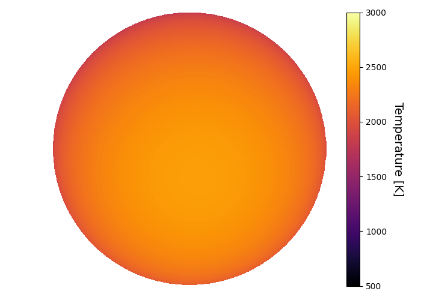
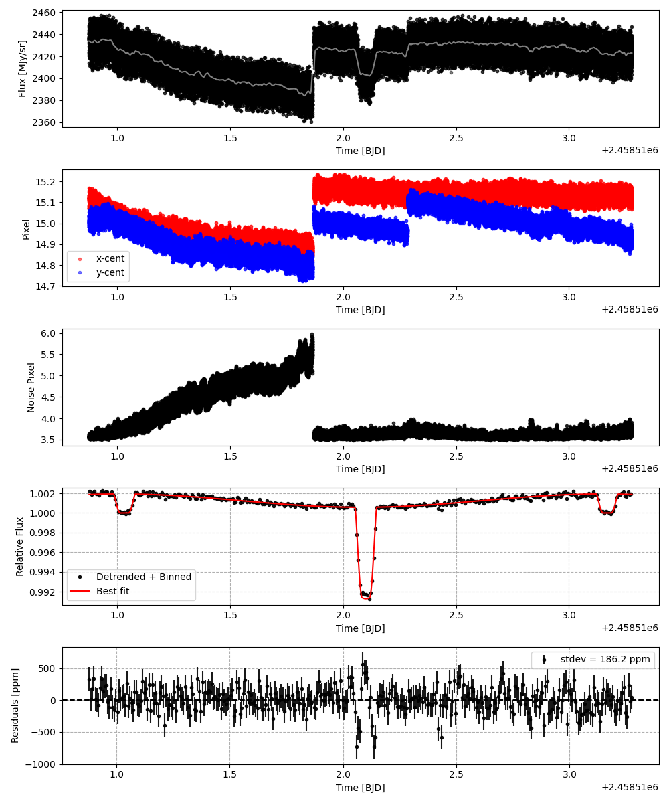
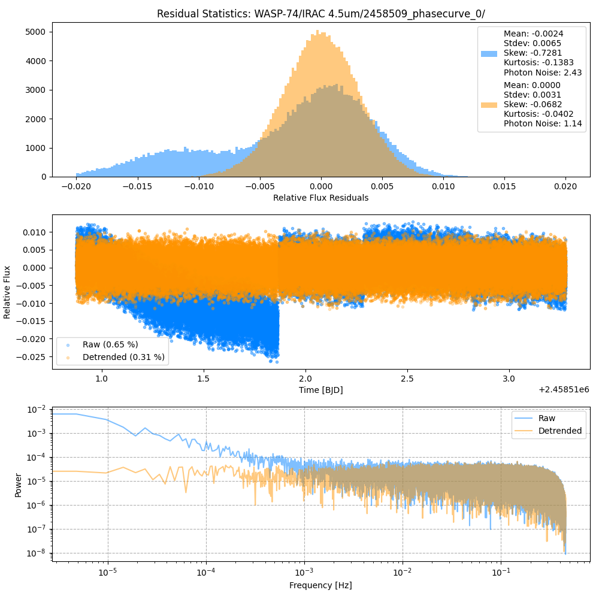
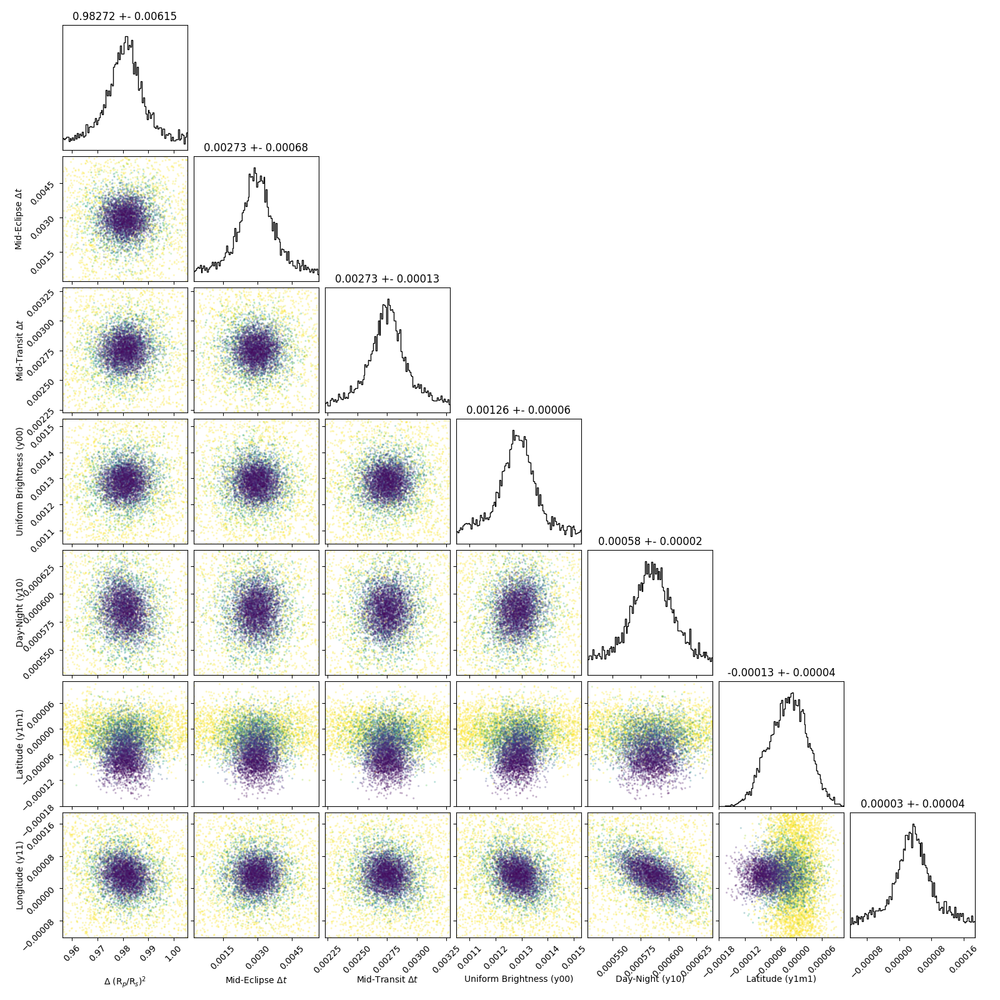
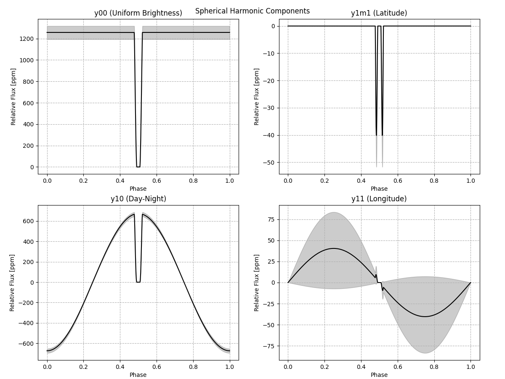
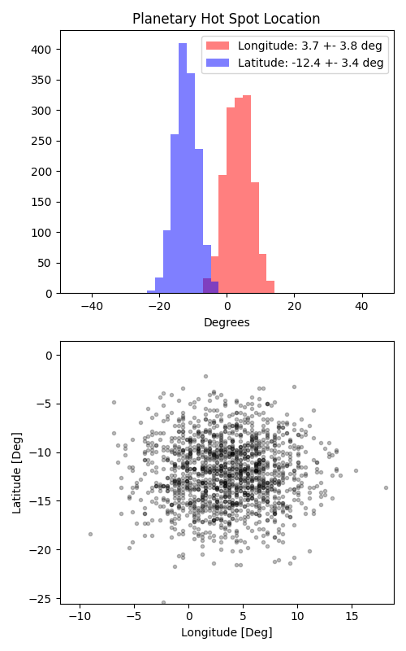

```
# target: wasp-74
# filter: IRAC 4.5um
# tmid: 2458512.100605 +- 0.000131
# emid: 2458511.031874 +- 0.000680
# transit_depth: 0.009312+-0.000022
# eclipse_depth: 0.001929 +- 0.000065
# nightside_amp: 0.000623 +- 0.000086
# hotspot_amp: 0.001928 +- 0.000065
# hotspot_lon[deg]: 3.519062 +- 3.829885
# hotspot_lat[deg]: -12.052786 +- 3.375720
time,flux,err,xcent,ycent,npp,phase,raw_flux,phasecurve
2458510.875579,0.998842,0.002861,15.168829,14.971601,3.637429,0.426885,2420.484522,1.001879
2458510.875579,0.999101,0.002861,15.168829,14.971601,3.637429,0.426885,2420.484522,1.001879
2458510.875602,1.002574,0.002856,15.154754,14.981594,3.619803,0.426896,2429.163845,1.001879
2458510.875602,1.002502,0.002856,15.154754,14.981594,3.619803,0.426896,2429.163845,1.001879
2458510.875624,1.003450,0.002854,15.148045,14.982395,3.575607,0.426907,2432.976632,1.001879

...
```

[timeseries.csv](timeseries.csv)

```python
import pandas as pd

df = pd.read_csv('timeseries.csv', comment='#')

# extract comments from the file
with open('timeseries.csv', 'r') as f:
    comments = [line for line in f if line.startswith('#')]

# clean and convert to a dictionary
comments_dict = dict()
for comment in comments:
    key, value = comment[1:].strip().split(': ')
    comments_dict[key] = value

# print the comments
print(comments_dict)
```















