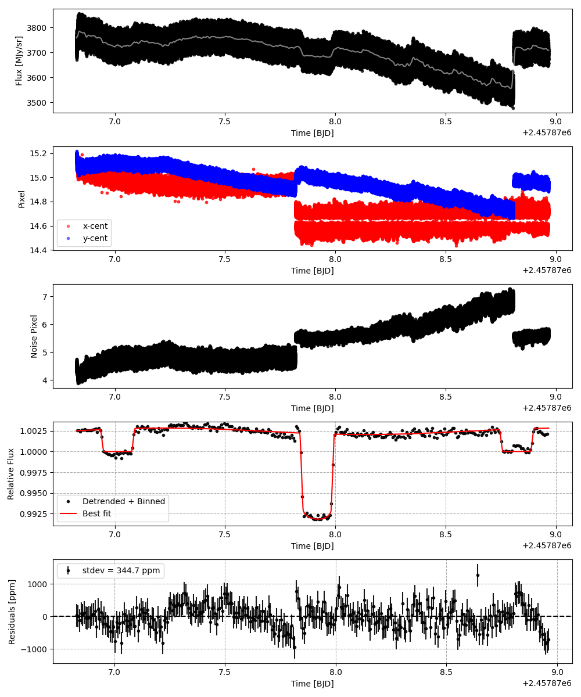
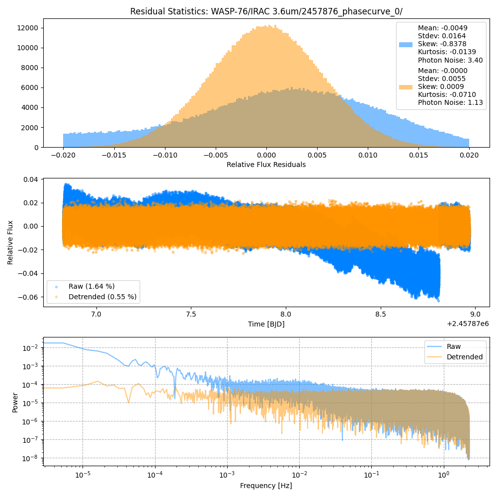
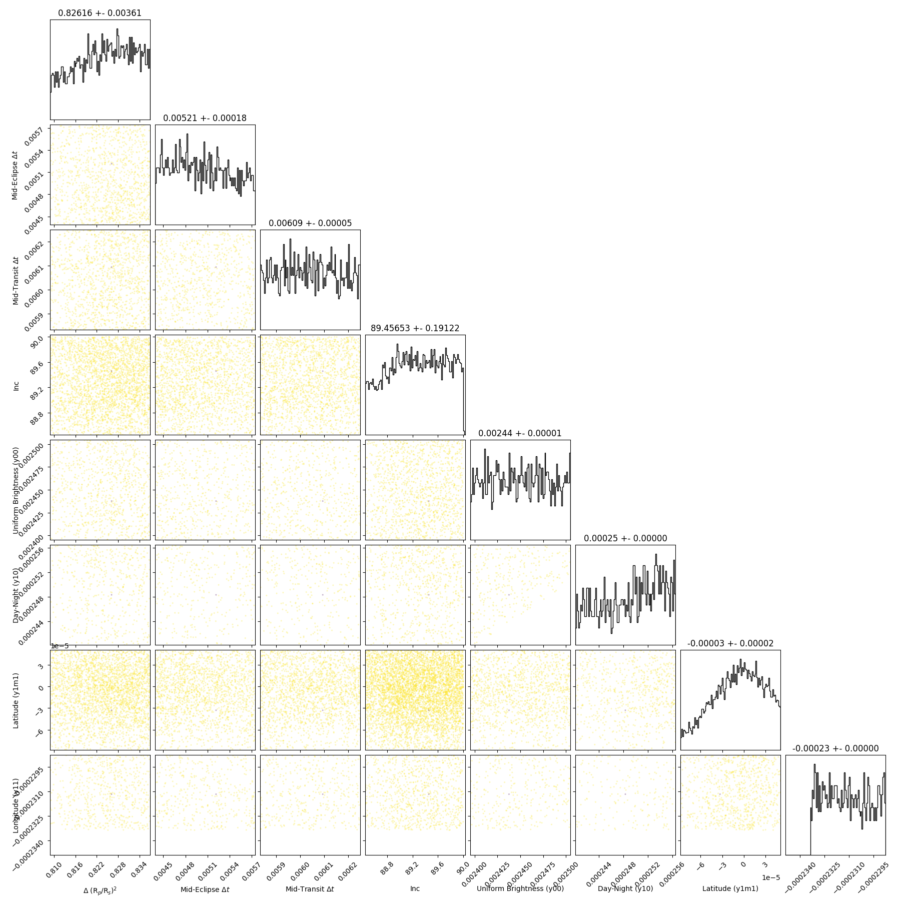
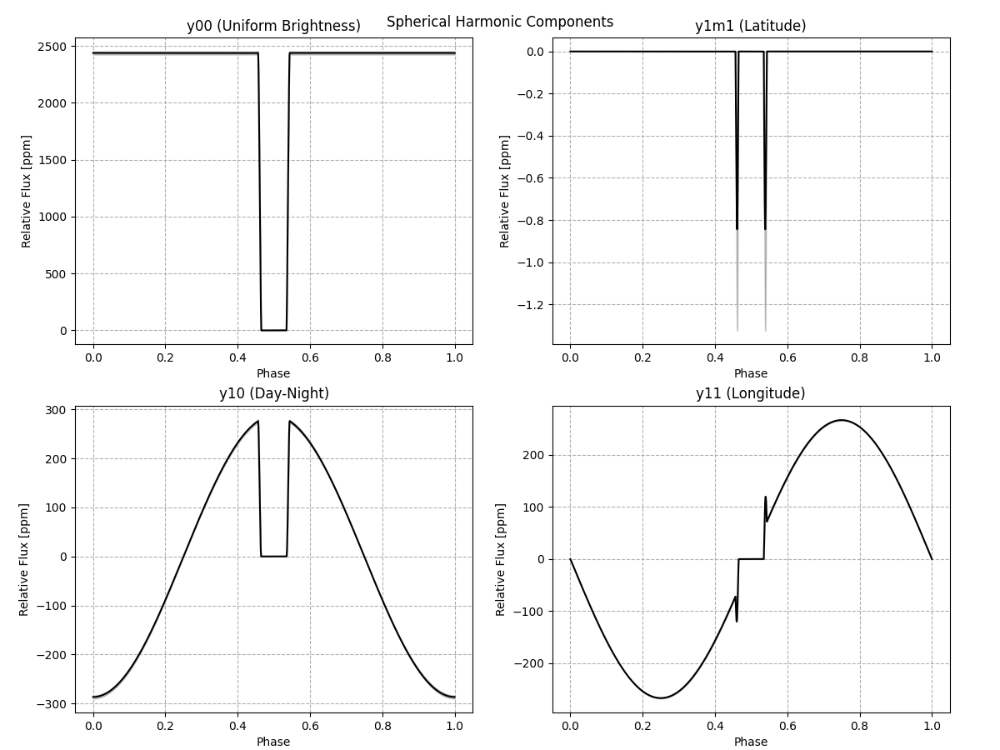
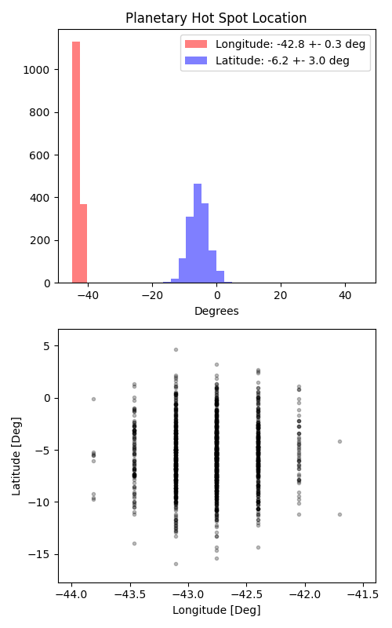

```
# target: wasp-76
# filter: <_io.TextIOWrapper name='DATA/WASP-76/IRAC 3.6um/2458229_phasecurve_0/timeseries.csv' mode='w' encoding='UTF-8'>
# tmid: 2457877.921238 +- 0.000052
# emid: 2457877.013425 +- 0.000177
# transit_depth: 0.010410+-0.000005
# eclipse_depth: 0.002795 +- 0.000014
# nightside_amp: 0.002253 +- 0.000027
# hotspot_amp: 0.002829 +- 0.000014
# hotspot_lon[deg]: -42.756598 +- 0.340440
# hotspot_lat[deg]: -5.542522 +- 3.046320
time,flux,err,xcent,ycent,npp,phase,raw_flux,phasecurve
2457876.826379,1.006763,0.004806,15.125315,15.194369,4.617467,0.396656,3736.719880,1.002505
2457876.826379,1.006169,0.004806,15.125315,15.194369,4.617467,0.396656,3736.719880,1.002505
2457876.826384,0.993562,0.004838,15.100814,15.192735,4.513236,0.396658,3687.866665,1.002505
2457876.826384,0.993575,0.004838,15.100814,15.192735,4.513236,0.396658,3687.866665,1.002505
2457876.826388,1.001443,0.004812,15.134325,15.188278,4.568589,0.396661,3726.930461,1.002505

...
```

[timeseries.csv](timeseries.csv)

```python
import pandas as pd

df = pd.read_csv('timeseries.csv', comment='#')

# extract comments from the file
with open('timeseries.csv', 'r') as f:
    comments = [line for line in f if line.startswith('#')]

# clean and convert to a dictionary
comments_dict = dict()
for comment in comments:
    key, value = comment[1:].strip().split(': ')
    comments_dict[key] = value

# print the comments
print(comments_dict)
```













