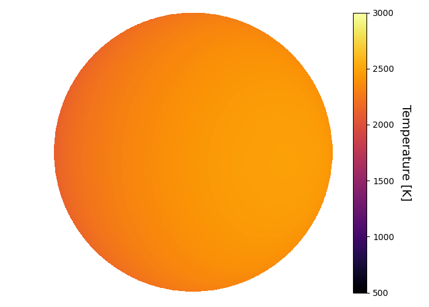
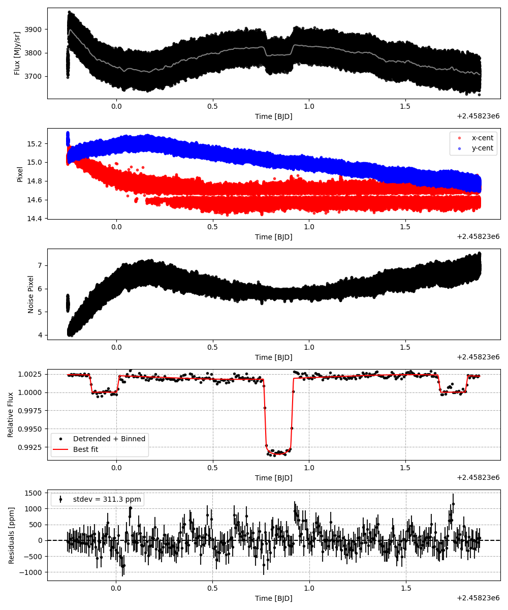
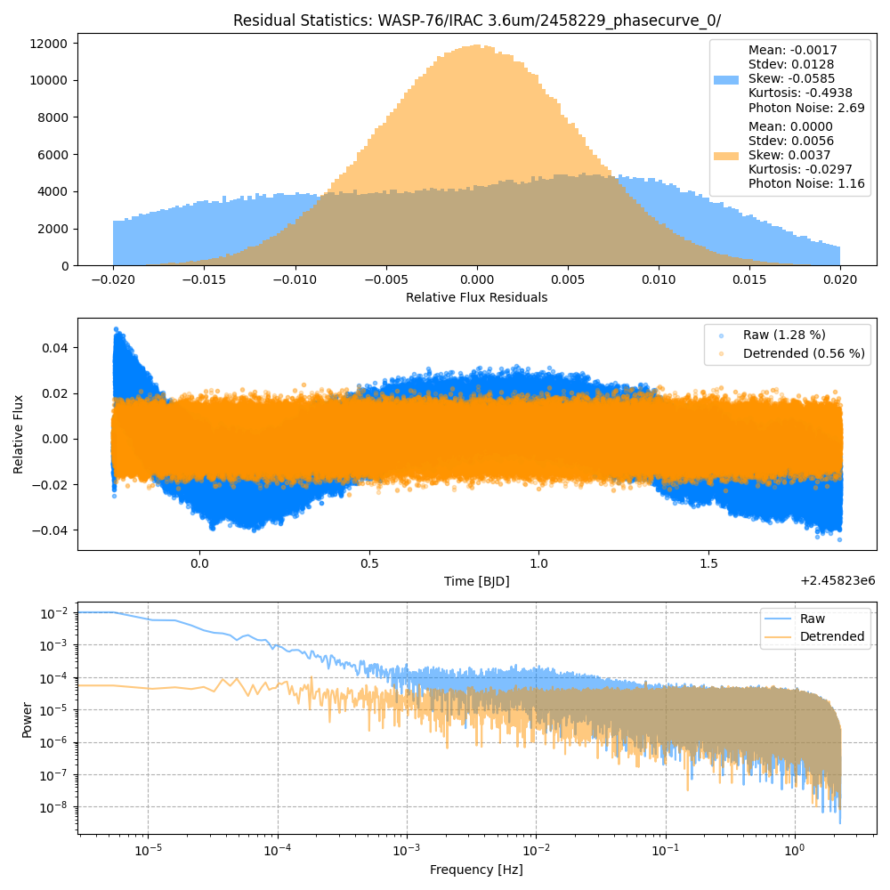
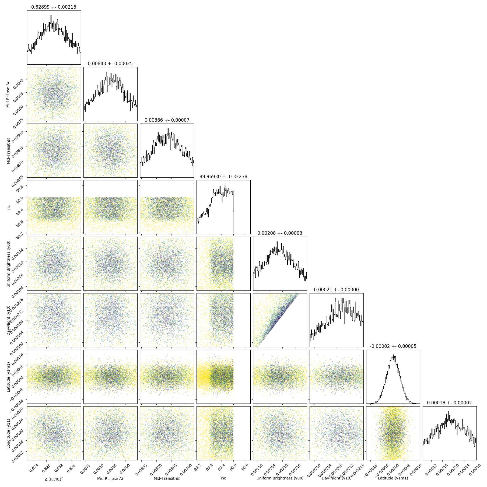
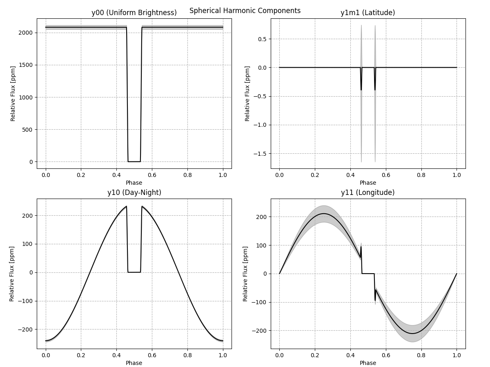
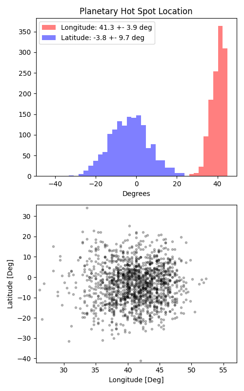

```
# target: wasp-76
# filter: IRAC 3.6um
# tmid: 2458230.839533 +- 0.000068
# emid: 2458229.937980 +- 0.000254
# transit_depth: 0.010425+-0.000014
# eclipse_depth: 0.002377 +- 0.000038
# nightside_amp: 0.001922 +- 0.000069
# hotspot_amp: 0.002401 +- 0.000038
# hotspot_lon[deg]: 41.348974 +- 3.930681
# hotspot_lat[deg]: -3.167155 +- 9.717305
time,flux,err,xcent,ycent,npp,phase,raw_flux,phasecurve
2458229.747096,1.005408,0.004783,15.013861,15.220455,5.331107,0.394534,3772.856317,1.002401
2458229.747096,1.005622,0.004783,15.013861,15.220455,5.331107,0.394534,3772.856317,1.002401
2458229.747100,0.996924,0.004806,15.016207,15.214519,5.442519,0.394536,3736.228340,1.002401
2458229.747100,0.997181,0.004806,15.016207,15.214519,5.442519,0.394536,3736.228340,1.002401
2458229.747105,1.004837,0.004784,15.031067,15.214554,5.373500,0.394539,3771.331707,1.002401

...
```

[timeseries.csv](timeseries.csv)

```python
import pandas as pd

df = pd.read_csv('timeseries.csv', comment='#')

# extract comments from the file
with open('timeseries.csv', 'r') as f:
    comments = [line for line in f if line.startswith('#')]

# clean and convert to a dictionary
comments_dict = dict()
for comment in comments:
    key, value = comment[1:].strip().split(': ')
    comments_dict[key] = value

# print the comments
print(comments_dict)
```















