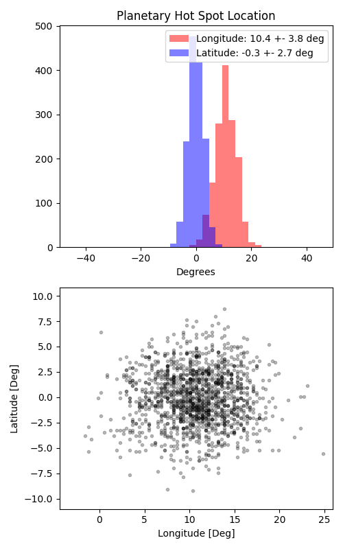

```
# target: wasp-76
# filter: IRAC 4.5um
# tmid: 2457859.813984 +- 0.000245
# emid: 2457858.913170 +- 0.000306
# transit_depth: 0.011657+-0.000041
# eclipse_depth: 0.003424 +- 0.000106
# nightside_amp: 0.000816 +- 0.000220
# hotspot_amp: 0.003421 +- 0.000106
# hotspot_lon[deg]: 10.733138 +- 3.792578
# hotspot_lat[deg]: -0.087977 +- 2.731455
time,flux,err,xcent,ycent,npp,phase,raw_flux,phasecurve
2457858.726135,1.004626,0.002930,15.276899,15.054206,3.992716,0.396660,2308.009460,1.003284
2457858.726135,1.004510,0.002930,15.276899,15.054206,3.992716,0.396660,2308.009460,1.003284
2457858.726158,1.000127,0.002937,15.280968,15.062162,4.073551,0.396673,2297.123339,1.003284
2457858.726158,1.000203,0.002937,15.280968,15.062162,4.073551,0.396673,2297.123339,1.003284
2457858.726181,1.004704,0.002931,15.285472,15.078518,4.059639,0.396685,2306.427792,1.003284

...
```

[timeseries.csv](timeseries.csv)

```python
import pandas as pd

df = pd.read_csv('timeseries.csv', comment='#')

# extract comments from the file
with open('timeseries.csv', 'r') as f:
    comments = [line for line in f if line.startswith('#')]

# clean and convert to a dictionary
comments_dict = dict()
for comment in comments:
    key, value = comment[1:].strip().split(': ')
    comments_dict[key] = value

# print the comments
print(comments_dict)
```




